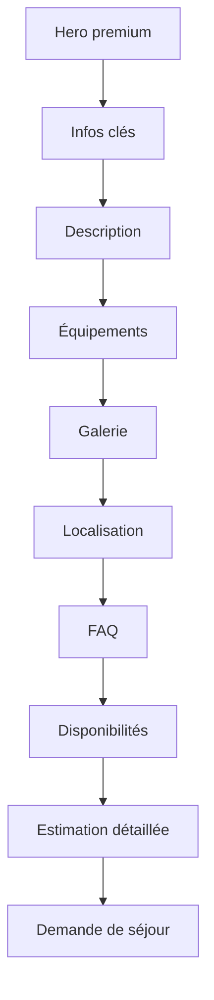

# 01 - Product

## Vision

**Le 115, Maison de Provence** est une expérience de découverte et de demande de séjour pour une maison premium en Provence.

Le produit doit faire trois choses très bien :

1. Donner envie.
2. Rassurer.
3. Transformer l'intérêt en demande qualifiée.

---

## Objectifs V1

### Voyageur

- Comprendre rapidement le positionnement de la maison.
- Voir les photos et équipements essentiels.
- Consulter les disponibilités.
- Estimer le prix d'un séjour.
- Envoyer une demande sans créer de compte.

### Propriétaire

- Voir le calendrier dès l'ouverture du dashboard.
- Traiter les demandes.
- Bloquer des périodes.
- Modifier les prix.
- Modifier les textes et photos du site.

---

## Fonctionnalités V1

| Domaine | Fonctionnalité | Priorité |
|---|---|---|
| Public | Landing page premium | Must |
| Public | Internationalisation FR / EN / ES | Must |
| Public | Galerie photos | Must |
| Public | Disponibilités | Must |
| Public | Estimation tarifaire détaillée | Must |
| Public | Demande de séjour | Must |
| Admin | Connexion sécurisée | Must |
| Admin | Calendrier dashboard | Must |
| Admin | Gestion des demandes | Must |
| Admin | Gestion des réservations | Must |
| Admin | Gestion des prix | Must |
| Admin | Gestion des contenus | Must |
| Admin | Gestion des photos | Must |

---

## Positionnement

Le site doit donner une impression :
- premium ;
- chaleureuse ;
- provençale ;
- familiale ;
- sérieuse.

Il ne doit pas ressembler à :
- un formulaire administratif ;
- une plateforme impersonnelle ;
- un clone low-cost d'Airbnb.

---

## Parcours de conversion

---

## Critères de succès

- Le visiteur comprend l'offre en moins de 30 secondes.
- Le visiteur peut obtenir un prix sans créer de compte.
- L'envoi d'une demande prend moins de 2 minutes.
- Le propriétaire peut modifier un tarif sans toucher au code.
- Le propriétaire peut bloquer une période en moins de 30 secondes.

---

## Questions ouvertes

| Question | Statut | Commentaire |
|---|---|---|
| Page “Découvrir la région” | V2 probable | Intéressant pour le SEO |
| Vidéo hero | V2 / amélioration | À faire si assets disponibles |
| Promotions ponctuelles | À arbitrer | Peut être utile hors saison |
| Paiement acompte | Hors V1 | À envisager après validation du concept |
