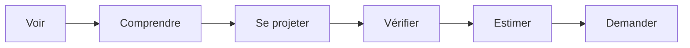

# 02 - UX

## Principe général

Le site public est une landing page premium structurée en sections.  
La navigation doit rester proche de la maquette fournie.

Le site doit guider naturellement le voyageur :



---

## Navigation

Desktop :
- Logo : `Le 115, Maison de Provence`
- Liens d'ancrage simples
- Sélecteur FR / EN / ES
- CTA `Estimer mon séjour`

Mobile :
- Logo
- CTA visible
- Menu compact si nécessaire

> Décision : conserver une navigation compatible avec la maquette existante.

---

## Sections de la landing

### 1. Hero

Objectif : créer l'émotion.

Contenu :
- photo principale ou vidéo courte ;
- titre ;
- sous-titre ;
- CTA principal.

Wireframe :

```text
┌──────────────────────────────────────────────────────┐
│ Le 115, Maison de Provence       FR EN ES  [CTA]     │
├──────────────────────────────────────────────────────┤
│                                                      │
│              IMAGE / VIDEO IMMERSIVE                 │
│                                                      │
│          Maison de caractère en Provence             │
│                                                      │
│              [ Estimer mon séjour ]                  │
│                                                      │
└──────────────────────────────────────────────────────┘
```

### 2. Infos clés

Objectif : rassurer immédiatement.

Exemples :
- Piscine
- 6 chambres
- 12 voyageurs
- Cour intérieure
- Wifi
- Parking

```text
┌──────────┬────────────┬────────────┬───────────┐
│ Piscine  │ 6 chambres │ 12 pers.   │ Provence  │
└──────────┴────────────┴────────────┴───────────┘
```

### 3. Présentation

Objectif : expliquer l'esprit de la maison sans surcharger.

Contenu :
- texte court ;
- ambiance ;
- type de séjour.

### 4. Équipements

Objectif : répondre aux questions pratiques.

Les équipements doivent être administrables.

### 5. Galerie

Objectif : permettre au voyageur de se projeter.

Fonctionnalités :
- photo principale ;
- grille de photos ;
- ouverture plein écran ;
- ordre configurable depuis l'administration.

### 6. Localisation

Objectif : situer la maison en Provence.

Contenu :
- texte court ;
- carte ;
- points d'intérêt.

### 7. FAQ

Objectif : lever les objections.

Exemples :
- Les animaux sont-ils acceptés ?
- Les draps sont-ils fournis ?
- La piscine est-elle chauffée ?
- Les fêtes sont-elles autorisées ?

### 8. Disponibilités et estimation

Objectif : convertir.

```text
┌───────────────────────────────┐
│ Estimer mon séjour            │
├───────────────────────────────┤
│ Arrivée   [ 09/07/2025 ]      │
│ Départ    [ 17/07/2025 ]      │
│ Adultes   [ optionnel ]       │
│ Enfants   [ optionnel ]       │
├───────────────────────────────┤
│ 8 nuits                       │
│ 09/07 : 450 €                 │
│ 10/07 : 450 €                 │
│ 11/07 : 500 €                 │
│ ...                           │
│ Sous-total : 3 900 €          │
│ Ménage : 400 €                │
│ Total : 4 300 €               │
├───────────────────────────────┤
│ [ Envoyer une demande ]       │
└───────────────────────────────┘
```

---

## États UX à prévoir

| État | Description |
|---|---|
| Chargement | Calendrier ou photos en cours |
| Dates indisponibles | Sélection impossible |
| Règle non respectée | Message explicite |
| Prix calculé | Détail affiché |
| Demande envoyée | Confirmation claire |
| Erreur technique | Message simple + retry |

---

## TODO UX

- [ ] Valider l'ordre final des sections.
- [ ] Définir les textes FR/EN/ES.
- [ ] Définir les équipements affichés en infos clés.
- [ ] Lister les questions FAQ.
- [ ] Définir le comportement mobile du calendrier.
