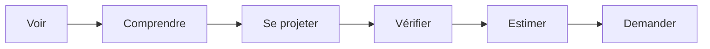

# 02 - UX

## Principe général

Le site public est une landing page premium structurée en sections.  
La navigation doit rester proche de la maquette fournie : sobre, élégante, avec une forte place donnée aux photos.

Le site doit guider naturellement le voyageur :

---

## Langues

La V1 ne propose que deux langues :

| Langue | Code | Statut |
|---|---|---|
| Français | `fr` | Langue principale |
| Anglais | `en` | Langue secondaire |

Conséquences UX :

- le sélecteur de langue affiche uniquement `FR` et `EN` ;
- aucun contenu espagnol n'est attendu en V1 ;
- le français reste la langue par défaut ;
- les contenus administrables doivent exister en français et en anglais.

---

## Navigation

### Desktop

| Élément | Comportement |
|---|---|
| Logo | Retour en haut de page |
| La maison | Ancre vers la présentation |
| Équipements | Ancre vers les équipements |
| Galerie | Ancre vers la galerie |
| FAQ | Ancre vers la FAQ |
| Localisation | Ancre vers la localisation |
| `FR / EN` | Changement de langue |
| CTA `Estimer mon séjour` | Scroll vers le module d'estimation |

### Mobile

| Élément | Comportement |
|---|---|
| Logo | Toujours visible |
| CTA | Visible sans ouvrir le menu si possible |
| Menu | Compact, avec les mêmes ancres que desktop |
| Langues | `FR / EN`, accessibles depuis le menu ou l'en-tête |

> Décision : conserver une navigation compatible avec la maquette existante.

---

## Structure de la landing

Au lieu de maintenir des wireframes ASCII peu lisibles dans MkDocs, chaque écran est décrit par ses zones, son objectif et ses règles d'affichage.

### 1. Hero

!!! info "Objectif"
    Créer l'émotion immédiatement avec une photo immersive de la maison.

| Zone | Contenu |
|---|---|
| En-tête | Logo, navigation, sélecteur `FR / EN` |
| Visuel | Photo principale ou vidéo courte |
| Texte | Titre, sous-titre court, promesse |
| CTA | `Estimer mon séjour` |
| Infos clés | Résumé en bandeau : chambres, voyageurs, piscine, climatisation, terrain, garage |

### 2. Infos clés

!!! info "Objectif"
    Rassurer immédiatement avec les caractéristiques essentielles.

| Information | Exemple |
|---|---|
| Capacité | 6 chambres, 12 personnes |
| Piscine | Piscine chauffée, 15 × 4 m |
| Confort | Climatisation dans toute la maison |
| Extérieur | Terrain arboré, 5 000 m² |
| Stationnement / vélos | Garage à disposition |

### 3. Présentation

!!! info "Objectif"
    Expliquer l'esprit de la maison sans surcharger la page.

| Zone | Contenu |
|---|---|
| Titre | À propos de la maison |
| Texte | Description courte, premium et chaleureuse |
| Points forts | Liste concise avec pictogrammes |
| Photos | Grande photo + vignettes secondaires |

### 4. Équipements

!!! info "Objectif"
    Répondre aux questions pratiques avant la demande de séjour.

Les équipements doivent être administrables depuis le dashboard.

| Catégorie | Exemples |
|---|---|
| Confort | Climatisation, Wi-Fi, linge fourni |
| Extérieur | Piscine, jardin, terrasse |
| Famille | Chambres, équipements enfants si disponibles |
| Pratique | Parking, garage vélos, ménage inclus |

### 5. Galerie

!!! info "Objectif"
    Permettre au voyageur de se projeter dans la maison.

| Fonctionnalité | Règle |
|---|---|
| Grille de photos | Ordre configurable depuis l'administration |
| Filtres | Tous, extérieur, intérieur, chambres, salles de bain |
| Plein écran | Ouverture au clic sur une photo |
| Photo principale | Définie depuis le dashboard |

### 6. Localisation

!!! info "Objectif"
    Situer la maison en Provence sans exposer inutilement l'adresse exacte si ce n'est pas souhaité.

| Zone | Contenu |
|---|---|
| Texte | Présentation de l'environnement |
| Carte | Position approximative ou exacte selon décision propriétaire |
| Points d'intérêt | Villages, marchés, activités, gares / accès |

### 7. FAQ

!!! info "Objectif"
    Lever les objections les plus courantes.

Exemples :

| Question | Réponse attendue |
|---|---|
| La maison est-elle adaptée aux enfants ? | Oui / détails à préciser |
| La piscine est-elle chauffée ? | Oui / période à préciser |
| Les animaux sont-ils acceptés ? | À arbitrer |
| Les horaires d'arrivée et de départ ? | Arrivée à partir de 16h, départ avant 10h |
| Comment se passe le paiement ? | Demande manuelle, réponse propriétaire sous 48h |

### 8. Disponibilités et estimation

!!! info "Objectif"
    Transformer l'intérêt en demande qualifiée.

| Étape | Contenu |
|---|---|
| 1. Dates | Arrivée et départ |
| 2. Voyageurs | Adultes et enfants optionnels |
| 3. Estimation | Nombre de nuits, prix nuit par nuit, frais, total |
| 4. Coordonnées | Prénom, nom, email, téléphone, message optionnel |
| 5. Confirmation | Message clair après envoi |

Le module doit afficher les erreurs métier de manière explicite : dates indisponibles, durée minimum non respectée, règle samedi-samedi en haute saison.

---

## États UX à prévoir

| État | Description |
|---|---|
| Chargement | Calendrier, disponibilité ou photos en cours de chargement |
| Dates indisponibles | Sélection impossible ou message explicite |
| Règle non respectée | Message clair avec explication |
| Prix calculé | Détail affiché nuit par nuit |
| Demande envoyée | Confirmation claire |
| Erreur technique | Message simple + possibilité de réessayer |
| Synchronisation externe indisponible | Afficher les disponibilités locales avec une alerte admin, jamais un message technique au voyageur |

---

## TODO UX

- [ ] Valider l'ordre final des sections.
- [ ] Rédiger les textes FR/EN.
- [ ] Définir les équipements affichés en infos clés.
- [ ] Lister les questions FAQ définitives.
- [ ] Définir le comportement mobile du calendrier.
