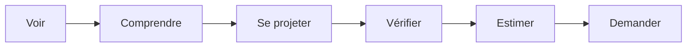

# 02 - UX

## Principe général

Le site public est une landing page premium structurée en sections.  
La navigation doit rester proche de la maquette fournie : sobre, élégante, avec une forte place donnée aux photos.

Le site doit guider naturellement le voyageur :

```mermaid
flowchart LR
    A[Voir] --> B[Comprendre]
    B --> C[Se projeter]
    C --> D[Vérifier]
    D --> E[Estimer]
    E --> F[Demander]
```

---

## Langues

La V1 ne propose que deux langues :

| Langue | Code | Statut |
|---|---|---|
| Français | `fr` | Langue principale |
| Anglais | `en` | Langue secondaire |

Conséquences UX :

- le sélecteur de langue affiche uniquement `FR` et `EN` ;
- aucun contenu espagnol n'est attendu en V1 ;
- le français reste la langue par défaut ;
- les contenus administrables doivent exister en français et en anglais.

> Le sélecteur `FR / EN` concerne le **site public**. Le **chrome du
> dashboard admin** (navigation, libellés d'interface) est **en français
> uniquement** : pas de sélecteur de langue ni de bibliothèque i18n côté
> admin — seuls les formulaires d'édition de contenus publics manipulent des
> champs FR/EN (cf. `04-Dashboard.md`).

---

## Navigation

### Desktop

| Élément | Comportement |
|---|---|
| Logo | Retour en haut de page |
| La maison | Ancre vers la présentation |
| Équipements | Ancre vers les équipements |
| Galerie | Ancre vers la galerie |
| FAQ | Ancre vers la FAQ |
| Localisation | Ancre vers la localisation |
| `FR / EN` | Changement de langue |
| CTA `Estimer mon séjour` | Scroll vers le module d'estimation |

### Mobile

| Élément | Comportement |
|---|---|
| Logo | Toujours visible |
| CTA | Visible sans ouvrir le menu si possible |
| Menu | Compact, avec les mêmes ancres que desktop |
| Langues | `FR / EN`, accessibles depuis le menu ou l'en-tête |

> Décision : conserver une navigation compatible avec la maquette existante.

---

## Structure retenue : un accueil à ancres, et des routes dédiées

La landing reste une page qui se parcourt au défilement, avec les ancres de la
navigation ci-dessus. Mais tout ne rentre pas dans une page : trois contenus ont
**leur propre URL**, parce qu’ils se partagent, se réfèrent et se référencent seuls.

| Route | Contenu |
|---|---|
| `/[langue]` | Hero, atouts, présentation, équipements, galerie, localisation, aperçu FAQ |
| `/[langue]/informations-pratiques` | FAQ complète et informations pratiques |
| `/[langue]/contact` | Téléphone, email, secteur, carte statique |
| `/[langue]/familles` | Première page d’audience (les quatre autres suivront) |

`[langue]` vaut `fr` ou `en` ; la racine redirige vers le français. Un chemin sans
préfixe de langue est **préfixé plutôt que rejeté** (`/contact` mène à `/fr/contact`),
pour qu’un lien partagé sans préfixe fonctionne.

### FAQ : un aperçu, puis la liste complète

L’accueil montre les **quatre premières questions dans l’ordre existant** — celui que
le propriétaire contrôle déjà avec les flèches ↑↓ de l’écran FAQ du dashboard —, puis
renvoie vers `/informations-pratiques`. Aucun champ neuf : l’ordre est un contrôle qui
existe. Le nombre est fixé à quatre : c’est ce que montre l’accordéon de la maquette
sans défiler, et un aperçu qui déborde n’est plus un aperçu.

**Les informations pratiques y entrent comme des questions ordinaires** — horaires
d’arrivée et de départ, dépôt de garantie, ce qui est inclus et ce qui ne l’est pas.
Elles ont déjà un foyer dans la FAQ (cf. les exemples plus bas), et sont donc
éditables sans champ neuf.

### Pages d’audience

Cinq pages de contenu prévues — Familles, Groupe d’amis, Tourisme et culture,
Cyclistes, Télétravail. Leur intérêt est le référencement : une page « maison de
famille pour cyclistes en Provence » capte des recherches que l’accueil ne captera
jamais. Elles sont **rédigées dans le dépôt** du site en V1, et destinées à devenir
éditables depuis le dashboard en V2.

La **rangée d’onglets d’audience s’affiche dès la première page**, en onglets à icônes à
droite du mot-symbole, comme sur la maquette de référence. L’onglet de la page courante
est marqué.

Le cadrage posait l’inverse — la rangée devait attendre deux pages, une rangée d’un seul
élément n’en étant pas une, et cinq onglets dont quatre ne mènent nulle part étant
indéfendable. **Renversé le 2026-08-16** : masquée, la page « Familles » n’était
atteignable que depuis le pied de page, un seul lien tout en bas de l’accueil. Pour une
page dont l’intérêt est le référencement et l’orientation du visiteur, un onglet seul est
moins gênant qu’une page introuvable.

Les icônes sont prises au catalogue des **équipements**, faute d’en avoir un pour les
types de séjour : « Familles » emprunte la silhouette de `guests`. Les audiences à venir
devront y choisir la leur — `bike` pour les cyclistes, `wifi` pour le télétravail — ou
justifier de l’élargir.

---

## Navigation admin (dashboard)

Le dashboard admin a sa propre navigation, distincte du site public : nav V1
à douze entrées (Tableau de bord, Calendrier, Demandes, Réservations, Tarifs,
Règles de séjour, Maison, Équipements, FAQ, Photos, Synchronisations,
Activité), écran d’accueil = **Tableau de bord**. Détail complet dans
`04-Dashboard.md`.

---

## Structure de la landing

Au lieu de maintenir des wireframes ASCII peu lisibles dans MkDocs, chaque écran est décrit par ses zones, son objectif et ses règles d'affichage.

### 1. Hero

!!! info "Objectif"
    Créer l'émotion immédiatement avec une photo immersive de la maison.

| Zone | Contenu |
|---|---|
| En-tête | Logo, navigation, sélecteur `FR / EN` |
| Visuel | Photo principale ou vidéo courte |
| Texte | Titre, sous-titre court, promesse |
| CTA | `Estimer mon séjour` |
| Infos clés | Résumé en bandeau : chambres, voyageurs, piscine, climatisation, terrain, garage |

### 2. Infos clés

!!! info "Objectif"
    Rassurer immédiatement avec les caractéristiques essentielles.

| Information | Exemple |
|---|---|
| Capacité | 6 chambres, 12 personnes |
| Piscine | Piscine chauffée, 15 × 4 m |
| Confort | Climatisation dans toute la maison |
| Extérieur | Terrain arboré, 5 000 m² |
| Stationnement / vélos | Garage à disposition |

### 3. Présentation

!!! info "Objectif"
    Expliquer l'esprit de la maison sans surcharger la page.

| Zone | Contenu |
|---|---|
| Titre | À propos de la maison |
| Texte | Description courte, premium et chaleureuse |
| Points forts | Liste concise avec pictogrammes |
| Photos | Grande photo + vignettes secondaires |

### 4. Équipements

!!! info "Objectif"
    Répondre aux questions pratiques avant la demande de séjour.

Les équipements doivent être administrables depuis le dashboard.

| Catégorie | Exemples |
|---|---|
| Confort | Climatisation, Wi-Fi, linge fourni |
| Extérieur | Piscine, jardin, terrasse |
| Famille | Chambres, équipements enfants si disponibles |
| Pratique | Parking, garage vélos, ménage inclus |

### 5. Galerie

!!! info "Objectif"
    Permettre au voyageur de se projeter dans la maison.

| Fonctionnalité | Règle |
|---|---|
| Grille de photos | Ordre configurable depuis l'administration |
| Filtres | Tous, extérieur, intérieur, chambres, salles de bain |
| Plein écran | Ouverture au clic sur une photo |
| Photo principale | Définie depuis le dashboard |

### 6. Localisation

!!! info "Objectif"
    Situer la maison en Provence sans exposer l'adresse exacte avant confirmation (`DEC-022`).

| Zone | Contenu |
|---|---|
| Texte | Présentation de l’environnement, **sans localiser** (DEC-022) |
| Carte | **Image statique du secteur**, servie par le site — position approximative (DEC-021, DEC-022) |
| Mention | « L’adresse exacte vous est communiquée une fois le séjour confirmé » |
| Lien | « Ouvrir dans Google Maps », qui part chez eux **au clic**, jamais avant |
| Points d'intérêt | Villages, marchés, activités, gares / accès |

> **La carte n’est pas interactive, et c’est délibéré.** Charger un fournisseur de
> tuiles imposerait un bandeau de consentement (DEC-021). L’image montre le secteur,
> pas le portail (DEC-022) : le site publierait sinon, au même endroit, où se trouve
> la maison et — via le calendrier de disponibilité, public par nature — quand elle
> est inoccupée.

### 7. FAQ

!!! info "Objectif"
    Lever les objections les plus courantes.

Exemples :

| Question | Réponse attendue |
|---|---|
| La maison est-elle adaptée aux enfants ? | Oui / détails à préciser |
| La piscine est-elle chauffée ? | Oui / période à préciser |
| Les animaux sont-ils acceptés ? | À arbitrer |
| Les horaires d'arrivée et de départ ? | Arrivée à partir de 16h, départ avant 10h |
| Comment se passe le paiement ? | Demande manuelle, réponse propriétaire sous 48h |

### 8. Disponibilités et estimation

!!! info "Objectif"
    Transformer l'intérêt en demande qualifiée.

| Étape | Contenu |
|---|---|
| 1. Dates | Arrivée et départ |
| 2. Voyageurs | Adultes et enfants optionnels |
| 3. Estimation | Nombre de nuits, prix nuit par nuit, frais, total |
| 4. Coordonnées | Prénom, nom, email, téléphone, message optionnel |
| 5. Confirmation | Message clair après envoi |

Le module doit afficher les erreurs métier de manière explicite : dates indisponibles, durée minimum non respectée, règle samedi-samedi en haute saison.

---

## États UX à prévoir

| État | Description |
|---|---|
| Chargement | Calendrier, disponibilité ou photos en cours de chargement |
| Dates indisponibles | Sélection impossible ou message explicite |
| Règle non respectée | Message clair avec explication |
| Prix calculé | Détail affiché nuit par nuit |
| Demande envoyée | Confirmation claire |
| Erreur technique | Message simple + possibilité de réessayer |
| Synchronisation externe indisponible | Afficher les disponibilités locales avec une alerte admin, jamais un message technique au voyageur |

---

## TODO UX

- [x] **Valider l’ordre final des sections.** Tranché et livré : hero, atouts,
  présentation, équipements, galerie, localisation, aperçu FAQ.
- [ ] Rédiger les textes FR/EN. *Partiellement fait* : le chrome du site public et la
  première page d’audience sont écrits en FR/EN ; les textes du parcours de demande
  restent à rédiger.
- [x] **Définir les équipements affichés en infos clés.** Le bandeau d’atouts affiche
  la **capacité** (`maxGuests`) puis les **équipements** dans l’ordre du propriétaire,
  limité à six au bureau et à trois sur mobile. Il ne peut rien annoncer d’autre :
  le modèle de données n’a ni nombre de
  chambres, ni nombre de salles de bain, ni superficie, que le bandeau de la maquette
  annonce pourtant — dette consignée dans `../le115-backend/docs/DEBTS.md`.
- [ ] Lister les questions FAQ définitives.
- [ ] Définir le comportement mobile du **calendrier**. *Toujours ouvert* : le
  calendrier de disponibilité relève du parcours de demande, pas encore construit. Le
  repli mobile du **reste du site**, lui, est tranché et livré — les deux niveaux
  d’en-tête fusionnent en un seul avec un menu `☰`, le bouton « Estimer mon séjour »
  reste visible sans ouvrir le menu (exigence de la table « Mobile » ci-dessus), le
  dégradé du hero bascule de latéral à vertical, le bandeau d’atouts garde trois
  éléments (les autres restent lisibles plus bas, dans la section Équipements), et la
  galerie passe à une colonne.

---

## À confirmer par le propriétaire

Contenus rédigés dans le dépôt du site public faute de source, et **non vérifiés** —
à faire confirmer avant toute mise en ligne, ou à corriger :

- sur la page d’audience « Familles » : que **le marché a lieu deux fois par semaine**,
  et qu’il faut **moins de vingt minutes** pour rejoindre les premières balades
  ombragées. Aucune source ne les corrobore, ni la documentation ni les données ;
- les **coordonnées publiques** affichées (téléphone, email) sont des valeurs de
  remplacement, ainsi que l’image de carte du secteur.

Ces points sont aussi consignés en dette dans `../le115-backend/docs/DEBTS.md`, pour
qu’ils ne se perdent pas entre deux chantiers.

> **Deux cas voisins, déjà tranchés — et c’était la même ligne.** Le secteur affiché
> annonçait « **Velleron**, Vaucluse — à 15 minutes d’**Aix-en-Provence** ». Les deux
> étaient faux, et c’était publié. La donnée saisie par la propriétaire dit **Avignon**,
> et sa description situe la maison dans « le centre historique du village de
> **Pernes-les-Fontaines** » — à une vingtaine de kilomètres d’Avignon, contre environ
> soixante-quinze d’Aix. Ce n’étaient pas des contenus à confirmer.
> Corrigés à leur racine — le seed de développement du backend — et partout en aval,
> le 2026-08-15 pour la ville, le 2026-08-16 pour le village.
>
> Le second n’a été démenti que le jour où la propriétaire a saisi sa description :
> tant que le contenu restait celui du seed, rien ne le contredisait. La leçon vaut
> pour les points ci-dessus, et elle est plus dure qu’il n’y paraît — ce qui n’a pas
> de source finit par être recopié comme s’il en avait une, et le contredire demande
> que quelqu’un apporte la vraie donnée.
