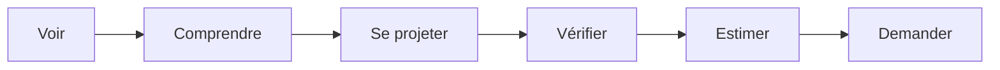

# 02 - UX

## Principe général

Le site public est une landing page premium structurée en sections.  
La navigation doit rester proche de la maquette fournie : sobre, élégante, avec une forte place donnée aux photos.

Le site doit guider naturellement le voyageur :

```mermaid
flowchart LR
    A[Voir] --> B[Comprendre]
    B --> C[Se projeter]
    C --> D[Vérifier]
    D --> E[Estimer]
    E --> F[Demander]
```

---

## Identité visuelle

Le graphiste de la propriétaire a transmis une charte : **dix couleurs** — cinq
principales, cinq secondaires — et **deux polices**, sous licence SIL Open Font.
Le site public l’a adoptée le 2026-08-19 (`DEC-027`).

### Les dix couleurs

Les cinq **principales** sont exactement les teintes du logo (vérifié dans
`Logo.tsx`, qui les code en dur) : la charte et la marque sont donc cohérentes,
ce qui n’allait pas de soi.

| Couleur | Code |
|---|---|
| Olive profond | `#59603A` |
| Sable | `#CDBB9E` |
| Terre cuite | `#D97859` |
| Eau | `#9FCBC7` |
| Soleil | `#E4B247` |

Les cinq **secondaires** :

| Couleur | Code |
|---|---|
| Lin | `#EFEBE1` |
| Châtaigne | `#806C57` |
| Bronze | `#B09057` |
| Ardoise | `#4A565C` |
| Lavande | `#8A87A5` |

### L’arbitrage : identité pure en décor, variantes assombries pour le texte

Cette charte est faite pour du papier. Appliquée telle quelle à l’écran, sur le
plus sombre des trois fonds de page (voir plus bas), **seules deux des dix
couleurs peuvent porter du texte courant** : Ardoise (6,35:1) et Olive profond
(5,58:1). Châtaigne s’en approche mais reste sous le seuil de 4,5:1, à 4,20:1.
Les six autres — Terre cuite, Soleil, Eau, Sable, Bronze et Lavande — tombent
entre 1,49:1 et 2,90:1. Et du blanc sur Terre cuite pure — la teinte qu’aurait
naturellement le bouton « Réserver » — ne donne que 3,10:1, insuffisant.

**Décision retenue.** Les dix couleurs restent l’identité complète : aplats,
traits, fonds, pastilles, et le logo qui les porte déjà en dur, exempté des
règles de contraste (un logotype l’est, un jeton de thème ne l’est pas). Pour
le **texte et les boutons seuls**, cinq teintes existent en variante
**assombrie** : seule la clarté descend, teinte et saturation restent celles du
dossier, au dixième de degré près.

| Pure | Assombrie | Ratio sur le fond le plus sombre | Rôle |
|---|---|---|---|
| Terre cuite `#D97859` | `#B24A29` | 4,52:1 (texte) · 5,38:1 (blanc dessus, bouton) | Accent, CTA |
| Châtaigne `#806C57` | `#7A6753` | 4,53:1 | Texte secondaire |
| Eau `#9FCBC7` | `#4F918B` | 3,07:1 | Interface (icône, filet) |
| Soleil `#E4B247` | `#AE7F1A` | 3,02:1 | Interface (icône, filet) |
| Sable `#CDBB9E` | `#A08353` | 3,01:1 | Interface (bordure) |

Ardoise et Olive profond n’ont pas besoin d’être assombries : pures, elles
tiennent déjà le seuil du texte. Les trois teintes assombries qui ne tiennent
que 3:1 (Eau, Soleil, Sable) sont réservées à l’interface — icône, filet,
bordure de champ — et jamais au texte : il leur manquerait un tiers du
contraste exigé.

**Le rôle de chaque couleur n’avait pas été précisé par le graphiste.** Le
dossier livre dix couleurs sans dire laquelle sert de texte, de fond ou de
décor ; l’affectation ci-dessus a été **proposée et validée par la
propriétaire**, elle n’a pas été reçue telle quelle.

### Les trois fonds

**Lin** est la seule teinte claire de la charte : elle devient le **bandeau**
(haut de page, sections), et non le fond de page. La placer au ton le plus
sombre des trois fonds fait de tous les ratios calculés sur elle le pire cas —
c’est cette colonne qui a servi de référence ci-dessus. Le fond de page en est
un éclaircissement à teinte et saturation identiques (42,9° / 30,4 %,
vérifié) ; les surfaces (cartes, rangée du logo) sont plus claires encore.

### Les deux polices

**Cormorant Garamond** (titres) et **Montserrat** (corps de texte, interface),
toutes deux sous licence **SIL Open Font**. Elles sont **hébergées dans le
dépôt** (`le115-frontend/src/app/fonts/`) plutôt que chargées d’un service
distant type Google Fonts — c’est ce qui préserve `DEC-021` : aucun tiers ne
s’ajoute, donc aucun bandeau de consentement. Un lien vers Google Fonts
révélerait l’adresse IP de chaque visiteur.

Les deux sont des polices **variables** (une seule requête par famille pour
toutes les graisses) et **restreintes aux caractères réellement employés** —
latin, ses suppléments et la ponctuation. Les fichiers livrés pèsent 34 Ko et
32 Ko, contre 200 Ko d’origine (cyrillique et grec inclus, inutilisés par le
site).

---

## Langues

La V1 ne propose que deux langues :

| Langue | Code | Statut |
|---|---|---|
| Français | `fr` | Langue principale |
| Anglais | `en` | Langue secondaire |

Conséquences UX :

- le sélecteur de langue affiche uniquement `FR` et `EN` ;
- aucun contenu espagnol n'est attendu en V1 ;
- le français reste la langue par défaut ;
- les contenus administrables doivent exister en français et en anglais.

> Le sélecteur `FR / EN` concerne le **site public**. Le **chrome du
> dashboard admin** (navigation, libellés d'interface) est **en français
> uniquement** : pas de sélecteur de langue ni de bibliothèque i18n côté
> admin — seuls les formulaires d'édition de contenus publics manipulent des
> champs FR/EN (cf. `04-Dashboard.md`).

---

## Navigation

### Desktop (à partir de 1024 px)

En-tête de 120 px sur deux lignes, d’après la maquette Figma (DEC-034).

| Élément | Comportement |
|---|---|
| Logo complet | Arche, « LE 115 » et la signature « Maison de caractère en Provence » ; retour à l’accueil |
| Ligne 1 | Accueil · Le 115 · Commodités · Les environs · Adresse & contact — les trois du milieu mènent aux sections de l’accueil en attendant leurs pages |
| Ligne 2 | Les pages d’audience **publiées** dans la langue, chacune avec son icône |
| Avis Google | Lien vers la fiche, au clic seulement (DEC-031) |
| CTA `Réserver` | Mène à la page de demande — `/fr/demande`, `/en/request` (DEC-023, DEC-026, DEC-033) |
| `FR / EN` | Drapeau et code, les deux langues côte à côte |

### Mobile et tablette (sous 1024 px)

| Élément | Comportement |
|---|---|
| Logo | Toujours visible |
| CTA | Visible sans ouvrir le menu |
| Menu | Replié ; les deux lignes l’une sous l’autre, puis le choix de langue |

### Pied de page

Trois colonnes, d’après la maquette Figma (DEC-034, DEC-035). Sous 1024 px elles
passent sur deux colonnes, puis une seule. Une colonne sans contenu disparaît.

| Colonne | Contenu |
|---|---|
| **Informations** | Informations pratiques, puis les pages légales **publiées dans la langue**, dans l’ordre Conditions de location, Mentions légales, Confidentialité et cookies — une page dépubliée n’y figure pas, sans lien mort —, puis les pages d’audience publiées dans la langue |
| **Nous contacter** | L’adresse affichée (DEC-022 amendée), ou le secteur quand elle est vide ; le téléphone ; l’email ; le lien Contact |
| **Nous suivre** | Facebook et Instagram, en icônes qui s’ouvrent dans un autre onglet. La colonne est **absente** si aucun des deux n’est renseigné au dashboard ; un seul renseigné, un seul lien |

Au premier déploiement rien n’est publié : le pied n’a alors aucun lien légal, et
cela n’est pas une erreur. Le téléphone et l’email restent ceux de la configuration
du site, par exception (DEC-035) : ils doivent s’afficher même quand l’API est en
panne.

---

## Structure retenue : un accueil à ancres, et des routes dédiées

La landing reste une page qui se parcourt au défilement, avec les ancres de la
navigation ci-dessus. Mais tout ne rentre pas dans une page : plusieurs contenus ont
**leur propre URL**, parce qu’ils se partagent, se réfèrent et se référencent seuls.

**Chaque page porte une adresse écrite dans sa propre langue** (DEC-033) : la table
donne donc les deux, et non une adresse à trou. Les segments de route sont TRADUITS,
le slug d’une page d’audience compris.

| Adresse française | Adresse anglaise | Contenu |
|---|---|---|
| `/fr` | `/en` | Hero, atouts, présentation, équipements, galerie, localisation, aperçu FAQ |
| `/fr/informations-pratiques` | `/en/practical-information` | FAQ complète et informations pratiques |
| `/fr/contact` | `/en/contact` | « Nous écrire » (formulaire) et « Nous trouver » (adresse affichée, carte statique, lien Google Maps) — voir « 6. Localisation » (DEC-035) |
| `/fr/mentions-legales` | `/en/legal-notice` | Mentions légales — page légale, éditable au dashboard (DEC-035) |
| `/fr/confidentialite` | `/en/privacy` | Confidentialité et cookies — page légale (DEC-035) |
| `/fr/conditions-de-location` | `/en/rental-terms` | Conditions de location — page légale (DEC-035) |
| `/fr/<slug>` | `/en/<slug>` | Pages d’audience, éditables depuis le dashboard (DEC-032) ; le slug est lui-même un contenu par langue (`familles` / `families`) |
| `/fr/demande` | `/en/request` | Parcours de demande : calendrier, devis, formulaire, confirmation (DEC-023) |

`contact` s’écrit à l’identique dans les deux langues ; c’est la seule route dont les
deux adresses coïncident.

**Les trois pages légales** (DEC-035) sont des routes dédiées, à adresse **fixe** : la
propriétaire écrit leur texte, jamais leur adresse. Elles se publient langue par langue,
sans repli. Une page non publiée dans une langue rend **404** à son adresse, jamais le
texte de l’autre langue. Chacune affiche son titre, ses sections dans l’ordre, et la
mention « Mis à jour le … », datée de la dernière écriture du texte (publier ne la
change pas). Dans le corps d’une section, un saut de ligne simple reste un retour à
la ligne, et une ligne vide ouvre un nouveau paragraphe. Les six adresses sont réservées
aux pages d’audience dans les deux langues. Les adresses croisées — `/en/mentions-legales`,
`/fr/legal-notice`… — rendent 404 comme les autres (DEC-033).

**Le texte riche** (DEC-036) s’affiche de la même façon dans le corps des sections des
pages légales et des pages d’audience : paragraphes, gras, italique, liens, listes à puces et
numérotées — et rien d’autre. Les retours à la ligne simples sont gardés. Un lien interne
(`/fr/…`, `/en/…`) s’ouvre dans le **même onglet** ; un lien externe (`https://`) dans un
**nouvel onglet** ; un lien `mailto:` ouvre le courrier. Une adresse d’une autre forme n’est pas
un lien : son texte s’affiche seul. Un HTML tapé dans un corps s’affiche tel quel, en texte.

Une adresse écrite dans la MAUVAISE langue — `/en/informations-pratiques`,
`/en/demande`, `/fr/practical-information`, `/fr/request` — rend **404**, jamais une
redirection : une même page ne doit jamais avoir deux URL vivantes (DEC-033). La racine
redirige vers le français, et un chemin sans préfixe de langue est **préfixé plutôt que
rejeté** (`/contact` mène à `/fr/contact`), pour qu’un lien partagé sans préfixe
fonctionne.

### FAQ : un aperçu, puis la liste complète

L’accueil montre les **quatre premières questions dans l’ordre existant** — celui que
le propriétaire contrôle déjà avec les flèches ↑↓ de l’écran FAQ du dashboard —, puis
renvoie vers `/informations-pratiques`. Aucun champ neuf : l’ordre est un contrôle qui
existe. Le nombre est fixé à quatre : c’est ce que montre l’accordéon de la maquette
sans défiler, et un aperçu qui déborde n’est plus un aperçu.

**Les informations pratiques y entrent comme des questions ordinaires** — horaires
d’arrivée et de départ, dépôt de garantie, ce qui est inclus et ce qui ne l’est pas.
Elles ont déjà un foyer dans la FAQ (cf. les exemples plus bas), et sont donc
éditables sans champ neuf.

### Pages d’audience

Cinq pages de contenu prévues — Familles, Groupe d’amis, Tourisme et culture,
Cyclistes, Télétravail. Leur intérêt est le référencement : une page « maison de
famille pour cyclistes en Provence » capte des recherches que l’accueil ne captera
jamais. Elles sont **éditables et créables depuis le dashboard** (DEC-032) : le
propriétaire les écrit, les publie langue par langue et les supprime, sans passer
par le dépôt du site.

La **rangée d’onglets d’audience s’affiche dès la première page**, en onglets à icônes à
droite du mot-symbole, comme sur la maquette de référence. L’onglet de la page courante
est marqué.

Le cadrage posait l’inverse — la rangée devait attendre deux pages, une rangée d’un seul
élément n’en étant pas une, et cinq onglets dont quatre ne mènent nulle part étant
indéfendable. **Renversé le 2026-08-16** : masquée, la page « Familles » n’était
atteignable que depuis le pied de page, un seul lien tout en bas de l’accueil. Pour une
page dont l’intérêt est le référencement et l’orientation du visiteur, un onglet seul est
moins gênant qu’une page introuvable.

Les icônes viennent d’un catalogue **propre aux pages d’audience** (dix-sept codes,
`PAGE_ICON_CHOICES`), pas de celui des équipements : il en reprend les seize codes et y
ajoute `guests`, la capacité — propre au site, pas un équipement — qu’emprunte
« Familles ». Les audiences à venir choisissent la leur dans ce catalogue-là — `bike`
pour les cyclistes, `wifi` pour le télétravail — ou justifient de l’élargir.

---

## Navigation admin (dashboard)

Le dashboard admin a sa propre navigation, distincte du site public : nav V1
à treize entrées (Tableau de bord, Calendrier, Demandes, Réservations, Tarifs,
Règles de séjour, Maison, Équipements, FAQ, Photos, Synchronisations,
Activité, Pages), écran d’accueil = **Tableau de bord**. Détail complet dans
`04-Dashboard.md`.

---

## Structure de la landing

Au lieu de maintenir des wireframes ASCII peu lisibles dans MkDocs, chaque écran est décrit par ses zones, son objectif et ses règles d'affichage.

### 1. Hero

!!! info "Objectif"
    Créer l'émotion immédiatement avec une photo immersive de la maison.

| Zone | Contenu |
|---|---|
| En-tête | Logo, navigation, sélecteur `FR / EN` |
| Visuel | Photo principale ou vidéo courte |
| Texte | Titre, sous-titre court, promesse |
| CTA | `Réserver` (DEC-026) |
| Infos clés | Bandeau d’atouts : six arches au plus, composées par la propriétaire (DEC-037) |

### 2. Infos clés

!!! info "Objectif"
    Rassurer immédiatement avec les caractéristiques essentielles.

| Information | Exemple |
|---|---|
| Capacité | 6 chambres, 12 personnes |
| Piscine | Piscine chauffée, 15 × 4 m |
| Confort | Climatisation dans toute la maison |
| Extérieur | Terrain arboré, 5 000 m² |
| Stationnement / vélos | Garage à disposition |

### 3. Présentation

!!! info "Objectif"
    Expliquer l'esprit de la maison sans surcharger la page.

| Zone | Contenu |
|---|---|
| Titre | À propos de la maison |
| Texte | Description courte, premium et chaleureuse |
| Points forts | Liste concise avec pictogrammes |
| Photos | Grande photo + vignettes secondaires |

### 4. Équipements

!!! info "Objectif"
    Répondre aux questions pratiques avant la demande de séjour.

Les équipements doivent être administrables depuis le dashboard.

| Catégorie | Exemples |
|---|---|
| Confort | Climatisation, Wi-Fi, linge fourni |
| Extérieur | Piscine, jardin, terrasse |
| Famille | Chambres, équipements enfants si disponibles |
| Pratique | Parking, garage vélos, ménage inclus |

### 5. Galerie

!!! info "Objectif"
    Permettre au voyageur de se projeter dans la maison.

| Fonctionnalité | Règle |
|---|---|
| Grille de photos | Ordre configurable depuis l'administration |
| Filtres | Tous, extérieur, intérieur, chambres, salles de bain |
| Plein écran | Ouverture au clic sur une photo |
| Photo principale | Définie depuis le dashboard |

### 6. Localisation

!!! info "Objectif"
    Situer la maison en Provence : la rue s'affiche, le numéro jamais, et l'adresse exacte n'est communiquée qu'une fois le séjour confirmé (`DEC-022` amendée par `DEC-035`).

| Zone | Contenu |
|---|---|
| Texte | Présentation de l’environnement, **sans désigner le portail** (DEC-022) |
| Adresse | L’**adresse affichée** saisie au dashboard — la rue, le code postal et le village, sans numéro. Vide, le site affiche le secteur à la place (DEC-022 amendée, DEC-035) |
| Carte | **Image statique**, servie par le site, avec un **repère sur la rue** (DEC-021, DEC-035) |
| Mention | « L’adresse exacte vous est communiquée une fois le séjour confirmé » |
| Lien | « Ouvrir dans Google Maps », qui cherche l’**adresse affichée** (à défaut le village) et part chez eux **au clic**, jamais avant |
| Points d'intérêt | Villages, marchés, activités, gares / accès |

> **La carte n’est pas interactive, et c’est délibéré.** Charger un fournisseur de
> tuiles imposerait un bandeau de consentement (DEC-021). Le repère se pose sur la
> rue, pas sur le portail (DEC-022 amendée) : le site publierait sinon, au même
> endroit, où se trouve la maison et — via le calendrier de disponibilité, public par
> nature — quand elle est inoccupée. Limite assumée : si l’adresse affichée change au
> dashboard, l’image ne suit pas — elle se régénère. Tant que l’image cadrée sur la
> rue n’est pas fournie, le site garde l’image du secteur.

#### La page Contact

Après le bandeau de la page, deux colonnes — « Nous écrire » à gauche, « Nous
trouver » à droite —, empilées sous 1024 px, le formulaire d’abord (DEC-035).

**Nous écrire.** Le formulaire envoie un simple email à la propriétaire ; rien n’est
conservé sur le site.

| Champ | Règle |
|---|---|
| Nom | Obligatoire, 120 caractères au plus, sans saut de ligne |
| Email | Obligatoire, une adresse valide |
| Téléphone | Facultatif, 40 caractères au plus, sans saut de ligne |
| Votre message | Obligatoire, 5 000 caractères au plus |
| Consentement | Case à cocher obligatoire, avec un lien vers la page Confidentialité et cookies **si elle est publiée dans la langue** — la case reste sinon |

Trois issues :

- **Envoyé** : le formulaire laisse place à une confirmation, qui reçoit le focus.
- **Champs à corriger** : un message d’erreur sous chaque champ fautif, tous à la fois,
  et la saisie conservée.
- **Échec sans correction possible** (trop d’envois, panne de l’envoi) : un message qui
  donne le téléphone et l’email du site, et la saisie conservée. Il ne propose pas de
  « réessayer » : sur un refus pour excès d’envois, c’est précisément ce qu’on refuse.

Le champ piège et le délai de trois secondes ne se voient pas ; un visiteur dont
l’horloge avance n’est pas pénalisé, l’instant de rendu venant du serveur du site.

**Nous trouver.** L’adresse affichée (ou le secteur), la mention de l’adresse exacte
communiquée après confirmation, la carte statique et le lien Google Maps ci-dessus.

### 7. FAQ

!!! info "Objectif"
    Lever les objections les plus courantes.

Exemples :

| Question | Réponse attendue |
|---|---|
| La maison est-elle adaptée aux enfants ? | Oui / détails à préciser |
| La piscine est-elle chauffée ? | Oui / période à préciser |
| Les animaux sont-ils acceptés ? | À arbitrer |
| Les horaires d'arrivée et de départ ? | Arrivée à partir de 16h, départ avant 10h |
| Comment se passe le paiement ? | Demande manuelle, réponse propriétaire sous 48h |

### 8. Disponibilités et estimation

!!! info "Objectif"
    Transformer l'intérêt en demande qualifiée.

**Ce n’est pas une section de la landing, c’est une page** : `/[langue]/demande`
(DEC-023). Livré le 2026-08-18.

| Étape | Contenu |
|---|---|
| 1. Dates | Arrivée et départ, choisies dans un calendrier de disponibilité |
| 2. Voyageurs | Adultes et enfants, présélectionnés (DEC-005) ; le sélecteur d’adultes s’arrête au plafond du bien (DEC-037) |
| 3. Estimation | Nombre de nuits, prix nuit par nuit, frais, total |
| 4. Coordonnées | Prénom, nom, email, téléphone, message optionnel |
| 5. Confirmation | Message clair après envoi, avec la référence de la demande |

Les cinq étapes sont **sur un seul écran**, dans cet ordre, et non dans un assistant
qui les cacherait les unes aux autres. Le devis se recalcule **au serveur** à chaque
changement de dates ou de voyageurs — le site n’additionne rien lui-même. Les
coordonnées n’apparaissent qu’une fois le devis déclaré soumissible par le serveur
(DEC-024) ; la confirmation fige **ce qui a été envoyé**, pas ce que l’écran affiche
au moment où elle s’ouvre.

Le module affiche les erreurs métier de manière explicite : dates indisponibles,
durée minimum non respectée, jour d’arrivée ou de départ interdit, voyageurs au-delà
de la capacité, adultes au-delà de la limite, dates dans le passé.
Le devis reste **affiché avec son obstacle** —
le serveur calcule le détail même quand il refuse —, pour que le visiteur voie ce
que coûterait le séjour et ce qui l’empêche.

**Adultes au plus (DEC-037).** Quand la propriétaire a fixé une limite, une ligne
d’annonce la dit sous le sélecteur : « 12 personnes au plus, dont 10 adultes » /
« Up to 12 guests, including no more than 10 adults ». Sans limite, ou quand elle égale
la capacité, la ligne se réduit à « 12 personnes au plus » / « Up to 12 guests » ; les
formes du singulier sont respectées. Le sélecteur d’adultes ne propose rien au-delà du
plafond, et le refus, si le serveur le prononce, se lit « Le 115 accueille 10 adultes au
plus. » / « Le 115 welcomes no more than 10 adults. » **Aucun âge d’enfant n’est
affiché** : le visiteur se compte comme il l’entend. Un groupe de 14 adultes voit
d’abord le refus de capacité, puis celui des adultes.

#### Le calendrier montre les disponibilités, pas les prix

Libre ou occupé, sans chiffre dans la grille, sur **douze mois glissants**
(DEC-025). Deux raisons :

- un prix par nuit affiché dans une case est un prix **hors frais** : il ferait
  attendre un total que le devis ne donnera pas. Le détail nuit par nuit exigé par
  DEC-007 vit dans le devis, où il est complet ;
- une seule requête de disponibilité par fenêtre affichée suffit, là où des prix en
  demanderaient une seconde à chaque changement de mois.

Techniquement, l’afficher serait possible — l’API rend le détail nuit par nuit. C’est
un choix, pas une limite.

#### Aveu : les règles de séjour restent invisibles avant l’erreur

Le calendrier **n’annonce pas** la durée minimale ni les jours d’arrivée autorisés.
Il ne le peut pas : `GET /api/public/property` ne les expose pas, et l’exposition
publique des règles de séjour est l’une des deux fonctionnalités écartées du
découpage faute de backend (cf. `08-Roadmap.md`).

Le visiteur choisit donc ses dates, puis **découvre qu’il en faut sept au minimum**
par le message d’erreur du devis. C’est moins bon qu’un calendrier qui griserait les
combinaisons impossibles, et c’est assumé comme tel. Le remède est une route publique
qui figera le contrat d’exposition des règles ; c’est elle, et non un calcul côté
site, qui refermera ce point — un site qui redirait la règle en aurait fait une
seconde source de vérité, exactement ce que DEC-019 refuse au dashboard.

---

## États UX à prévoir

| État | Description |
|---|---|
| Chargement | Calendrier, disponibilité ou photos en cours de chargement |
| Dates indisponibles | Sélection impossible ou message explicite |
| Règle non respectée | Message clair avec explication |
| Prix calculé | Détail affiché nuit par nuit |
| Demande envoyée | Confirmation claire, avec la référence de la demande |
| Demande **peut-être** envoyée | Le serveur a bien créé la demande mais sa réponse est illisible : le site ne dit jamais « réessayez », il invite à nous joindre — deux demandes pour un séjour valent moins qu’une demande perdue |
| Erreur technique | Message simple + possibilité de réessayer |
| Synchronisation externe indisponible | Afficher les disponibilités locales avec une alerte admin, jamais un message technique au voyageur |

---

## TODO UX

- [x] **Valider l’ordre final des sections.** Tranché et livré : hero, atouts,
  présentation, équipements, galerie, localisation, aperçu FAQ.
- [ ] Rédiger les textes FR/EN. *Partiellement fait* : le chrome du site public, la
  première page d’audience et **tout le parcours de demande** — libellés, six messages
  d’erreur métier, confirmation, accusé de réception — sont écrits en FR/EN. Restent
  les quatre pages d’audience à venir.
- [x] **Définir les équipements affichés en infos clés.** Le bandeau d’atouts n’est plus
  calculé (DEC-037) : il affiche les **atouts que la propriétaire compose** (six au plus,
  une arche et un libellé chacun, dans son ordre). La liste naît des six atouts de la
  maquette. Quand elle est vide, le bandeau disparaît et l’accueil reste entier. Les six
  s’affichent aussi sur téléphone, en grille de deux colonnes.
- [ ] Lister les questions FAQ définitives.
- [ ] Définir le comportement mobile du **calendrier**. *Décidé et écrit, jamais vu* :
  un seul mois sur téléphone et deux au bureau, cibles tactiles de 44 px comme partout
  ailleurs sur le site. Mais à 320 px de large, sept colonnes de 44 px demandent 308 px
  quand la marge du site n’en laisse que 288 : la grille reçoit donc une largeur
  minimale et défile horizontalement. **Ce repli n’a jamais été ouvert dans un
  navigateur** — il est prouvé par la lecture du CSS, pas à l’œil ni au doigt. À
  valider dans la passe visuelle due avant la mise en ligne (cf.
  `../le115-backend/docs/DEBTS.md`). Le repli mobile du **reste du site**, lui, est
  tranché, livré et sans réserve — les deux niveaux
  d’en-tête fusionnent en un seul avec un menu `☰`, le bouton « Réserver »
  reste visible sans ouvrir le menu (exigence de la table « Mobile » ci-dessus), le
  dégradé du hero bascule de latéral à vertical, le bandeau d’atouts garde ses six
  éléments, en grille de deux colonnes, et la galerie passe à une colonne.

---

## À confirmer par le propriétaire

Contenus rédigés dans le dépôt du site public faute de source, et **non vérifiés** —
à faire confirmer avant toute mise en ligne, ou à corriger :

- les **coordonnées publiques** affichées (téléphone, email) sont des valeurs de
  remplacement, ainsi que l’image de carte du secteur ;
- l’**image de carte cadrée sur la rue, avec son repère** (DEC-035), reste à fournir ;
- les **trois pages légales** sont livrées en brouillons non publiés, leurs trous
  marqués « À COMPLÉTER » : mentions légales et confidentialité sont à compléter, les
  conditions de location à faire relire par un professionnel, avant toute mise en
  ligne (DEC-035).

Ces points sont aussi consignés en dette dans `../le115-backend/docs/DEBTS.md`, pour
qu’ils ne se perdent pas entre deux chantiers.

> **Deux cas voisins, déjà tranchés — et c’était la même ligne.** Le secteur affiché
> annonçait « **Velleron**, Vaucluse — à 15 minutes d’**Aix-en-Provence** ». Les deux
> étaient faux, et c’était publié. La donnée saisie par la propriétaire dit **Avignon**,
> et sa description situe la maison dans « le centre historique du village de
> **Pernes-les-Fontaines** » — à une vingtaine de kilomètres d’Avignon, contre environ
> soixante-quinze d’Aix. Ce n’étaient pas des contenus à confirmer.
> Corrigés à leur racine — le seed de développement du backend — et partout en aval,
> le 2026-08-15 pour la ville, le 2026-08-16 pour le village.
>
> Le second n’a été démenti que le jour où la propriétaire a saisi sa description :
> tant que le contenu restait celui du seed, rien ne le contredisait. La leçon vaut
> pour les points ci-dessus, et elle est plus dure qu’il n’y paraît — ce qui n’a pas
> de source finit par être recopié comme s’il en avait une, et le contredire demande
> que quelqu’un apporte la vraie donnée.
>
> **Un troisième cas, tranché le 2026-08-31** : sur la page d’audience « Familles »,
> que **le marché a lieu deux fois par semaine** et qu’il faut **moins de vingt
> minutes** pour rejoindre les premières balades ombragées. La propriétaire les a
> dits FAUX. La phrase qui les portait est retirée, amputée de ces deux affirmations
> et de rien d’autre — pas réécrite avec un contenu de remplacement inventé pour
> combler le vide. Ce cas ferme aussi la cause : la page « Familles » a quitté le
> dépôt du site pour la base (`../le115-backend/migrations/00020_familles_contenu.sql`),
> elle est désormais éditable par la propriétaire depuis le dashboard — voir DEC-032.
