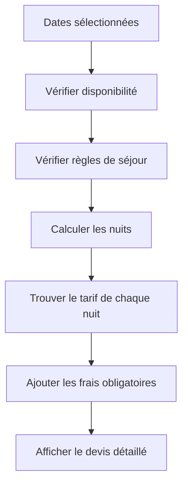
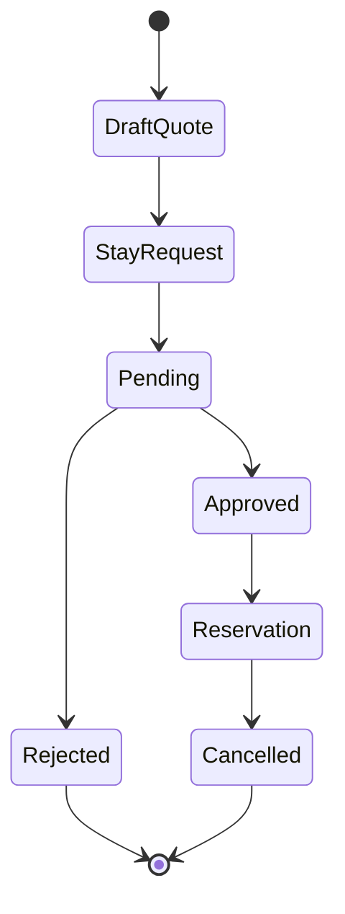

# 03 - Business Rules

## Règles de séjour

| Période | Durée minimum | Arrivée | Départ |
|---|---:|---|---|
| Hors haute saison | 3 nuits | Tous les jours | Tous les jours |
| 14 juin → 28 août | 7 nuits | Samedi | Samedi |

Pendant la période du 14 juin au 28 août, afficher :

> *Les demandes de dérogation à cette règle pourront être étudiées.*

## Tarifs 2025

| Période | Prix / nuit |
|---|---:|
| Basse saison | 400 € |
| 4 juillet → 10 juillet inclus | 450 € |
| 11 juillet → 24 juillet inclus | 500 € |
| 25 juillet → 31 juillet inclus | 550 € |
| 1 août → 14 août inclus | 600 € |
| 15 août → 21 août inclus | 500 € |
| 22 août → 28 août inclus | 450 € |

## Frais

| Frais | Montant | Obligatoire |
|---|---:|---|
| Ménage | 400 € | Oui |

> Challenge PM : modéliser les frais comme des `AdditionalFee` plutôt que coder uniquement `cleaning_fee`. Cela permettra d'ajouter plus tard linge, animal ou autre supplément sans refonte.

## Calcul du devis

## Exemple

Séjour du 9 au 17 juillet :

| Nuit | Date | Tarif |
|---:|---|---:|
| 1 | 9 juillet | 450 € |
| 2 | 10 juillet | 450 € |
| 3 | 11 juillet | 500 € |
| 4 | 12 juillet | 500 € |
| 5 | 13 juillet | 500 € |
| 6 | 14 juillet | 500 € |
| 7 | 15 juillet | 500 € |
| 8 | 16 juillet | 500 € |

Sous-total nuits : 3 900 €  
Ménage : 400 €  
Total : 4 300 €

## Disponibilité

Une date est indisponible si elle appartient à :
- une réservation confirmée ;
- un blocage manuel ;
- une période fermée.

Une demande en attente ne bloque pas les dates.

## Cycle de vie

## Edge cases

| Cas | Règle |
|---|---|
| Deux demandes sur les mêmes dates | Autorisé tant qu'aucune n'est validée |
| Réservation validée | Les dates deviennent indisponibles |
| Arrivée le jour du départ précédent | Autorisé |
| Prix modifié après demande | Le devis de la demande reste figé |
| Prix modifié avant demande | Le nouveau prix s'applique |
| Séjour traversant plusieurs périodes | Addition des prix nuit par nuit |
| Nombre de voyageurs absent | Autorisé en V1 |
| Dates haute saison hors samedi | Refus + message dérogation |
