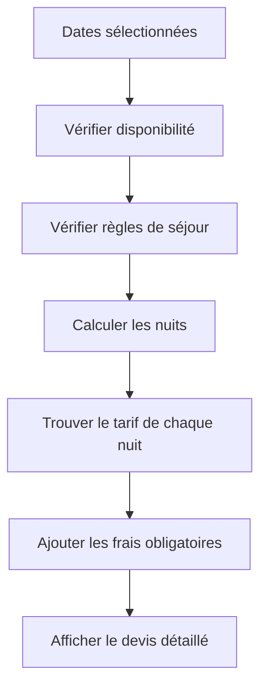
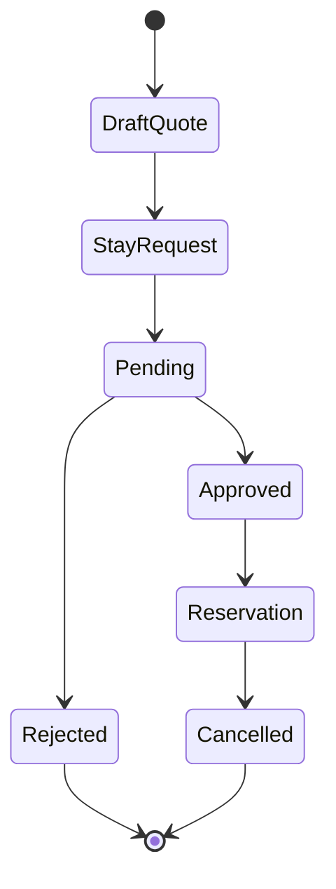

# 03 - Business Rules

## Règles de séjour

| Période | Durée minimum | Arrivée | Départ |
|---|---:|---|---|
| Hors haute saison (règle par défaut) | 3 nuits | Tous les jours | Tous les jours |
| 14 juin → 28 août | 7 nuits | Samedi | Samedi |

Pendant la période du 14 juin au 28 août, afficher :

> *Les demandes de dérogation à cette règle pourront être étudiées.*

Cette note de dérogation est **bilingue FR/EN** et éditable par le propriétaire (voir
« CRUD règles de séjour » ci-dessous) ; elle est renvoyée dans la langue du visiteur sur le
devis (`/quote`) et sur le refus d'une demande de séjour non soumissible.

### CRUD règles de séjour (admin)

Le propriétaire édite ces règles depuis le dashboard (nom, saison optionnelle, durée
minimale, jours d'arrivée/de départ autorisés, note de dérogation bilingue, priorité), sans
toucher à la base :

- **Superposition autorisée entre règles saisonnières** : deux règles saisonnières peuvent
  se chevaucher si leurs **priorités diffèrent** (la règle de plus haute priorité s'applique).
  Le **chevauchement est interdit entre deux règles saisonnières de même priorité** —
  garanti par une **contrainte d'exclusion en base** (PostgreSQL). Un chevauchement de
  même-priorité → **409 CONFLICT**.
- **Exactement une règle par défaut** (la règle sans dates, applicable hors saison) : elle
  est **obligatoire** — une seconde règle par défaut est refusée à la création
  (**409 CONFLICT**), et **la supprimer est également refusé** (**409 CONFLICT**) : sans
  elle, tout séjour hors saison deviendrait soumissible sans aucune contrainte.
- **La nature d'une règle est immuable** : une règle saisonnière ne peut pas être convertie
  en règle par défaut (ni l'inverse) par une modification ultérieure — conséquence directe
  de l'invariant « une seule règle par défaut ». Une tentative de changement de nature est
  refusée (**422 VALIDATION**).
- Les jours d'arrivée/de départ autorisés sont exprimés en entiers **0 à 6, dimanche = 0**.

**Hors périmètre V1** : ces règles ne sont pas encore annoncées au visiteur avant sa
demande (pas d'affichage sur la fiche du bien, pas d'aperçu par dates) ; il les découvre en
les violant, via le message de refus.

## Tarifs 2025

| Période | Prix / nuit |
|---|---:|
| Basse saison | 400 € |
| 4 juillet → 10 juillet inclus | 450 € |
| 11 juillet → 24 juillet inclus | 500 € |
| 25 juillet → 31 juillet inclus | 550 € |
| 1 août → 14 août inclus | 600 € |
| 15 août → 21 août inclus | 500 € |
| 22 août → 28 août inclus | 450 € |

**Règle d'anti-chevauchement** : deux périodes tarifaires ne doivent pas se chevaucher à priorité identique. Cette règle est **garantie par une contrainte d'exclusion en base** (PostgreSQL). Un chevauchement de même-priorité → **409 CONFLICT**.

## Frais

| Frais | Montant | Obligatoire |
|---|---:|---|
| Ménage | 400 € | Oui |

> Challenge PM : modéliser les frais comme des `AdditionalFee` plutôt que coder uniquement `cleaning_fee`. Cela permettra d'ajouter plus tard linge, animal ou autre supplément sans refonte.

## Ajustements

L'administrateur peut appliquer un ajustement de prix (ex : geste commercial −200 €).

- ligne de devis à montant signé (négatif = remise), distincte des frais ;
- action admin uniquement ;
- régénère le devis figé (`QuoteSnapshot`), détail d'origine conservé.

Total = sous-total nuits + frais obligatoires + ajustements.

## Calcul du devis

## Exemple

> Cet exemple illustre uniquement le **calcul tarifaire** (prix nuit par nuit). Les dates choisies ne respectent pas la contrainte arrivée/départ le samedi de la haute saison ; un tel séjour serait refusé par les règles de séjour.

Séjour du 9 au 17 juillet :

| Nuit | Date | Tarif |
|---:|---|---:|
| 1 | 9 juillet | 450 € |
| 2 | 10 juillet | 450 € |
| 3 | 11 juillet | 500 € |
| 4 | 12 juillet | 500 € |
| 5 | 13 juillet | 500 € |
| 6 | 14 juillet | 500 € |
| 7 | 15 juillet | 500 € |
| 8 | 16 juillet | 500 € |

Sous-total nuits : 3 900 €  
Ménage : 400 €  
Total : 4 300 €

## Disponibilité

Une date est indisponible si elle appartient à :
- une réservation confirmée ;
- un blocage manuel ;
- une période fermée ;
- un événement d'un **calendrier externe** synchronisé (Abritel/Vrbo, import iCal) : il bloque les dates au même titre qu'une réservation, sans être une réservation Le 115.

Une demande en attente ne bloque pas les dates.

Côté voyageur, la disponibilité affichée reflète les calendriers externes à la **fraîcheur du dernier sync** (temps réel non garanti côté public).

## Cycle de vie

## Edge cases

| Cas | Règle |
|---|---|
| Deux demandes sur les mêmes dates | Autorisé tant qu'aucune n'est validée |
| Réservation validée | Les dates deviennent indisponibles |
| Réservation sur un calendrier externe (Abritel) | Les dates deviennent indisponibles (bloquées), sans être une réservation Le 115 |
| Validation (approbation) d'une demande | Possible **uniquement après une synchronisation réussie** des calendriers externes activés ; si le sync échoue, la validation est **bloquée** (« sync-avant-validation », anti-sur-réservation) |
| Arrivée le jour du départ précédent | Autorisé |
| Prix modifié après demande | Le devis de la demande reste figé |
| Prix modifié avant demande | Le nouveau prix s'applique |
| Séjour traversant plusieurs périodes | Addition des prix nuit par nuit |
| Nombre de voyageurs absent | Autorisé en V1 |
| Dates haute saison hors samedi | Refus + message dérogation |
