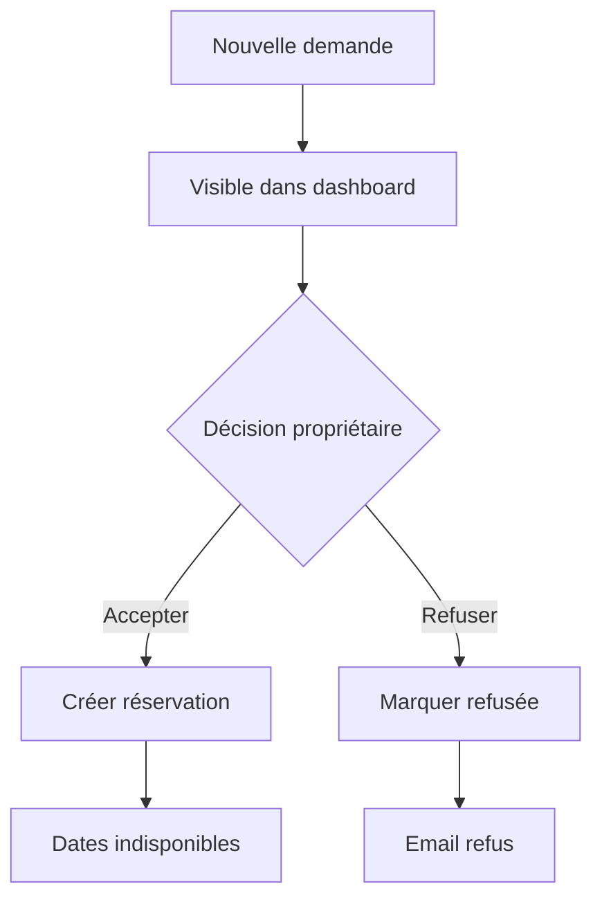

# 04 - Dashboard

## Objectif

Le dashboard permet au propriétaire de gérer l'activité courante du site sans intervention technique.

Le premier écran est une **vue calendrier**, car c'est l'information la plus utile au quotidien.

---

## Navigation admin

| Entrée | Rôle |
|---|---|
| Calendrier | Vue principale, disponibilités, réservations et blocages |
| Demandes | Demandes de séjour à traiter |
| Réservations | Séjours confirmés |
| Tarifs | Périodes tarifaires et frais |
| Maison | Informations principales du bien |
| Contenus | Textes FR / EN |
| Photos | Galerie et photo principale |
| Synchronisations | Imports externes, notamment Abritel / iCal |
| Activité | Journal des actions importantes |

---

## Écran d'accueil dashboard

!!! info "Principe"
    Le dashboard s'ouvre sur le calendrier, avec les demandes en attente visibles sans changer de page.

| Zone | Contenu |
|---|---|
| En-tête | Logo admin, accès compte propriétaire |
| Navigation latérale | Modules du dashboard |
| Zone principale | Calendrier mensuel ou hebdomadaire |
| Colonne / bloc secondaire | Demandes en attente, dernières actions, alertes de synchronisation |


---

## États du calendrier

| État | Couleur suggérée | Bloque la disponibilité |
|---|---|---|
| Disponible | Vert / neutre | Non |
| Demande en attente | Orange | Non |
| Réservé | Rouge | Oui |
| Bloqué | Gris / noir | Oui |

---

## Demandes de séjour

### Liste

Champs affichés :
- nom ;
- email ;
- téléphone ;
- dates ;
- montant ;
- statut ;
- date de création.

### Actions

- voir le détail ;
- accepter ;
- refuser ;
- annuler ;
- ajuster le prix (geste commercial) ;
- ajouter une note interne.

---

## Réservations

Une réservation est créée après acceptation d'une demande ou manuellement depuis le dashboard.

Champs :
- dates ;
- voyageur ;
- montant figé ;
- détail du devis ;
- statut ;
- note interne.

Actions :
- ajuster le prix (geste commercial) ;
- annuler.

Un ajustement régénère le devis figé et fait apparaître la ligne dans le détail.

---

## Tarifs

L'admin peut créer des périodes tarifaires.

| Champ | Exemple | Règle |
|---|---|---|
| Nom | Haute saison août | Libellé interne |
| Début | 01/08/2025 | Date incluse |
| Fin | 14/08/2025 | Date incluse |
| Prix / nuit | 600 € | Montant en euros, stocké en centimes |
| Priorité | 100 | Optionnel, utile pour les exceptions |


Règle V1 :
- deux périodes ne doivent pas se chevaucher à priorité identique ;
- si des priorités sont utilisées, la priorité la plus haute gagne.

---

## Maison / CMS

L'admin peut modifier :
- titre ;
- sous-titre ;
- description ;
- équipements ;
- FAQ ;
- localisation ;
- photos ;
- note affichée ;
- nombre d'avis.

Chaque contenu éditorial existe en FR / EN.


---

## Synchronisations externes

Le calendrier devra probablement se synchroniser avec des réservations provenant d'Abritel.

### Décision V1

La V1 doit prévoir une intégration **iCal en import** afin de récupérer les périodes réservées sur Abritel et de les rendre indisponibles sur le site Le 115.

| Source | Sens | Effet sur le calendrier |
|---|---|---|
| Abritel / iCal | Import | Crée ou met à jour des blocages externes |
| Dashboard Le 115 | Local | Gère demandes, réservations et blocages manuels |

### Règles UX admin

| Cas | Comportement |
|---|---|
| Synchronisation réussie | Afficher date et heure du dernier import |
| Nouvelle réservation Abritel détectée | Dates marquées comme indisponibles |
| Conflit avec une demande en attente | Afficher une alerte admin, sans bloquer l'historique de la demande |
| Erreur de synchronisation | Alerte visible dans le dashboard |

### Hors V1

L'export iCal depuis Le 115 vers d'autres plateformes est utile, mais peut rester en V1.1 si l'import Abritel est prioritaire.

---

## Activité

Journal simple des actions importantes :

```text
Aujourd'hui
- Réservation acceptée : Dupont, 9 → 17 juillet
- Tarif modifié : 1 → 14 août, 600 €
- Photo ajoutée : piscine.jpg
```

---

## Mermaid — workflow admin



---

## TODO

- [ ] Créer l'écran calendrier.
- [ ] Créer la liste des demandes.
- [ ] Créer la fiche demande.
- [ ] Implémenter accepter/refuser.
- [ ] Créer l'éditeur de tarifs.
- [ ] Créer l'éditeur de contenus.
- [ ] Créer le journal d'activité.
