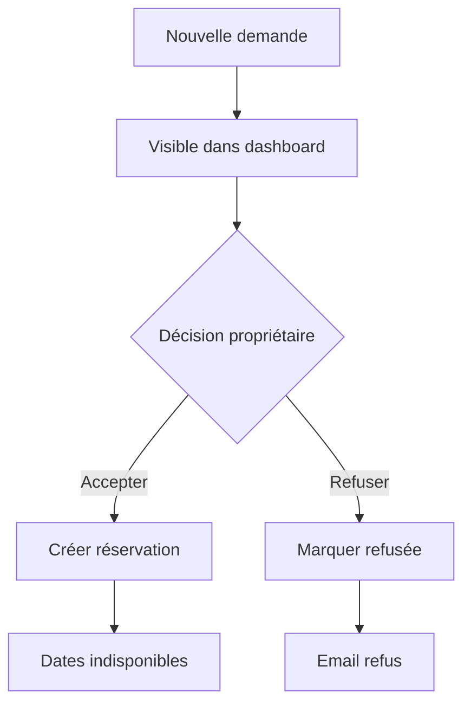

# 04 - Dashboard

## Objectif

Le dashboard permet au propriétaire de gérer l'activité courante du site sans intervention technique.

Le premier écran est une **vue calendrier**, car c'est l'information la plus utile au quotidien.

---

## Navigation admin

```text
Dashboard
├── Calendrier
├── Demandes
├── Réservations
├── Tarifs
├── Maison
├── Contenus
├── Photos
└── Activité
```

---

## Wireframe global

```text
┌─────────────────────────────────────────────────────────────┐
│ Le 115 Admin                              Matthieu ▾        │
├───────────────┬─────────────────────────────────────────────┤
│ Calendrier    │  Juin 2025                                  │
│ Demandes      │                                             │
│ Réservations  │  ┌────┬────┬────┬────┬────┬────┬────┐       │
│ Tarifs        │  │ Lu │ Ma │ Me │ Je │ Ve │ Sa │ Di │       │
│ Maison        │  ├────┼────┼────┼────┼────┼────┼────┤       │
│ Photos        │  │    │    │    │    │    │ R  │ R  │       │
│ Activité      │  │    │ B  │ B  │    │    │ R  │ R  │       │
│               │  └────┴────┴────┴────┴────┴────┴────┘       │
│               │                                             │
│               │  Demandes en attente                        │
│               │  ┌────────────┬────────────┬────────────┐   │
│               │  │ Nom        │ Dates      │ Montant    │   │
│               │  └────────────┴────────────┴────────────┘   │
└───────────────┴─────────────────────────────────────────────┘
```

---

## États du calendrier

| État | Couleur suggérée | Bloque la disponibilité |
|---|---|---|
| Disponible | Vert / neutre | Non |
| Demande en attente | Orange | Non |
| Réservé | Rouge | Oui |
| Bloqué | Gris / noir | Oui |

---

## Demandes de séjour

### Liste

Champs affichés :
- nom ;
- email ;
- téléphone ;
- dates ;
- montant ;
- statut ;
- date de création.

### Actions

- voir le détail ;
- accepter ;
- refuser ;
- annuler ;
- ajouter une note interne.

---

## Réservations

Une réservation est créée après acceptation d'une demande ou manuellement depuis le dashboard.

Champs :
- dates ;
- voyageur ;
- montant figé ;
- détail du devis ;
- statut ;
- note interne.

---

## Tarifs

L'admin peut créer des périodes tarifaires.

```text
┌───────────────────────────────────────────────┐
│ Nouvelle période tarifaire                    │
├───────────────────────────────────────────────┤
│ Nom            [ Haute saison août ]          │
│ Début          [ 01/08/2025 ]                 │
│ Fin incluse    [ 14/08/2025 ]                 │
│ Prix / nuit    [ 600 € ]                      │
│ Priorité       [ 100 ]                        │
│                                               │
│ [ Enregistrer ]                               │
└───────────────────────────────────────────────┘
```

Règle V1 :
- deux périodes ne doivent pas se chevaucher à priorité identique ;
- si des priorités sont utilisées, la priorité la plus haute gagne.

---

## Maison / CMS

L'admin peut modifier :
- titre ;
- sous-titre ;
- description ;
- équipements ;
- FAQ ;
- localisation ;
- photos ;
- note affichée ;
- nombre d'avis.

Chaque contenu éditorial existe en FR / EN / ES.

---

## Activité

Journal simple des actions importantes :

```text
Aujourd'hui
- Réservation acceptée : Dupont, 9 → 17 juillet
- Tarif modifié : 1 → 14 août, 600 €
- Photo ajoutée : piscine.jpg
```

---

## Mermaid — workflow admin



---

## TODO

- [ ] Créer l'écran calendrier.
- [ ] Créer la liste des demandes.
- [ ] Créer la fiche demande.
- [ ] Implémenter accepter/refuser.
- [ ] Créer l'éditeur de tarifs.
- [ ] Créer l'éditeur de contenus.
- [ ] Créer le journal d'activité.
