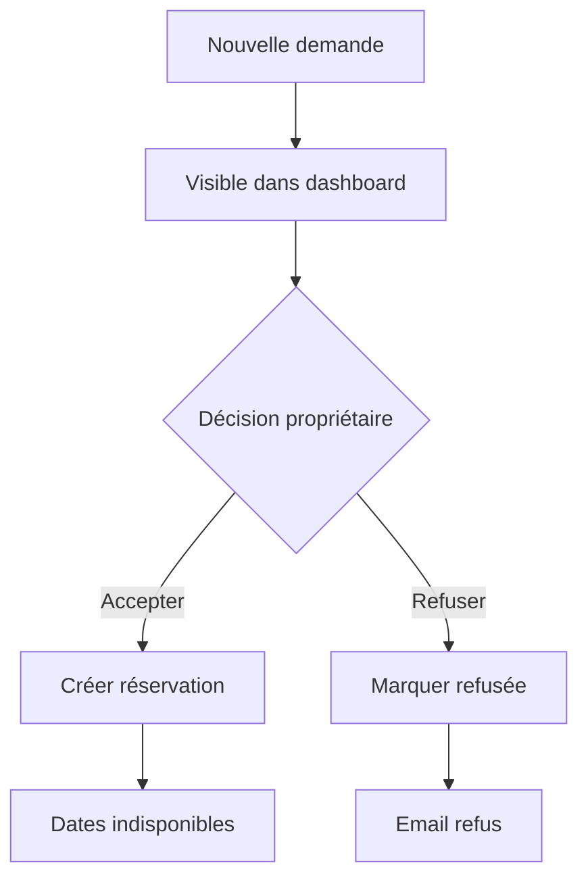

# 04 - Dashboard

## Objectif

Le dashboard permet au propriétaire de gérer l'activité courante du site sans intervention technique.

Il est livré comme une **application front séparée** (SPA, dépôt
`le115-dashboard`), déployée en **même origine** que l'API (cf. DEC-014 dans
`00-Product-Decisions.md`) : pas de CORS, cookie de session `SameSite=Lax`.

Le **périmètre V1 est mono-bien** : le dashboard gère le bien unique servi
par le backend, sans notion de sélection de logement (cf. DEC-015).

Le premier écran est un **Tableau de bord** de synthèse ; le Calendrier
reste l'outil de référence pour le détail des disponibilités, accessible en
un clic depuis la navigation.

---

## Navigation admin

Nav V1 réelle, huit entrées, chrome en français uniquement :

| Entrée | Rôle |
|---|---|
| Tableau de bord | Écran d'accueil : synthèse de l'activité (demandes en attente, dernières actions, alertes de synchronisation) |
| Calendrier | Disponibilités, réservations et blocages |
| Demandes | Demandes de séjour à traiter |
| Réservations | Séjours confirmés |
| Tarifs | Périodes tarifaires et frais |
| Maison | Informations principales du bien (contenus FR/EN, photos) |
| Synchronisations | Imports externes, notamment Abritel / iCal |
| Activité | Journal des actions importantes |

`Contenus` et `Photos` ne sont pas des entrées de navigation séparées : elles
sont couvertes par le module `Maison`.

---

## Écran d'accueil dashboard

!!! info "Principe"
    Le dashboard s'ouvre sur le **Tableau de bord**, avec les demandes en attente visibles sans changer de page. Le Calendrier détaillé est à un clic.

| Zone | Contenu |
|---|---|
| En-tête | Logo admin, accès compte propriétaire |
| Navigation latérale | Modules du dashboard (nav V1, huit entrées) |
| Zone principale | Synthèse de l'activité (indicateurs, aperçu calendrier) |
| Colonne / bloc secondaire | Demandes en attente, dernières actions, alertes de synchronisation |


---

## États du calendrier

| État | Couleur suggérée | Bloque la disponibilité |
|---|---|---|
| Disponible | Vert / neutre | Non |
| Demande en attente | Orange | Non |
| Réservé | Rouge | Oui |
| Bloqué | Gris / noir | Oui |

---

## Demandes de séjour

### Liste

Champs affichés :
- nom ;
- email ;
- téléphone ;
- dates ;
- montant ;
- statut ;
- date de création.

### Actions

- voir le détail ;
- accepter ;
- refuser ;
- annuler ;
- ajuster le prix (geste commercial) ;
- ajouter une note interne.

---

## Réservations

Une réservation est créée après acceptation d'une demande.

!!! note "Reporté post-V1"
    La création manuelle d'une réservation depuis le dashboard (sans passer
    par une demande) est reportée post-V1 — voir « Modules reportés
    post-V1 » plus bas.

Champs :
- dates ;
- voyageur ;
- montant figé ;
- détail du devis ;
- statut ;
- note interne.

Actions :
- ajuster le prix (geste commercial) ;
- annuler.

Un ajustement régénère le devis figé et fait apparaître la ligne dans le détail.

---

## Tarifs

L'admin peut créer des périodes tarifaires.

| Champ | Exemple | Règle |
|---|---|---|
| Nom | Haute saison août | Libellé interne |
| Début | 01/08/2025 | Date incluse |
| Fin | 14/08/2025 | Date incluse |
| Prix / nuit | 600 € | Montant en euros, stocké en centimes |
| Priorité | 100 | Optionnel, utile pour les exceptions |


Règle V1 :
- deux périodes ne doivent pas se chevaucher à priorité identique (garantie par une **contrainte d'exclusion en base**) ;
- si des priorités sont utilisées, la priorité la plus haute gagne.

Un chevauchement de même-priorité déclenche une erreur **409 CONFLICT** au dashboard.

---

## Maison / CMS

L'admin peut modifier :
- titre ;
- sous-titre ;
- description ;
- équipements ;
- FAQ ;
- localisation ;
- photos ;
- note affichée ;
- nombre d'avis.

Chaque contenu éditorial existe en FR / EN.


---

## Synchronisations externes

Le calendrier devra probablement se synchroniser avec des réservations provenant d'Abritel.

### Décision V1

La V1 doit prévoir une intégration **iCal en import** afin de récupérer les périodes réservées sur Abritel et de les rendre indisponibles sur le site Le 115.

| Source | Sens | Effet sur le calendrier |
|---|---|---|
| Abritel / iCal | Import | Crée ou met à jour des blocages externes |
| Dashboard Le 115 | Local | Gère demandes, réservations et blocages manuels |

### Règles UX admin

| Cas | Comportement |
|---|---|
| Synchronisation réussie | Afficher date et heure du dernier import |
| Nouvelle réservation Abritel détectée | Dates marquées comme indisponibles |
| Conflit avec une demande en attente | Afficher une alerte admin, sans bloquer l'historique de la demande |
| Erreur de synchronisation | Alerte visible dans le dashboard |

### Hors V1

L'export iCal depuis Le 115 vers d'autres plateformes est utile, mais peut rester en V1.1 si l'import Abritel est prioritaire.

---

## Activité

Journal simple des actions importantes :

```text
Aujourd'hui
- Réservation acceptée : Dupont, 9 → 17 juillet
- Tarif modifié : 1 → 14 août, 600 €
- Photo ajoutée : piscine.jpg
```

---

## Modules reportés post-V1

Ces modules ont été envisagés en amont mais ne font **pas** partie de la nav
V1 du dashboard livré ; ils impliqueront, s'ils sont un jour retenus, du
backend neuf en plus du front (cf. `../le115-backend/docs/DEBTS.md`) :

| Module | Description |
|---|---|
| Clients | Fiche client transverse (historique multi-séjours) |
| Avis unitaires | Gestion des avis individuels (au-delà de la note/nombre affichés en V1) |
| Messages | Messagerie intégrée avec le voyageur |
| Rapports | Exports et rapports formatés |
| Multi-bien / Logements | Sélection et gestion de plusieurs biens (V1 = mono-bien, cf. DEC-015) |
| Utilisateurs | Gestion de comptes admin multiples, rôles/permissions |
| Paiements | Acompte, paiement en ligne (cf. Roadmap V2) |
| KPI d'agrégation | Occupation, chiffre d'affaires, revenus agrégés sur une période |
| Création manuelle de réservation | Création d'une réservation par l'admin sans passer par une demande |
| Nuits max. | Règle de séjour plafonnant la durée maximale (seule la durée minimum existe en V1) |

---

## Mermaid — workflow admin



---

## TODO

- [ ] Créer l'écran calendrier.
- [ ] Créer la liste des demandes.
- [ ] Créer la fiche demande.
- [ ] Implémenter accepter/refuser.
- [ ] Créer l'éditeur de tarifs.
- [ ] Créer l'éditeur de contenus.
- [ ] Créer le journal d'activité.
