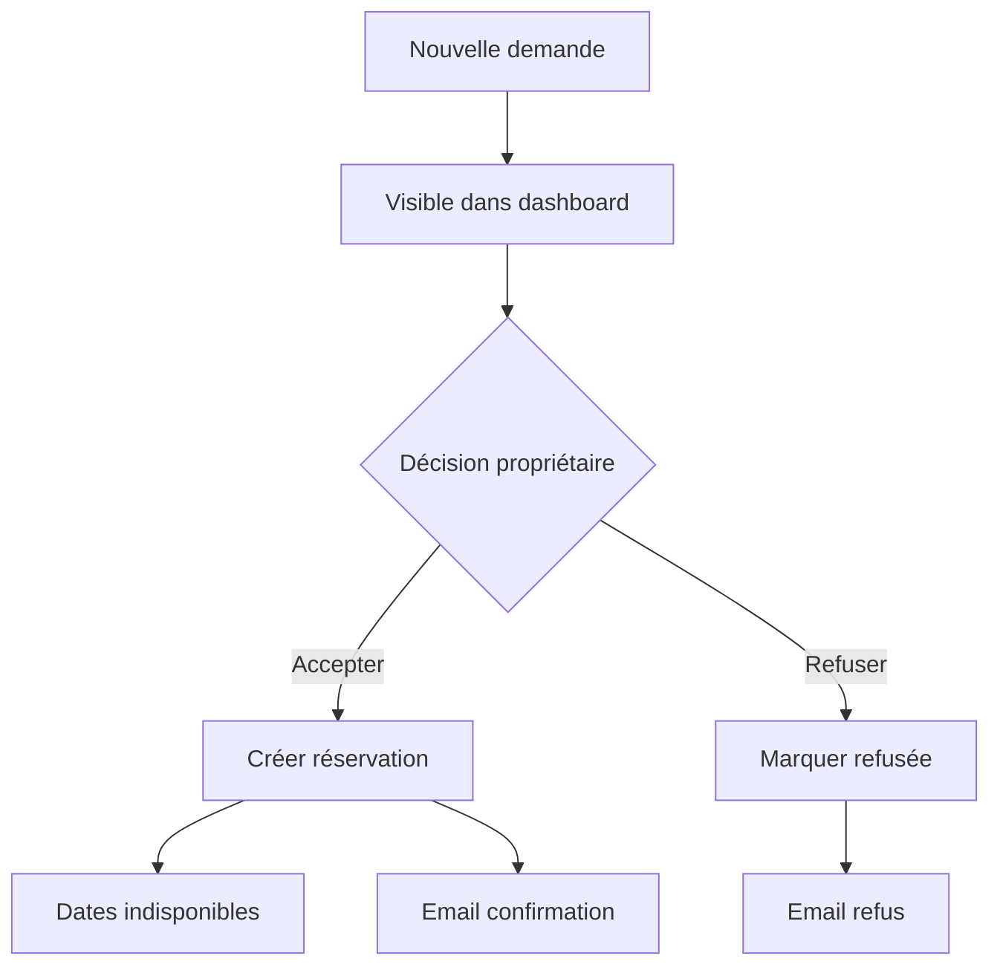

# 04 - Dashboard

## Objectif

Le dashboard permet au propriétaire de gérer l'activité courante du site sans intervention technique.

Il est livré comme une **application front séparée** (SPA, dépôt
`le115-dashboard`), déployée en **même origine** que l'API (cf. DEC-014 dans
`00-Product-Decisions.md`) : pas de CORS, cookie de session `SameSite=Lax`.

Le **périmètre V1 est mono-bien** : le dashboard gère le bien unique servi
par le backend, sans notion de sélection de logement (cf. DEC-015).

Le premier écran est un **Tableau de bord** de synthèse ; le Calendrier
reste l'outil de référence pour le détail des disponibilités, accessible en
un clic depuis la navigation.

---

## Navigation admin

Nav V1 réelle, huit entrées, chrome en français uniquement :

| Entrée | Rôle |
|---|---|
| Tableau de bord | Écran d'accueil : synthèse de l'activité (demandes en attente, dernières actions, alertes de synchronisation) |
| Calendrier | Disponibilités, réservations et blocages |
| Demandes | Demandes de séjour à traiter |
| Réservations | Séjours confirmés |
| Tarifs | Périodes tarifaires et frais |
| Maison | Informations principales du bien (contenus FR/EN, photos) |
| Synchronisations | Imports externes, notamment Abritel / iCal |
| Activité | Journal des actions importantes |

`Contenus` et `Photos` ne sont pas des entrées de navigation séparées : elles
sont couvertes par le module `Maison`.

---

## Écran d'accueil dashboard

!!! info "Principe"
    Le dashboard s'ouvre sur le **Tableau de bord**, avec les demandes en attente visibles sans changer de page. Le Calendrier détaillé est à un clic.

| Zone | Contenu |
|---|---|
| En-tête | Logo admin, accès compte propriétaire |
| Navigation latérale | Modules du dashboard (nav V1, huit entrées) |
| Zone principale | Synthèse de l'activité (indicateurs, aperçu calendrier) |
| Colonne / bloc secondaire | Demandes en attente, dernières actions, alertes de synchronisation |


---

## États du calendrier

| État | Couleur | Bloque la disponibilité |
|---|---|---|
| Disponible | Neutre | Non |
| Réservé | Vert | Oui |
| Bloqué | Gris | Oui |
| Externe | Rouge | Oui |

Le dashboard affiche les **3 types d'occupation** servis par l'API
(`GET /api/admin/calendar`) : **réservé** (vert), **bloqué** (gris),
**externe** (rouge, imports Abritel/iCal) ; le reste est **disponible**. Les
demandes en attente n'apparaissent pas sur le calendrier (elles ne bloquent
pas la disponibilité et vivent dans le module Demandes).

L'admin **bloque une période** via un formulaire **Du / Au** (dates
**inclusives** — « du 15 au 20 » bloque les 6 jours, le 20 compris) + un
motif, et **lève un blocage** en cliquant dessus puis en confirmant. Une
case de réservation renvoie vers la fiche `/reservations/:id`.

---

## Demandes de séjour

### Liste

Champs affichés :
- nom ;
- email ;
- téléphone ;
- dates ;
- montant (issu du devis figé) ;
- statut ;
- date de création.

La liste est triée par date de création décroissante. Le filtre de statut est
porté par l'URL, et ouvre par défaut sur les demandes **en attente**.

### Actions

- voir le détail (dont le devis figé au moment de la soumission) ;
- accepter (crée une réservation confirmée, notifie le voyageur par email dans sa langue) ;
- refuser (notifie le voyageur par email, dans sa langue) ;
- ajouter une note interne.

!!! note "Annuler et ajuster le prix"
    Ces deux actions portent sur une **réservation confirmée**, pas sur une
    demande : elles sont décrites dans la section Réservations. Une demande
    ne peut être qu'acceptée, refusée ou annotée.

---

## Réservations

Une réservation est créée après acceptation d'une demande.

!!! note "Reporté post-V1"
    La création manuelle d'une réservation depuis le dashboard (sans passer
    par une demande) est reportée post-V1 — voir « Modules reportés
    post-V1 » plus bas.

La liste est triée par **date d'arrivée croissante** (séjours à venir en tête)
et filtrable par statut (défaut : **confirmées**). Le détail expose le devis
figé — ajustements compris — et la note interne.

Champs :
- dates ;
- voyageur ;
- montant figé ;
- détail du devis ;
- statut ;
- note interne.

Actions :
- ajuster le prix (geste commercial guidé : sens remise/supplément + montant, régénère le devis figé) ;
- annuler (libère les dates ; aucune notification voyageur en V1) ;
- ajouter une note interne.

---

## Tarifs

L'admin peut créer des périodes tarifaires.

| Champ | Exemple | Règle |
|---|---|---|
| Nom | Haute saison août | Libellé interne |
| Début | 01/08/2025 | Date incluse |
| Fin | 14/08/2025 | Date incluse |
| Prix / nuit | 600 € | Montant en euros, stocké en centimes |
| Priorité | 100 | Optionnel, utile pour les exceptions |


Règle V1 :
- deux périodes ne doivent pas se chevaucher à priorité identique (garantie par une **contrainte d'exclusion en base**) ;
- si des priorités sont utilisées, la priorité la plus haute gagne.

Un chevauchement de même-priorité déclenche une erreur **409 CONFLICT** au dashboard.

Le module **Tarifs** (`/tarifs`) gère deux entités sur une page unique :

**Périodes tarifaires** — nom, dates **du / au inclusives** (`[du, au]`, le
jour « au » est compris), prix par nuit et **priorité** (champ avancé, replié,
défaut 0). Deux périodes ne peuvent se chevaucher **qu'à priorité identique**
(sinon la plus haute l'emporte) ; un chevauchement à priorité égale est refusé
(**409 CONFLICT**). Création, modification et suppression depuis le dashboard ;
les devis déjà figés ne sont pas affectés par une suppression.

**Frais** — code unique (identifiant technique), libellés **FR / EN**, montant,
caractère **obligatoire**, **ordre d'affichage**, et un état **Actif / Inactif**.
Désactiver un frais le retire des nouveaux devis sans le perdre (pause non
destructive) ; on peut aussi le **supprimer** définitivement. Un code déjà
utilisé est refusé (**409 CONFLICT**).

---

## Maison / CMS

L'admin peut modifier :
- titre ;
- sous-titre ;
- description ;
- équipements ;
- FAQ ;
- localisation ;
- photos ;
- note affichée ;
- nombre d'avis.

Chaque contenu éditorial existe en FR / EN.


---

## Synchronisations externes

Le calendrier devra probablement se synchroniser avec des réservations provenant d'Abritel.

### Décision V1

La V1 doit prévoir une intégration **iCal en import** afin de récupérer les périodes réservées sur Abritel et de les rendre indisponibles sur le site Le 115.

| Source | Sens | Effet sur le calendrier |
|---|---|---|
| Abritel / iCal | Import | Crée ou met à jour des blocages externes |
| Dashboard Le 115 | Local | Gère demandes, réservations et blocages manuels |

### Règles UX admin

| Cas | Comportement |
|---|---|
| Synchronisation réussie | Afficher date et heure du dernier import |
| Nouvelle réservation Abritel détectée | Dates marquées comme indisponibles |
| Conflit avec une demande en attente | Afficher une alerte admin, sans bloquer l'historique de la demande |
| Erreur de synchronisation | Alerte visible dans le dashboard |

### Module V1 livré

L'écran **Synchronisations** (`/synchronisations`) est livré en **consultation +
import manuel** : il **liste les sources** de calendrier externe (Abritel /
iCal) avec, pour chacune, le **statut du dernier import** (Succès / Vide ignoré
/ Erreur / Jamais synchronisée), sa **date/heure**, l'éventuel **message
d'erreur**, et un bouton **« Synchroniser maintenant »** qui relance un import à
la demande.

Deux états explicites distinguent l'absence de données : **« Synchronisation
externe non configurée »** (aucune clé de chiffrement côté serveur) et **« Aucune
source de synchronisation »** (service actif, mais rien de configuré).

Les **alertes détaillées** (conflit avec une demande en attente, erreur, sync
vide ignorée) restent servies par le module **Activité** — l'écran
Synchronisations ne les duplique pas.

Sont **reportés** (hors V1) : la création / édition / activation / suppression
d'une source depuis le dashboard, un historique horodaté des imports, un panneau
de conflits avec liens vers les demandes, et toute **synchronisation
périodique** (l'import reste manuel, plus une resynchro automatique avant chaque
approbation de réservation).

### Hors V1

L'export iCal depuis Le 115 vers d'autres plateformes est utile, mais peut rester en V1.1 si l'import Abritel est prioritaire.

---

## Activité

Journal simple des actions importantes :

```text
Aujourd'hui
- Réservation acceptée : Dupont, 9 → 17 juillet
- Tarif modifié : 1 → 14 août, 600 €
- Photo ajoutée : piscine.jpg
```

L'écran **Activité** (`/activite`) affiche, en **lecture seule**, le journal
servi par l'API (`GET /api/admin/activity-log`) : les entrées sont **groupées
par jour** (en-têtes « Aujourd'hui », « Hier », puis la date, en heure
d'Europe/Paris), du plus récent au plus ancien, chacune portant un **badge de
catégorie** (Demande, Réservation, Calendrier, Tarif, Contenu, Sync, Alerte).
Un bouton **« Voir plus »** charge davantage d'entrées (plafond 500).

En V1, une entrée n'est pas cliquable vers l'élément concerné : le journal ne
transporte pas de référence machine, seulement un message déjà rédigé.

Le message met en avant des **noms/titres lisibles** (nom du voyageur, nom de
la période tarifaire, motif du blocage, catégorie de la photo), suivis de
l'**identifiant court** de l'entité entre parenthèses (les huit premiers
caractères de l'UUID, par exemple `(réservation a1b2c3d4)`). Aucun UUID complet
n'est exposé. Exemples de messages tels qu'ils apparaissent :

```text
Demande de Camille Fabre approuvée → réservation confirmée (2026-08-08 → 2026-08-15) (réservation a1b2c3d4)
Blocage « Entretien de la piscine » créé (2026-10-01 → 2026-10-04) (blocage f7e8d9c0)
Photo « exterieur » ajoutée (photo 5c6d7e8f)
```

---

## Modules reportés post-V1

Ces modules ont été envisagés en amont mais ne font **pas** partie de la nav
V1 du dashboard livré ; ils impliqueront, s'ils sont un jour retenus, du
backend neuf en plus du front (cf. `../le115-backend/docs/DEBTS.md`) :

| Module | Description |
|---|---|
| Clients | Fiche client transverse (historique multi-séjours) |
| Avis unitaires | Gestion des avis individuels (au-delà de la note/nombre affichés en V1) |
| Messages | Messagerie intégrée avec le voyageur |
| Rapports | Exports et rapports formatés |
| Multi-bien / Logements | Sélection et gestion de plusieurs biens (V1 = mono-bien, cf. DEC-015) |
| Utilisateurs | Gestion de comptes admin multiples, rôles/permissions |
| Paiements | Acompte, paiement en ligne (cf. Roadmap V2) |
| KPI d'agrégation | Occupation, chiffre d'affaires, revenus agrégés sur une période |
| Création manuelle de réservation | Création d'une réservation par l'admin sans passer par une demande |
| Nuits max. | Règle de séjour plafonnant la durée maximale (seule la durée minimum existe en V1) |

---

## Mermaid — workflow admin


```mermaid
flowchart TD
    A[Nouvelle demande] --> B[Visible dans dashboard]
    B --> C{Décision propriétaire}
    C -->|Accepter| D[Créer réservation]
    C -->|Refuser| E[Marquer refusée]
    D --> F[Dates indisponibles]
    D --> H[Email confirmation]
    E --> G[Email refus]
```

---

## TODO

- [x] Créer la liste des demandes.
- [x] Créer la fiche demande.
- [x] Implémenter accepter/refuser (et la note interne).
- [x] Créer la liste des réservations (tri par arrivée, filtre de statut).
- [x] Créer la fiche réservation (devis figé + note interne).
- [x] Implémenter annuler et ajuster le prix.
- [x] Créer l'écran calendrier (grille mensuelle, blocages manuels).
- [x] Créer l'éditeur de tarifs.
- [ ] Créer l'éditeur de contenus.
- [x] Créer le journal d'activité.
