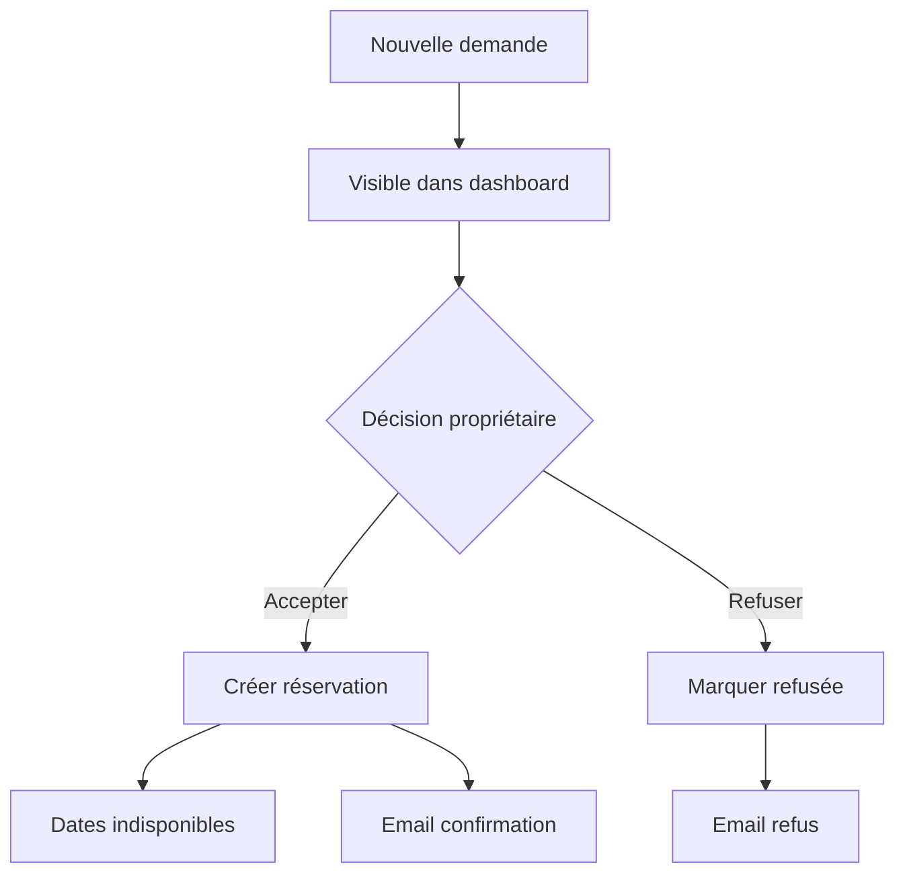

# 04 - Dashboard

## Objectif

Le dashboard permet au propriétaire de gérer l'activité courante du site sans intervention technique.

Il est livré comme une **application front séparée** (SPA, dépôt
`le115-dashboard`), déployée en **même origine** que l'API (cf. DEC-014 dans
`00-Product-Decisions.md`) : pas de CORS, cookie de session `SameSite=Lax`.

Le **périmètre V1 est mono-bien** : le dashboard gère le bien unique servi
par le backend, sans notion de sélection de logement (cf. DEC-015).

Le premier écran est un **Tableau de bord** de synthèse ; le Calendrier
reste l'outil de référence pour le détail des disponibilités, accessible en
un clic depuis la navigation.

---

## Navigation admin

Nav V1 réelle, douze entrées, chrome en français uniquement :

| Entrée | Rôle |
|---|---|
| Tableau de bord | Écran d’accueil : quatre cartes — demandes en attente, arrivées et départs, dernières actions, état des synchronisations (cf. DEC-018) |
| Calendrier | Disponibilités, réservations et blocages |
| Demandes | Demandes de séjour à traiter |
| Réservations | Séjours confirmés |
| Tarifs | Périodes tarifaires et frais |
| Règles de séjour | Durée minimale, jours d’arrivée et de départ, saisons |
| Maison | Informations principales du bien FR/EN |
| Équipements | Liste ordonnée des équipements du bien, bilingue FR/EN |
| FAQ | Liste ordonnée de questions/réponses, bilingue FR/EN |
| Photos | Galerie ordonnée, catégories, photo principale, alt FR/EN |
| Synchronisations | Imports externes, notamment Abritel / iCal |
| Activité | Journal des actions importantes |

`Photos`, `Équipements` et `FAQ` ont chacun leur propre entrée de navigation
— ce ne sont plus des sections de `Maison` (cf. DEC-016 et DEC-017 dans
`00-Product-Decisions.md`).

---

## Écran d'accueil dashboard

!!! info "Principe"
    Le dashboard s'ouvre sur le **Tableau de bord**, avec les demandes en attente visibles sans changer de page. Le Calendrier détaillé est à un clic.

Le tableau de bord est un **poste de pilotage** : il répond à « qu’est-ce qui
m’attend », pas à « comment se porte l’affaire ». Il ne porte **aucun
indicateur d’agrégation** (cf. DEC-018).

Quatre cartes, en grille :

| Carte | Contenu | Mène à |
|---|---|---|
| Demandes en attente | les cinq plus récentes (nom, dates, montant) ; le compteur porte le total | la fiche de la demande |
| Arrivées et départs | les cinq prochains mouvements des séjours confirmés, départ avant arrivée à date égale | la fiche de la réservation ; le lien de pied ouvre le calendrier |
| Dernières actions | les dix dernières entrées du journal, avec leur badge de catégorie | le journal complet |
| Synchronisations | chaque source avec son statut, et une **pastille de tête** verte / ambre / rouge | le module Synchronisations |

La carte Synchronisations ne disparaît jamais : un état calme n’est pas une
alerte permanente, c’est la confirmation que l’import a tourné — ce qu’on veut
savoir avant d’accepter une demande. Le niveau affiché est le **pire** parmi les
sources **activées** : une source désactivée est un choix, pas une panne, et
n’entre pas dans le calcul. L’ambre couvre deux cas — une source **jamais
importée**, et un import **« vide ignoré »** (le garde-fou anti-effacement du
backend a refusé un import vide) : dans les deux, le calendrier externe peut
être périmé. La pastille disparaît aussi quand **toutes les sources
configurées sont désactivées** : la carte continue de lister ces sources
avec leur badge de statut, mais comme aucune n’est activée, il n’y a rien à
surveiller — même absence de pastille que la synchronisation externe **pas
configurée**, pour la même raison, mais un état différent (des sources
existent, elles sont juste toutes mises en pause). Enfin, quand la
synchronisation externe n’est **pas configurée**, la carte reste grise et
**sans pastille** : il n’y a rien à surveiller.

Chaque carte charge, échoue et se vide **indépendamment** : une panne d’un
endpoint n’emporte jamais les trois autres cartes.


---

## États du calendrier

| État | Couleur | Bloque la disponibilité |
|---|---|---|
| Disponible | Neutre | Non |
| Réservé | Vert | Oui |
| Bloqué | Gris | Oui |
| Externe | Rouge | Oui |

Le dashboard affiche les **3 types d'occupation** servis par l'API
(`GET /api/admin/calendar`) : **réservé** (vert), **bloqué** (gris),
**externe** (rouge, imports Abritel/iCal) ; le reste est **disponible**. Les
demandes en attente n'apparaissent pas sur le calendrier (elles ne bloquent
pas la disponibilité et vivent dans le module Demandes).

L'admin **bloque une période** via un formulaire **Du / Au** (dates
**inclusives** — « du 15 au 20 » bloque les 6 jours, le 20 compris) + un
motif, et **lève un blocage** en cliquant dessus puis en confirmant. Une
case de réservation renvoie vers la fiche `/reservations/:id`.

---

## Demandes de séjour

### Liste

Champs affichés :
- nom ;
- email ;
- téléphone ;
- dates ;
- montant (issu du devis figé) ;
- statut ;
- date de création.

La liste est triée par date de création décroissante. Le filtre de statut est
porté par l'URL, et ouvre par défaut sur les demandes **en attente**.

### Actions

- voir le détail (dont le devis figé au moment de la soumission) ;
- accepter (crée une réservation confirmée, notifie le voyageur par email dans sa langue) ;
- refuser (notifie le voyageur par email, dans sa langue) ;
- ajouter une note interne.

!!! note "Annuler et ajuster le prix"
    Ces deux actions portent sur une **réservation confirmée**, pas sur une
    demande : elles sont décrites dans la section Réservations. Une demande
    ne peut être qu'acceptée, refusée ou annotée.

---

## Réservations

Une réservation est créée après acceptation d'une demande.

!!! note "Reporté post-V1"
    La création manuelle d'une réservation depuis le dashboard (sans passer
    par une demande) est reportée post-V1 — voir « Modules reportés
    post-V1 » plus bas.

La liste est triée par **date d'arrivée croissante** (séjours à venir en tête)
et filtrable par statut (défaut : **confirmées**). Le détail expose le devis
figé — ajustements compris — et la note interne.

Champs :
- dates ;
- voyageur ;
- montant figé ;
- détail du devis ;
- statut ;
- note interne.

Actions :
- ajuster le prix (geste commercial guidé : sens remise/supplément + montant, régénère le devis figé ;
  une remise est bornée au total courant, refusée si elle le dépasserait) ;
- annuler (libère les dates ; aucune notification voyageur en V1) ;
- ajouter une note interne.

---

## Tarifs

L'admin peut créer des périodes tarifaires.

| Champ | Exemple | Règle |
|---|---|---|
| Nom | Haute saison août | Libellé interne |
| Début | 01/08/2025 | Date incluse |
| Fin | 14/08/2025 | Date incluse |
| Prix / nuit | 600 € | Montant en euros, stocké en centimes |
| Priorité | 100 | Optionnel, utile pour les exceptions |


Règle V1 :
- deux périodes ne doivent pas se chevaucher à priorité identique (garantie par une **contrainte d'exclusion en base**) ;
- si des priorités sont utilisées, la priorité la plus haute gagne.

Un chevauchement de même-priorité déclenche une erreur **409 CONFLICT** au dashboard.

Le module **Tarifs** (`/tarifs`) réunit trois sections sur une page unique :

**Prix de base** — le tarif de repli, appliqué à toute nuit qu’aucune période
ci-dessous ne couvre. Il vit **en tête de la page**, au-dessus des périodes qui
le surchargent, pour qu’on le modifie en voyant ce qui le rend sans effet.
C’est une colonne de `property` (`base_nightly_price_cents`), éditée par la
même route partielle `PATCH /api/admin/property` que l’**Identité du bien**
sur l’écran Maison (cf. « Identité du bien » ci-dessous) : un seul champ
euros, positif, converti en centimes.

**Périodes tarifaires** — nom, dates **du / au inclusives** (`[du, au]`, le
jour « au » est compris), prix par nuit et **priorité** (champ avancé, replié,
défaut 0). Deux périodes ne peuvent se chevaucher **qu'à priorité identique**
(sinon la plus haute l'emporte) ; un chevauchement à priorité égale est refusé
(**409 CONFLICT**). Création, modification et suppression depuis le dashboard ;
les devis déjà figés ne sont pas affectés par une suppression.

**Frais** — code unique (identifiant technique), libellés **FR / EN**, montant,
caractère **obligatoire**, **ordre d'affichage**, et un état **Actif / Inactif**.
Désactiver un frais le retire des nouveaux devis sans le perdre (pause non
destructive) ; on peut aussi le **supprimer** définitivement. Un code déjà
utilisé est refusé (**409 CONFLICT**).

---

## Règles de séjour

Écran `/regles-de-sejour`. Le propriétaire édite ici la durée minimale de séjour, les jours d’arrivée et de départ
autorisés, la note de dérogation bilingue et la priorité de chaque règle.

**Aperçu de l’année.** Une frise couvrant une année civile, avec un sélecteur `‹ 2026 ›`,
montre la règle par défaut en socle pleine largeur et chaque saison posée dessus, triées par
priorité décroissante. Les bandes se **superposent** : l’écran ne calcule jamais quelle règle
l’emporte à une date donnée, il l’énonce en légende (« la règle de plus haute priorité
l’emporte sur la date d’arrivée »). La résolution reste au serveur, seul endroit où elle est
implémentée.

Les règles portent des dates **absolues**, pas des récurrences : la haute saison de l’année
suivante doit être re-datée à la main. Le sélecteur d’année sert précisément à rendre cet
oubli visible — une année sans saison affiche « Aucune saison définie pour 2027 : la règle par
défaut s’applique toute l’année. »

**La règle par défaut a un statut particulier**, hérité des invariants métier : elle est
unique et obligatoire. L’écran ne permet donc **ni de la créer ni de la supprimer** — sa ligne
porte un badge « Par défaut » et n’offre pas l’action de suppression, et la modale de création
ne propose que des saisons. Elle se modifie, sans champs de dates : sa nature est immuable.

**Jours autorisés.** Sept cases par groupe, lundi en tête. Une phrase sous les cases dit ce
que l’œil ne devine pas : aucune case cochée signifie « aucune restriction, tous les jours »,
et non « aucun jour ».

---

## Maison / CMS

L’écran **Maison** (`/maison`) réunit les informations principales du bien.
Équipements, FAQ (cf. DEC-016) puis Photos (cf. DEC-017), autrefois envisagées
ou livrées comme des sections de cet écran, en sont sorties pour devenir des
modules à part entière ; `Maison` se limite désormais, et définitivement, aux
informations du bien.

### Informations du bien

Titre, sous-titre, description et localisation (FR/EN), saisis **côte à
côte** : une traduction anglaise manquante est signalée, sans bloquer — le
site public retombe alors sur le français. S’y ajoutent la **note affichée**
(0 à 5) et le **nombre d'avis**. On modifie librement puis on **enregistre**
; seuls les champs réellement modifiés sont transmis. Une note déjà
enregistrée peut être **changée mais pas effacée**.

Les photos ne sont plus une extension de cet écran : elles ont leur propre
écran et leur propre entrée de menu, décrits dans la section **Photos**
ci-dessous.

### Identité du bien

Depuis le 2026-08-21, l’écran **Maison** porte aussi la **fiche du bien**
elle-même — les colonnes non traduites de `property`, distinctes du contenu
FR/EN ci-dessus : **nom**, **accroche**, **adresse** et **capacité
d’accueil** (`max_guests`). `slug` et **devise** restent affichés en lecture
seule, sans champ de saisie — le premier est dupliqué par la configuration du
serveur, la seconde réinterpréterait rétroactivement tous les montants déjà
stockés en centimes. Un seul `PATCH /api/admin/property` partiel porte cette
section et, depuis la même route, la section **Prix de base** de l’écran
Tarifs (ci-dessus).

Le nom est **obligatoire** ; en dessous de 1, la capacité est refusée
(**422 VALIDATION**). **Baisser la capacité sous l’effectif d’une réservation
déjà confirmée et non terminée est accepté, jamais refusé** — `max_guests`
gouverne les demandes à venir, une réservation confirmée est un engagement
pris — et la réponse **signale** le nombre de séjours concernés sans bloquer
l’enregistrement ; ce signalement est **aveugle aux réservations saisies à la
main**, qui n’ont pas de demande d’origine et donc pas d’effectif connu
(DEC-028). L’adresse exacte n’est **jamais affichée au visiteur** : le site
public situe la maison par son secteur (champ **Localisation** ci-dessus) et
l’adresse complète part par email une fois le séjour confirmé (DEC-022).

---

## Équipements

L’écran **Équipements** (`/equipements`) est un module à part entière,
accessible par sa propre entrée de menu — ce n’est plus une section de
Maison (cf. DEC-016).

Liste ordonnée — l'ordre est celui du site public, réglé par des **flèches
monter / descendre**. Un équipement porte un **code** (identifiant technique,
unique : un doublon est refusé), une **icône choisie dans un catalogue fermé**
et un **libellé FR/EN**.

Catalogue d'icônes V1 (vocabulaire que le site public doit savoir dessiner),
dans l'ordre du sélecteur : « aucune » (valeur vide), puis `pool`, `wifi`,
`parking`, `ac`, `heating`, `kitchen`, `dishwasher`, `washer`, `tv`, `bbq`,
`garden`, `bike`, `pets`, `baby`, `bathtub`, `cleaning`.

Le catalogue est **fermé côté serveur** : une icône qui n'y figure pas est
refusée en `422 VALIDATION`, pas seulement grisée dans le dashboard.

---

## FAQ

L’écran **FAQ** (`/faq`) est, de la même façon, un module à part entière,
accessible par sa propre entrée de menu — ce n’est plus une section de
Maison (cf. DEC-016). Liste ordonnée de questions/réponses bilingues, même
mécanique de réordonnancement et d’édition que les équipements.

Cette séparation ne concerne que le dashboard admin : côté site public, le
payload `GET /api/public/property` continue de porter équipements et FAQ
ensemble ; l’opportunité d’une page FAQ publique dédiée reste une question
ouverte, à trancher quand le site visiteur sera cadré.

---

## Photos

L’écran **Photos** (`/photos`) est, à son tour, un module à part entière,
accessible par sa propre entrée de menu plutôt que par une seconde section de
`Maison` (cf. DEC-017).

La grille affiche les photos dans l’**ordre du site public**, réglé par des
**flèches monter / descendre** ; ces flèches sont **masquées dès qu’un filtre
de catégorie est actif**, car déplacer une photo d’un cran n’aurait pas de
sens dans une vue partielle — le réordonnancement porte sur l’ordre global du
bien. Le filtre lui-même parcourt le **catalogue fermé de cinq catégories** :
Extérieur, Intérieur, Chambres, Salles de bain, Autre.

Chaque photo porte une **catégorie** (obligatoire, dans ce même catalogue),
un **texte alternatif bilingue FR/EN** et le statut de **photo principale** —
une seule à la fois par bien : la définir sur une nouvelle photo retire
automatiquement l’ancienne.

L’ajout se fait **en lot** : plusieurs fichiers choisis en une fois, rattachés
à une **catégorie commune** choisie avant l’envoi (modifiable ensuite photo
par photo) ; les textes alternatifs, eux, restent à compléter individuellement
après coup. Formats acceptés : **JPEG et PNG** uniquement, jusqu’à **20 Mo**
par photo et **8000 px** maximum par côté. Un fichier hors de ces bornes est
écarté avec un message explicite nommant le fichier et la raison, sans
empêcher l’envoi du reste du lot.

---

## Synchronisations externes

Le calendrier devra probablement se synchroniser avec des réservations provenant d'Abritel.

### Décision V1

La V1 doit prévoir une intégration **iCal en import** afin de récupérer les périodes réservées sur Abritel et de les rendre indisponibles sur le site Le 115.

| Source | Sens | Effet sur le calendrier |
|---|---|---|
| Abritel / iCal | Import | Crée ou met à jour des blocages externes |
| Dashboard Le 115 | Local | Gère demandes, réservations et blocages manuels |

### Règles UX admin

| Cas | Comportement |
|---|---|
| Synchronisation réussie | Afficher date et heure du dernier import |
| Nouvelle réservation Abritel détectée | Dates marquées comme indisponibles |
| Conflit avec une demande en attente | Afficher une alerte admin, sans bloquer l'historique de la demande |
| Erreur de synchronisation | Alerte visible dans le dashboard |

### Module V1 livré

L'écran **Synchronisations** (`/synchronisations`) est livré en **consultation +
import manuel** : il **liste les sources** de calendrier externe (Abritel /
iCal) avec, pour chacune, le **statut du dernier import** (Succès / Vide ignoré
/ Erreur / Jamais synchronisée), sa **date/heure**, l'éventuel **message
d'erreur**, et un bouton **« Synchroniser maintenant »** qui relance un import à
la demande.

Deux états explicites distinguent l'absence de données : **« Synchronisation
externe non configurée »** (aucune clé de chiffrement côté serveur) et **« Aucune
source de synchronisation »** (service actif, mais rien de configuré).

Les **alertes détaillées** (conflit avec une demande en attente, erreur, sync
vide ignorée) restent servies par le module **Activité** — l'écran
Synchronisations ne les duplique pas.

Sont **reportés** (hors V1) : la création / édition / activation / suppression
d'une source depuis le dashboard, un historique horodaté des imports, un panneau
de conflits avec liens vers les demandes, et toute **synchronisation
périodique** (l'import reste manuel, plus une resynchro automatique avant chaque
approbation de réservation).

### Hors V1

L'export iCal depuis Le 115 vers d'autres plateformes est utile, mais peut rester en V1.1 si l'import Abritel est prioritaire.

---

## Activité

Journal simple des actions importantes :

```text
Aujourd'hui
- Réservation acceptée : Dupont, 9 → 17 juillet
- Tarif modifié : 1 → 14 août, 600 €
- Photo ajoutée : piscine.jpg
```

L'écran **Activité** (`/activite`) affiche, en **lecture seule**, le journal
servi par l'API (`GET /api/admin/activity-log`) : les entrées sont **groupées
par jour** (en-têtes « Aujourd'hui », « Hier », puis la date, en heure
d'Europe/Paris), du plus récent au plus ancien, chacune portant un **badge de
catégorie** (Demande, Réservation, Calendrier, Tarif, Contenu, Sync, Alerte).
Un bouton **« Voir plus »** charge davantage d'entrées (plafond 500).

En V1, une entrée n'est pas cliquable vers l'élément concerné : le journal ne
transporte pas de référence machine, seulement un message déjà rédigé.

Le message met en avant des **noms/titres lisibles** (nom du voyageur, nom de
la période tarifaire, motif du blocage, catégorie de la photo), suivis de
l'**identifiant court** de l'entité entre parenthèses (les huit premiers
caractères de l'UUID, par exemple `(réservation a1b2c3d4)`). Aucun UUID complet
n'est exposé. Exemples de messages tels qu'ils apparaissent :

```text
Demande de Camille Fabre approuvée → réservation confirmée (2026-08-08 → 2026-08-15) (réservation a1b2c3d4)
Blocage « Entretien de la piscine » créé (2026-10-01 → 2026-10-04) (blocage f7e8d9c0)
Photo « Extérieur » ajoutée (photo 5c6d7e8f)
```

---

## Modules reportés post-V1

Ces modules ont été envisagés en amont mais ne font **pas** partie de la nav
V1 du dashboard livré ; ils impliqueront, s'ils sont un jour retenus, du
backend neuf en plus du front (cf. `../le115-backend/docs/DEBTS.md`) :

| Module | Description |
|---|---|
| Clients | Fiche client transverse (historique multi-séjours) |
| Avis unitaires | Gestion des avis individuels (au-delà de la note/nombre affichés en V1) |
| Messages | Messagerie intégrée avec le voyageur |
| Rapports | Exports et rapports formatés |
| Multi-bien / Logements | Sélection et gestion de plusieurs biens (V1 = mono-bien, cf. DEC-015) |
| Utilisateurs | Gestion de comptes admin multiples, rôles/permissions |
| Paiements | Acompte, paiement en ligne (cf. Roadmap V2) |
| KPI d'agrégation | Occupation, chiffre d'affaires, revenus agrégés sur une période |
| Création manuelle de réservation | Création d'une réservation par l'admin sans passer par une demande |
| Nuits max. | Règle de séjour plafonnant la durée maximale (seule la durée minimum existe en V1) |

---

## Mermaid — workflow admin


```mermaid
flowchart TD
    A[Nouvelle demande] --> B[Visible dans dashboard]
    B --> C{Décision propriétaire}
    C -->|Accepter| D[Créer réservation]
    C -->|Refuser| E[Marquer refusée]
    D --> F[Dates indisponibles]
    D --> H[Email confirmation]
    E --> G[Email refus]
```

---

## TODO

- [x] Créer la liste des demandes.
- [x] Créer la fiche demande.
- [x] Implémenter accepter/refuser (et la note interne).
- [x] Créer la liste des réservations (tri par arrivée, filtre de statut).
- [x] Créer la fiche réservation (devis figé + note interne).
- [x] Implémenter annuler et ajuster le prix.
- [x] Créer l'écran calendrier (grille mensuelle, blocages manuels).
- [x] Créer l'éditeur de tarifs.
- [x] Créer l’éditeur de contenus texte : informations du bien, équipements et
      FAQ sont livrés, désormais sur trois écrans distincts (`/maison`,
      `/equipements`, `/faq`).
- [x] Créer l'éditeur de photos.
- [x] Créer le journal d'activité.
