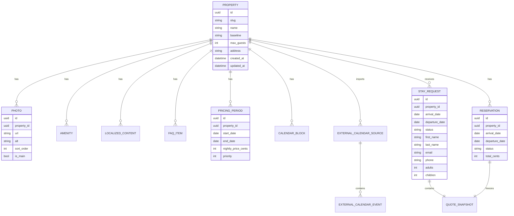
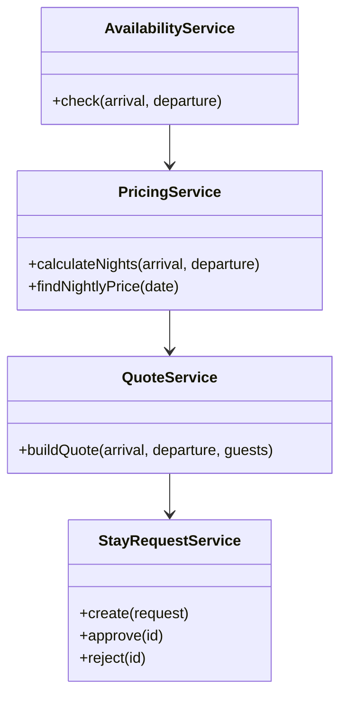

# 05 - Data Model

## Objectif

Définir un modèle métier simple mais suffisamment propre pour éviter les refontes rapides.

La V1 ne gère qu'une seule maison, mais le modèle conserve l'entité `Property`.

---

## Vue d'ensemble

---

## Entités principales

### Property

Représente la maison.

Même si une seule maison existe en V1, cette entité évite de disperser les paramètres globaux.

### LocalizedContent

Contenus éditoriaux traduits.

Champs recommandés :
- `entity_type`
- `entity_id`
- `locale`
- `field`
- `value`

Cette approche évite de créer des colonnes comme `title_fr` et `title_en` sur chaque table métier.

### Photo

Photo affichée sur le site.

Responsabilités :
- URL ;
- ordre ;
- photo principale ;
- texte alternatif.

### Amenity

Équipement affiché sur le site.

Exemples :
- Piscine
- Wifi
- Parking
- Garage vélo
- Climatisation

### FAQItem

Question / réponse affichée sur la landing.

Chaque question est traduisible.

### PricingPeriod

Définit un prix par nuit sur une période.

V1 :
- prix fixe par nuit ;
- priorité prévue pour gérer plus tard exceptions / promotions.

### AdditionalFee

Frais additionnel.

V1 :
- ménage : 400 €.

Modèle générique afin de pouvoir ajouter plus tard linge, animal, chauffage piscine, etc.

### StayRequest

Demande envoyée par un voyageur.

Ne bloque pas les dates.

### Reservation

Séjour validé par le propriétaire.

Bloque les dates.

### ExternalCalendarSource

Source de calendrier externe importée dans Le 115.

Exemple V1 probable : URL iCal Abritel.

Champs recommandés :
- `provider` (`abritel`, `ical`) ;
- `name` ;
- `ical_url` chiffrée ou stockée de manière sécurisée ;
- `enabled` ;
- `last_sync_at` ;
- `last_sync_status` ;
- `last_error`.

### ExternalCalendarEvent

Événement importé depuis une source externe.

Responsabilités :
- bloquer les dates correspondantes ;
- conserver l'identifiant externe si disponible ;
- permettre la mise à jour ou la suppression lors des imports suivants.

Un événement externe n'est pas une réservation Le 115 : c'est un blocage de disponibilité issu d'une autre plateforme.

### QuoteSnapshot

Capture du devis au moment de la demande ou de la validation.

Important : si les prix changent plus tard, l'ancien devis reste inchangé.

---

## Diagramme métier

---

## Règle importante

Le devis (`Quote`) est un objet métier calculé.

Le snapshot (`QuoteSnapshot`) est une version persistée du devis.
