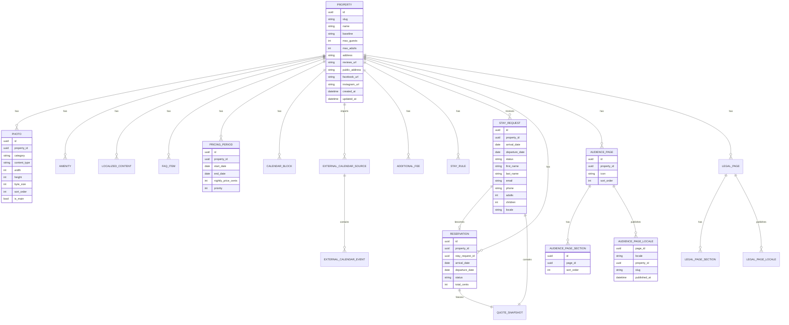
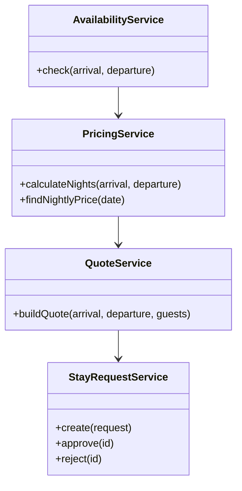

# 05 - Data Model

## Objectif

Définir un modèle métier simple mais suffisamment propre pour éviter les refontes rapides.

La V1 ne gère qu'une seule maison, mais le modèle conserve l'entité `Property`.

---

## Vue d'ensemble

```mermaid
erDiagram
    PROPERTY ||--o{ PHOTO : has
    PROPERTY ||--o{ AMENITY : has
    PROPERTY ||--o{ LOCALIZED_CONTENT : has
    PROPERTY ||--o{ FAQ_ITEM : has
    PROPERTY ||--o{ PRICING_PERIOD : has
    PROPERTY ||--o{ CALENDAR_BLOCK : has
    PROPERTY ||--o{ EXTERNAL_CALENDAR_SOURCE : imports
    PROPERTY ||--o{ ADDITIONAL_FEE : has
    PROPERTY ||--o{ STAY_RULE : has
    PROPERTY ||--o{ STAY_REQUEST : receives
    PROPERTY ||--o{ RESERVATION : has
    PROPERTY ||--o{ AUDIENCE_PAGE : has
    AUDIENCE_PAGE ||--o{ AUDIENCE_PAGE_SECTION : has
    AUDIENCE_PAGE ||--o{ AUDIENCE_PAGE_LOCALE : publishes
    PROPERTY ||--o{ LEGAL_PAGE : has
    LEGAL_PAGE ||--o{ LEGAL_PAGE_SECTION : has
    LEGAL_PAGE ||--o{ LEGAL_PAGE_LOCALE : publishes
    STAY_REQUEST ||--o| RESERVATION : becomes
    EXTERNAL_CALENDAR_SOURCE ||--o{ EXTERNAL_CALENDAR_EVENT : contains

    STAY_REQUEST ||--|| QUOTE_SNAPSHOT : contains
    RESERVATION ||--|| QUOTE_SNAPSHOT : freezes

    PROPERTY {
        uuid id
        string slug
        string name
        string baseline
        int max_guests
        int max_adults
        string address
        string reviews_url
        string public_address
        string facebook_url
        string instagram_url
        datetime created_at
        datetime updated_at
    }

    PHOTO {
        uuid id
        uuid property_id
        string category
        string content_type
        int width
        int height
        int byte_size
        int sort_order
        bool is_main
    }

    PRICING_PERIOD {
        uuid id
        uuid property_id
        date start_date
        date end_date
        int nightly_price_cents
        int priority
    }

    STAY_REQUEST {
        uuid id
        uuid property_id
        date arrival_date
        date departure_date
        string status
        string first_name
        string last_name
        string email
        string phone
        int adults
        int children
        string locale
    }

    RESERVATION {
        uuid id
        uuid property_id
        uuid stay_request_id
        date arrival_date
        date departure_date
        string status
        int total_cents
    }

    AUDIENCE_PAGE {
        uuid id
        uuid property_id
        string icon
        int sort_order
    }

    AUDIENCE_PAGE_SECTION {
        uuid id
        uuid page_id
        int sort_order
    }

    AUDIENCE_PAGE_LOCALE {
        uuid page_id
        string locale
        uuid property_id
        string slug
        datetime published_at
    }
```

---

## Entités principales

### Property

Représente la maison.

Même si une seule maison existe en V1, cette entité évite de disperser les paramètres globaux.

Colonnes non traduites ajoutées par B1 (DEC-035), toutes `text NOT NULL DEFAULT ''` —
la chaîne vide dit « non renseigné », comme pour `reviews_url` :
- `public_address` : l'**adresse affichée** sur le site, sans numéro de rue (DEC-022
  amendée), 200 caractères au plus. Jamais déduite de `address`, l'adresse exacte, qui
  n'est exposée par aucune route publique. Vide : le site affiche le secteur ;
- `facebook_url`, `instagram_url` : vides, ou une URL `https` sur `facebook.com` /
  `instagram.com` (règle tenue par l'application, pas par une contrainte de base).

Colonne ajoutée par B2b (DEC-037) :
- `max_adults` : `int NULL`, **adultes au plus**. `NULL` : aucune limite (le comportement
  d'avant B2b) ; la migration ne la remplit pas. Contrainte de base
  `property_max_adults_check` : `NULL`, ou entre 1 et `max_guests` — elle double la
  validation de l'application (qui rend un `422` nommé) pour qu'aucun chemin (psql, seed,
  écriture concurrente) ne laisse une limite qu'aucun devis ne pourrait satisfaire. Aucun
  âge n'y est attaché : elle borne les adultes que le visiteur déclare.

### LocalizedContent

Contenus éditoriaux traduits (modèle EAV).

Champs :
- `entity_type` : type d'entité (`property`, `amenity`, `faq_item`, `photo`, `additional_fee`,
  `stay_rule`, `audience_page`, `audience_page_section`, `legal_page`, `legal_page_section`,
  `highlight`)
- `entity_id` : UUID de l'entité
- `locale` : `fr` ou `en`
- `field` : clé du champ (voir ci-dessous)
- `value` : contenu texte

Champs par entité :

| entity_type | field | Exemple |
|---|---|---|
| `property` | `title` | « La Provençale » |
| `property` | `subtitle` | « Maison d'exception » |
| `property` | `description` | « Au cœur de la Provence... » |
| `property` | `location` | « Luberon » |
| `amenity` | `label` | « Wifi haute vitesse » |
| `highlight` | `label` | « Cour intérieure » / « Inner courtyard » |
| `faq_item` | `question` | « Puis-je amener un animal ? » |
| `faq_item` | `answer` | « Oui, chiens et chats bienvenus. » |
| `photo` | `alt` | « Vue de la piscine » |
| `additional_fee` | `label` | « Ménage » / « Cleaning » |
| `stay_rule` | `derogation_note` | « Hors samedi : nous contacter. » / « Outside Saturdays: please contact us. » |
| `audience_page` | `nav_label` | « Familles » / « Families » |
| `audience_page` | `title` | « La maison en famille » |
| `audience_page` | `intro` | « Une cour close, une piscine... » |
| `audience_page_section` | `heading` | « Pour les enfants » |
| `audience_page_section` | `body` | « La cour est close et **sans vis-à-vis**. » — Markdown restreint (DEC-036) |
| `legal_page` | `title` | « Mentions légales » / « Legal notice » |
| `legal_page_section` | `heading` | « Éditeur du site » |
| `legal_page_section` | `body` | Le texte de la section, en Markdown restreint (DEC-036) ; une ligne vide sépare deux paragraphes |

Cette approche évite de créer des colonnes comme `title_fr` et `title_en` sur chaque table métier.

### Photo

Photo affichée sur le site.

Responsabilités :
- catégorie (enum fixe V1 : `exterieur`, `interieur`, `chambres`, `salles-de-bain`, `autre`) ;
- dimensions (`width`, `height`, `byte_size`) et format (`content_type` : JPEG ou PNG) ;
- ordre d'affichage ;
- photo principale (une seule par bien via `is_main` unique) ;
- texte alternatif bilingue via `localized_content` (`entity_type='photo'`, `field='alt'`, `locale` en `fr`/`en`).

**Pas de colonne `url`** : les URLs sont calculées à partir de l'id photo (`/api/public/media/{id}`) et
permettent le service avec variantes responsive (widths 400/800/1600/original).

### Amenity

Équipement affiché sur le site.

Exemples :
- Piscine
- Wifi
- Parking
- Garage vélo
- Climatisation

### Highlight

Atout du **bandeau** de l'accueil (DEC-037) : une arche et un libellé, composés par la
propriétaire.

Colonnes : `id`, `property_id` (`ON DELETE CASCADE`), `icon` (`text NOT NULL`, jamais
vide — un code du catalogue d'icônes, qui comprend `guests`, réservé aux atouts),
`sort_order` (ordre d'affichage). Index `highlight_property_idx (property_id, sort_order)`.
Le libellé vit dans `localized_content` (`entity_type='highlight'`, `field='label'`), comme
celui d'un équipement ; l'anglais vide retombe sur le français à la lecture.

- **Six au plus par bien**, règle tenue par l'application (et éprouvée par un test), pas
  par une contrainte de base.
- **Naissance par déclencheur.** Un bien reçoit ses six atouts de la maquette (Cour
  intérieure, Piscine, 12 couchages, Chambres climatisées, Commerces de qualité, 4 salles de
  bain) à son insertion — `AFTER INSERT` sur `property`, même patron que les pages légales
  — et, une fois, au passage de la migration pour les biens déjà là. La pose est
  idempotente : un bien qui a déjà au moins un atout n'en reçoit pas, et une liste que la
  propriétaire a vidée n'est jamais re-remplie.
- **Écriture entière** : la liste reçue remplace l'existante, dans l'ordre reçu ; un atout
  absent du corps est supprimé avec ses libellés.

### FAQItem

Question / réponse affichée sur la landing.

Chaque question est traduisible.

### AudiencePage / AudiencePageSection / AudiencePageLocale

Pages « pour qui » du site public (« Familles », « Cyclistes »…), éditables et
créables depuis le dashboard (DEC-032) — ce ne sont **pas** des colonnes de
`Property` : un agrégat à elles, publié langue par langue.

`AudiencePage` :
- `icon` (catalogue fermé propre aux pages, dix-sept codes — distinct de celui
  des équipements, qui n'a pas `guests`) ;
- `sort_order`.

`AudiencePage` ne porte plus de `slug` : l'adresse d'une page est désormais un
contenu **par langue** (DEC-033), portée par `AudiencePageLocale`.

`AudiencePageSection` : les paragraphes de la page, une table fille — pas un
document JSONB par langue, pour rester fidèle à la convention EAV du projet.
Chaque section a son `sort_order`.

`AudiencePageLocale` : une ligne `(page_id, locale, slug, published_at)` par
langue — **la ligne ne signifie plus « publiée » mais « la page a une identité
dans cette langue »**. Le `slug` (unique par bien et par langue, minuscules/
chiffres/tirets, refusé s'il appartient à la liste des routes fixes du site
public — dans les deux langues) vit ici, et `published_at`, **nullable**, est
seul à porter la publication : une langue qui a un slug mais aucun
`published_at` reste un brouillon. **Aucun repli** : une page publiée en
français seulement rend un 404 sur son adresse anglaise, jamais le texte
français (DEC-032). Une langue ne se publie pas tant qu'un champ requis — le
slug (DEC-033), le libellé d'onglet, le titre, le chapeau, ou l'intitulé/le
corps d'une section — est vide, ni tant que la page n'a aucune section.

Les textes (`nav_label`, `title`, `intro` de la page ; `heading`, `body` de
chaque section) vivent dans `LocalizedContent`, comme le reste de l'éditorial
— voir la table ci-dessus. La suppression d'une page cascade ses sections et
ses lignes de publication ; les lignes `LocalizedContent`, polymorphes et sans
clé étrangère, sont supprimées par l'application dans la même transaction.

Le `body` d'une section est du **Markdown restreint** (DEC-036) : gras, italique, liens
(`https://`, `/fr/`, `/en/`, `mailto:`), listes à puces ou numérotées sur un niveau. Il est
validé à l'écriture ; tout le reste est refusé (`422 RICH_TEXT_INVALID`). Les autres champs
(`nav_label`, `title`, `intro`, `heading`) restent du texte simple.

### LegalPage / LegalPageSection / LegalPageLocale

Les trois pages légales du site (DEC-035) : mentions légales, confidentialité et
cookies, conditions de location. Un agrégat **propre**, sur le patron des pages
d'audience sans en être une variante : une page légale n'a ni slug, ni icône, ni
libellé d'onglet, ni place dans le menu, et ne se crée ni ne se supprime.

`LegalPage` :
- `kind` : `legal-notice`, `privacy` ou `rental-terms` — liste **fermée** (contrainte
  `CHECK`), unique par bien. Le `kind` désigne la page dans l'API ; il n'y a pas d'`id`
  côté contrat ;
- `updated_at` : avance à chaque écriture du **contenu**, et seulement à celle-là (publier
  ne change pas le texte) ; le site l'affiche (« Mis à jour le … »).

**Trois lignes par bien, créées par migration** — ni création ni suppression par l'API.
Elles naissent d'un déclencheur `AFTER INSERT` sur `property` : un bien créé plus tard
(base neuve, environnement de test) reçoit lui aussi ses trois pages et leurs brouillons,
non publiés. Aucune migration ne crée la ligne `property`, d'où le déclencheur plutôt
qu'une insertion ponctuelle.

Le texte des brouillons vit dans une fonction SQL (`legal_page_drafts`, migration 00024).
La migration 00025 la remplace pour ajouter, au marqueur « Adresse » des mentions légales,
une mise en garde (l'adresse de l'éditeur peut être un domicile) ; elle ne corrige les pages
existantes que si leur texte est encore exactement le brouillon d'origine.

`LegalPageSection` : les paragraphes de la page, une table fille ordonnée par
`sort_order`, supprimée en cascade avec sa page.

`LegalPageLocale` : une ligne `(page_id, locale, published_at)` par langue, présente dès
la création de la page. `published_at`, **nullable**, est **seul** porteur de la
publication, avec la même sémantique que `AudiencePageLocale`. **Aucun repli** de langue.

Les textes (`title` de la page ; `heading`, `body` de chaque section) vivent dans
`LocalizedContent`. Le `body` est du **Markdown restreint**, validé à l'écriture
(DEC-036, voir les pages d'audience) ; `title` et `heading` restent du texte simple.
Règles de complétude et d'écriture (DEC-035) :
- une langue est **complète** quand elle a un titre, au moins une section, et l'intitulé
  comme le corps de chaque section — le corps se juge sur son **texte extrait**, pas sur le
  Markdown brut (DEC-036) ;
- elle ne se publie pas tant qu'elle est incomplète (`PAGE_INCOMPLETE`) ni tant qu'un
  texte contient le marqueur des brouillons **« À COMPLÉTER »** (`PLACEHOLDER_REMAINING`) —
  reconnu sans égard à la casse ni aux accents, avec des frontières de mot ;
- une écriture qui rendrait ainsi **impubliable une langue publiée** est **refusée** et
  n'écrit rien, au lieu de la dépublier comme le fait une page d'audience ;
- les six adresses publiques sont réservées aux pages d'audience (`SLUG_RESERVED`), et la
  migration refuse de s'appliquer si une page d'audience en occupe déjà une.

### PricingPeriod

Définit un prix par nuit sur une période.

V1 :
- prix fixe par nuit ;
- priorité prévue pour gérer plus tard exceptions / promotions.

### AdditionalFee

Frais additionnel.

V1 :
- ménage : 400 €.

Modèle générique afin de pouvoir ajouter plus tard linge, animal, chauffage piscine, etc.

Libellé localisé FR/EN via `localized_content` (`entity_type='additional_fee'`, `field='label'`, `locale` en `fr`/`en`).

### StayRule

Règle de séjour applicable à une période.

Champs :
- `start_date` / `end_date` (nulles = règle par défaut) ;
- `min_nights` ;
- `allowed_checkin_dows` / `allowed_checkout_dows` (jours d'arrivée / de départ autorisés,
  entiers `0`–`6`, dimanche = `0`) ;
- `priority`.

La note de dérogation n'est **pas** une colonne de `stay_rule` : elle vit dans
`localized_content` (`entity_type='stay_rule'`, `field='derogation_note'`, `locale` en
`fr`/`en`), comme les autres textes bilingues du modèle.

V1 :
- basse saison (règle par défaut) : 3 nuits, arrivée/départ tous les jours ;
- 14 juin → 28 août : 7 nuits, arrivée/départ le samedi, avec message de dérogation bilingue.

La règle applicable est celle de plus haute priorité dont la période contient la date d'arrivée.

**Invariants garantis en base :**
- **Anti-chevauchement à priorité identique** entre règles saisonnières : contrainte
  d'exclusion PostgreSQL `stay_rule_no_overlap` (`gist`, sur `property_id`, `priority`,
  `daterange(start_date, end_date, '[]')`), n'affectant que les règles saisonnières
  (`start_date IS NOT NULL`). Deux règles saisonnières peuvent en revanche se **superposer**
  si leurs priorités diffèrent (la plus haute gagne).
- **Une seule règle par défaut** par bien : index unique partiel `stay_rule_one_default`
  sur `(property_id) WHERE start_date IS NULL`. Cette règle est obligatoire (non
  supprimable) : sans elle, tout séjour hors saison serait soumissible sans contrainte.
- **Nature d'une règle immuable** : une règle saisonnière ne devient jamais une règle par
  défaut (ni l'inverse) après création — conséquence de l'invariant précédent.

### StayRequest

Demande envoyée par un voyageur.

Ne bloque pas les dates.

Mémorise la `locale` choisie par le voyageur (`fr` par défaut, ou `en`) au moment de la
demande. Cette langue sert à localiser l'email de refus envoyé au voyageur si le propriétaire
rejette la demande (le devis lui-même reste indépendant de la locale, figé dans
`QuoteSnapshot`).

### Reservation

Séjour validé par le propriétaire.

Bloque les dates.

### ExternalCalendarSource

Source de calendrier externe importée dans Le 115.

Exemple V1 probable : URL iCal Abritel.

Champs recommandés :
- `provider` (`abritel`, `ical`) ;
- `name` ;
- `ical_url` chiffrée ou stockée de manière sécurisée ;
- `enabled` ;
- `last_sync_at` ;
- `last_sync_status` ;
- `last_error`.

### ExternalCalendarEvent

Événement importé depuis une source externe.

Responsabilités :
- bloquer les dates correspondantes ;
- conserver l'identifiant externe si disponible ;
- permettre la mise à jour ou la suppression lors des imports suivants.

Un événement externe n'est pas une réservation Le 115 : c'est un blocage de disponibilité issu d'une autre plateforme.

### QuoteSnapshot

Capture du devis au moment de la demande ou de la validation.

Le snapshot inclut le détail des nuits, les frais et d'éventuels ajustements admin (montant signé, négatif = remise). Un ajustement régénère un nouveau snapshot en conservant le détail d'origine.

Important : si les prix changent plus tard, l'ancien devis reste inchangé.

### Reservation ↔ StayRequest

Une réservation issue d'une demande référence celle-ci via `stay_request_id`. Ce lien est nul pour une réservation créée manuellement depuis le dashboard.

---

## Diagramme métier

```mermaid
classDiagram
    class AvailabilityService {
        +check(arrival, departure)
    }

    class PricingService {
        +calculateNights(arrival, departure)
        +findNightlyPrice(date)
    }

    class QuoteService {
        +buildQuote(arrival, departure, guests)
    }

    class StayRequestService {
        +create(request)
        +approve(id)
        +reject(id)
    }

    AvailabilityService --> PricingService
    PricingService --> QuoteService
    QuoteService --> StayRequestService
```

---

## Règle importante

Le devis (`Quote`) est un objet métier calculé.

Le snapshot (`QuoteSnapshot`) est une version persistée du devis.
