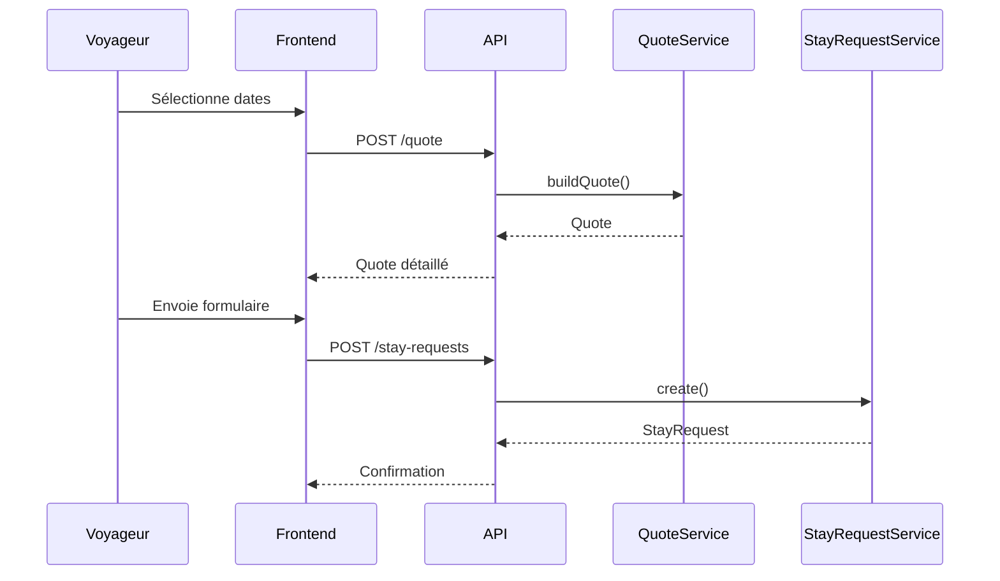

# 06 - API

## Objectif

Décrire les endpoints REST nécessaires à la V1.

Les noms sont indicatifs, mais doivent rester orientés métier.

---

## Public API

### GET /api/public/property

Retourne les informations publiques de la maison enrichies et localisées.

Query :
- `locale=fr|en` (défaut : `fr`, fallback sur `fr` si locale non disponible)

Response `200` :

```json
{
  "title": "La Provençale",
  "subtitle": "Maison d'exception",
  "description": "Au cœur de la Provence...",
  "location": "Luberon",
  "rating": 4.8,
  "reviewCount": 42,
  "amenities": [
    { "id": "...", "code": "wifi", "icon": "📡", "label": "Wifi haute vitesse" }
  ],
  "faq": [
    { "id": "...", "question": "Puis-je amener mon chien ?", "answer": "Oui, chiens bienvenus." }
  ],
  "photos": [
    {
      "id": "...",
      "category": "exterieur",
      "alt": "Vue de la façade principale",
      "isMain": true,
      "variants": [
        { "width": 400, "url": "/api/public/media/.../400" },
        { "width": 800, "url": "/api/public/media/.../800" },
        { "width": 1600, "url": "/api/public/media/.../1600" }
      ],
      "originalUrl": "/api/public/media/.../original",
      "originalWidth": 2400,
      "originalHeight": 1800
    }
  ]
}
```

**Rupture de compatibilité** : l'endpoint ne retourne plus `name` ni `baseline` (remplacés par `title` et `subtitle` localisés).

### GET /api/public/media/{id}

Sert le binaire d'une photo ou sa variante responsive.

Query :
- `w` : largeur souhaitée (`400`, `800`, `1600`, ou `original` ; défaut : `original`)

Response `200` : binaire JPEG ou PNG (Content-Type: `image/jpeg` ou `image/png`).

Notes :
- Pas d'upscale : si `w` dépasse la largeur native, retourne l'original.
- Cache immuable (`Cache-Control: public, max-age=31536000, immutable`).
- En dehors du rate limiting public.

Erreurs : `404` si la photo n'existe pas, si `w` n'est pas reconnu (les variantes < source width
seulement), **ou** si `{id}` n'est pas un identifiant valide — le visiteur ne doit pas pouvoir
distinguer « identifiant malformé » d'« identifiant inexistant ».

### GET /api/public/availability

Retourne les disponibilités sur une période.

Query :
- `from`
- `to`

### POST /api/public/quote

Calcule un devis. Le devis est **toujours recalculé côté serveur** (aucun montant client n'est accepté).

Body :

```json
{
  "arrival": "2026-07-04",
  "departure": "2026-07-11",
  "adults": 4,
  "children": 2,
  "locale": "fr"
}
```

Response `200` :

```json
{
  "nights": 7,
  "breakdown": [
    { "date": "2026-07-04", "priceCents": 30000 }
  ],
  "subtotalCents": 210000,
  "fees": [
    { "code": "cleaning", "amountCents": 12000, "label": "Ménage" }
  ],
  "adjustments": [],
  "totalCents": 222000,
  "appliedRule": "Haute saison",
  "submittable": true,
  "errors": []
}
```

- `locale` : optionnel (défaut `fr`), détermine la langue des libellés des frais (fallback `fr` si locale non disponible).
- `fees[].label` : libellé du frais résolu dans la locale demandée, à titre informatif (le calcul du montant est inchangé).

- `submittable` : `false` si le devis viole une règle (durée min, jour d'arrivée/départ, dates dans le passé, voyageurs > max). Le devis reste **affichable** mais non soumissible ; `errors[]` porte alors les codes concernés (voir *Erreurs*).
- `POST /quote` ne vérifie **pas** la disponibilité (prix pur) ; celle-ci est contrôlée à la soumission.
- Champs de date au format ISO `AAAA-MM-JJ`. « Aujourd'hui » est évalué en Europe/Paris.

### POST /api/public/stay-requests

Crée une demande de séjour. Le serveur **re-vérifie les règles et la disponibilité** et **recalcule le devis** avant de persister ; le devis est **figé** (`quote_snapshot`) sur la demande.

Body :
- `arrival`, `departure` (ISO) ;
- `firstName`, `lastName`, `email` (**requis, adresse valide**), `phone` ;
- `adults`, `children` (optionnels) ;
- `message` ;
- `locale` : optionnel (défaut `fr`, comme `/quote`), détermine la langue de la note de
  dérogation renvoyée dans `details[]` si la demande est refusée pour violation d'une règle
  de séjour (fallback `fr` si locale non disponible).

Response `201` : `{ "id": "...", "quote": { ... } }` (le devis figé).

Erreurs possibles : `422 VALIDATION` (devis non soumissible, `details` = codes, avec la note
de dérogation localisée le cas échéant), `409 DATES_UNAVAILABLE` (dates indisponibles),
`400 INVALID_REQUEST` (email manquant/invalide, dates invalides, corps invalide).

---

## Admin API

Toutes les routes admin (hors `login`) exigent une **session authentifiée**. L'authentification se fait par **cookie de session opaque HttpOnly** (compte propriétaire unique, seedé — pas d'inscription). Sans session valide → `401 UNAUTHORIZED`. Sur toute route portant un paramètre `{id}`, un identifiant qui n'est pas un UUID valide renvoie `400 INVALID_REQUEST` (et non une erreur de base de données).

### POST /api/admin/login

Connexion propriétaire. Body `{ "email", "password" }`. Succès → `204` + cookie de session (`HttpOnly`, `SameSite=Lax`, `Secure` en production). Identifiants invalides → `401 UNAUTHORIZED` (message générique, sans distinguer email inconnu et mot de passe faux). Endpoint **rate-limité**.

### POST /api/admin/logout

Déconnexion : invalide la session et efface le cookie. → `204`.

### GET /api/admin/me

Retourne le propriétaire de la session courante (`{ "email" }`). Protégé.

### GET /api/admin/calendar

Retourne les réservations, demandes et blocages.

### GET /api/admin/stay-requests

Liste les demandes.

### GET /api/admin/stay-requests/{id}

Détail d'une demande.

### POST /api/admin/stay-requests/{id}/approve

Accepte une demande et crée une réservation.

### POST /api/admin/stay-requests/{id}/reject

Refuse une demande.

### GET /api/admin/reservations

Liste les réservations.

### POST /api/admin/calendar-blocks

Bloque une période.

### DELETE /api/admin/calendar-blocks/{id}

Supprime un blocage. Succès → `204`. `{id}` inexistant → `404 NOT_FOUND` (aucune entrée n'est
journalisée pour un blocage qui n'a jamais existé). `{id}` n'est pas un identifiant valide →
`400 INVALID_REQUEST`, comme tout paramètre de route admin nommé `id`.

### GET /api/admin/sync-sources

Liste les sources de synchronisation externes configurées.

Exemple : Abritel via URL iCal.

### POST /api/admin/sync-sources

Ajoute une source de synchronisation externe.

Body :
- `provider` : `abritel` ou `ical` ;
- `name` ;
- `icalUrl` ;
- `enabled`.

### POST /api/admin/sync-sources/{id}/run

Déclenche manuellement une synchronisation.

### GET /api/admin/sync-runs

Liste les derniers imports, leur statut et les erreurs éventuelles.

### GET /api/admin/pricing-periods

Liste les périodes tarifaires.

### POST /api/admin/pricing-periods

Crée une période.

### PATCH /api/admin/pricing-periods/{id}

Modifie une période.

### DELETE /api/admin/pricing-periods/{id}

Supprime une période.

### GET /api/admin/fees

Liste les frais additionnels.

### POST /api/admin/fees

Crée un frais additionnel avec libellé bilingue.

Body :
- `code` : identifiant unique du frais ;
- `amountCents` : montant en centimes ;
- `label` : `{ "fr": "...", "en": "..." }`.

Erreur : `409 CONFLICT` si le code existe déjà.

### PATCH /api/admin/fees/{id}

Modifie un frais (partiel : seuls les champs présents sont mis à jour).

Body (tous optionnels) :
- `label` : `{ "fr": "...", "en": "..." }` ;
- `amountCents`.

Response `200`.

### DELETE /api/admin/fees/{id}

Supprime un frais.

Response `204`.

### GET /api/admin/stay-rules

Liste les règles de séjour.

Response `200` :

```json
[
  {
    "id": "...",
    "name": "Haute saison",
    "from": "2026-06-14",
    "to": "2026-08-28",
    "minNights": 7,
    "allowedCheckinDows": [6],
    "allowedCheckoutDows": [6],
    "derogationNote": { "fr": "Hors samedi : nous contacter.", "en": "Outside Saturdays: please contact us." },
    "priority": 10,
    "isDefault": false
  }
]
```

- `from`/`to` à `null` ⇒ règle par défaut (`isDefault: true`).
- `allowedCheckinDows`/`allowedCheckoutDows` : entiers `0`–`6`, dimanche = `0`.

### POST /api/admin/stay-rules

Crée une règle de séjour. Body : mêmes champs que la réponse (hors `id`/`isDefault` :
`from`/`to` absents ou `null` ⇒ règle par défaut).

Response `201` : `{ "id": "..." }`.

Erreurs :
- `422 VALIDATION` : nom vide, `minNights` hors `1`–`365`, un seul de `from`/`to` fourni,
  `to < from`, jour hors `0`–`6`.
- `409 CONFLICT` : chevauchement avec une règle saisonnière existante de **même priorité**
  (la superposition est autorisée entre règles de priorités différentes) ; ou tentative de
  créer une **seconde règle par défaut** (une seule autorisée par bien).

### PATCH /api/admin/stay-rules/{id}

Modifie une règle de séjour (partiel : seuls les champs présents sont mis à jour).

Body (tous optionnels) : `name`, `from`, `to`, `minNights`, `allowedCheckinDows`,
`allowedCheckoutDows`, `derogationNote`, `priority`.

Response `204`.

Erreurs :
- `422 VALIDATION` : mêmes règles qu'à la création, plus le refus d'un changement de
  **nature** de la règle (convertir une règle saisonnière en règle par défaut, ou l'inverse).
- `409 CONFLICT` : chevauchement à priorité identique avec une autre règle.
- `404 NOT_FOUND` : identifiant inconnu.

### DELETE /api/admin/stay-rules/{id}

Supprime une règle de séjour.

Response `204`.

Erreurs :
- `409 CONFLICT` : la règle visée est **la règle par défaut** — elle ne peut pas être
  supprimée (elle est obligatoire ; sans elle, tout séjour hors saison serait soumissible
  sans aucune contrainte).
- `404 NOT_FOUND` : identifiant inconnu.

### GET /api/admin/content

Retourne le contenu éditorial bilingue : `rating`, `reviewCount`, `title/subtitle/description/location` en `{fr,en}`, `amenities[]` (`id`, `code`, `icon`, `label{fr,en}`), `faq[]` (`id`, `question{fr,en}`, `answer{fr,en}`).

### PATCH /api/admin/content

Met à jour les champs éditoriaux property (`title/subtitle/description/location` en `{fr,en}`) + `rating` (0–5) + `reviewCount` (≥0).

**Partiel** : seuls les champs présents dans le corps de la requête sont mis à jour ; les champs omis (y compris `rating`/`reviewCount`) restent inchangés. Chaque champ localisé, quand il est fourni, doit porter les deux locales `{fr,en}`.

### POST /api/admin/amenities

Crée un équipement (libellé bilingue).

### PATCH /api/admin/amenities/{id}

Modifie un équipement.

### DELETE /api/admin/amenities/{id}

Supprime un équipement.

### POST /api/admin/amenities/reorder

Réordonne les équipements.

### POST /api/admin/faq

Crée une question FAQ (question/réponse bilingues).

### PATCH /api/admin/faq/{id}

Modifie une question FAQ.

### DELETE /api/admin/faq/{id}

Supprime une question FAQ.

### POST /api/admin/faq/reorder

Réordonne les questions FAQ.

### GET /api/admin/photos

Liste toutes les photos du bien.

Response `200` :

```json
[
  {
    "id": "...",
    "category": "exterieur",
    "contentType": "image/jpeg",
    "width": 2400,
    "height": 1800,
    "byteSize": 524288,
    "sortOrder": 1,
    "isMain": true,
    "alt": {
      "fr": "Vue de la façade",
      "en": "Facade view"
    }
  }
]
```

### POST /api/admin/photos

Upload une photo (multipart, max 20 MiB).

Body :
- `file` : binaire du fichier (JPEG ou PNG) ;
- `category` : enum (`exterieur`, `interieur`, `chambres`, `salles-de-bain`, `autre`) ;
- `altFr` : texte alternatif français ;
- `altEn` : texte alternatif anglais ;
- `isMain` (optional, défaut `false`) : définir comme photo principale.

Response `201` : `{ "id": "...", "url": "/api/public/media/..." }` (emplacement + variants générées).

Génère automatiquement les variantes responsive (400/800/1600).

### PATCH /api/admin/photos/{id}

Modifie une photo (partiel : seuls les champs présents sont mis à jour).

Body (tous optionnels) :
- `sortOrder` : réordonner ;
- `isMain` : définir/annuler comme photo principale ;
- `altFr`, `altEn` : mettre à jour les textes alternatifs localisés.

Response `200`.

### POST /api/admin/photos/{id}/set-main

Définit la photo comme principale (l'ancienne principale est annulée).

Response `204`.

### DELETE /api/admin/photos/{id}

Supprime une photo (y compris ses fichiers et variantes).

Response `204`.

### POST /api/admin/photos/reorder

Réordonne les photos.

Body : `[{ "id": "...", "sortOrder": 1 }, …]`

Response `204`.

---

## Séquence : création d'une demande



---

## Erreurs

Toutes les erreurs suivent une enveloppe JSON stable :

```json
{ "error": { "code": "VALIDATION", "message": "…", "details": [ ] } }
```

Codes métier stables :

| Code | HTTP | Sens |
|---|---:|---|
| `INVALID_REQUEST` | 400 | Corps/paramètres invalides (dates mal formées, email manquant/invalide…) |
| `UNAUTHORIZED` | 401 | Authentification requise ou identifiants/session invalides |
| `PROPERTY_NOT_FOUND` | 404 | Bien introuvable |
| `NOT_FOUND` | 404 | Ressource admin introuvable (blocage, photo, tarif, règle de séjour…), y compris un paramètre de route `{id}` syntaxiquement valide mais ne correspondant à rien |
| `VALIDATION` | 422 | Demande non soumissible ; `details` liste les codes de règle enfreints |
| `CONFLICT` | 409 | Conflit d'intégrité : chevauchement de périodes tarifaires (même priorité), code de frais dupliqué, etc. |
| `DATES_UNAVAILABLE` | 409 | Dates demandées indisponibles |
| `INTERNAL` | 500 | Erreur interne |

Codes de règle (portés par `errors[]` d'un devis et par `details` d'un `VALIDATION`) :

| Code | Sens |
|---|---|
| `MIN_NIGHTS` | Durée inférieure au minimum de la règle applicable |
| `CHECKIN_DAY` | Jour d'arrivée non autorisé (ex. haute saison hors samedi) |
| `CHECKOUT_DAY` | Jour de départ non autorisé |
| `INVALID_DATES` | Arrivée ≥ départ |
| `DATES_IN_PAST` | Arrivée dans le passé (« aujourd'hui » Europe/Paris) |
| `GUESTS_EXCEED_MAX` | Nombre de voyageurs supérieur à la capacité |

## Rate limiting

Les endpoints publics et la connexion admin sont soumis à un rate limiting (dépassement → `429`). Le corps des requêtes est borné.

## TODO

- [x] Valider les noms d'endpoint (surface publique + auth admin figées).
- [x] Définir les codes d'erreur (enveloppe + catalogue ci-dessus).
- [x] Ajouter l'auth admin (session cookie HttpOnly, login/logout/me).
- [x] Ajouter rate limiting sur les endpoints publics (+ login admin).
- [ ] Endpoints admin de cycle de vie (approve/reject/cancel, ajustement de prix, calendrier agrégé) — noms définis ci-dessus, implémentation à venir.
- [ ] Contenus/photos/tarifs (CRUD admin) et import iCal — à venir.
