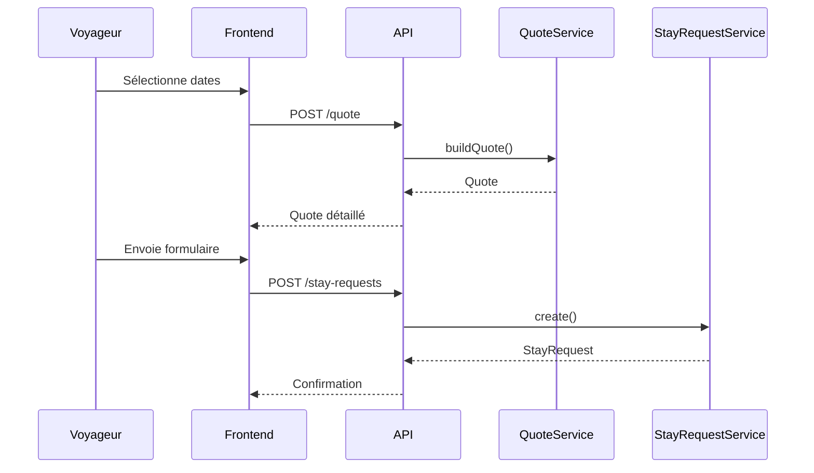

# 06 - API

## Objectif

Décrire les endpoints REST nécessaires à la V1.

Les noms sont indicatifs, mais doivent rester orientés métier.

---

## Public API

### GET /api/public/property

Retourne les informations publiques de la maison enrichies et localisées.

Query :
- `locale=fr|en` (défaut : `fr`, fallback sur `fr` si locale non disponible)

Response `200` :

```json
{
  "title": "La Provençale",
  "subtitle": "Maison d'exception",
  "description": "Au cœur de la Provence...",
  "location": "Luberon",
  "rating": 4.8,
  "reviewCount": 42,
  "amenities": [
    { "id": "...", "code": "wifi", "icon": "📡", "label": "Wifi haute vitesse" }
  ],
  "faq": [
    { "id": "...", "question": "Puis-je amener mon chien ?", "answer": "Oui, chiens bienvenus." }
  ]
}
```

**Rupture de compatibilité** : l'endpoint ne retourne plus `name` ni `baseline` (remplacés par `title` et `subtitle` localisés).

### GET /api/public/availability

Retourne les disponibilités sur une période.

Query :
- `from`
- `to`

### POST /api/public/quote

Calcule un devis. Le devis est **toujours recalculé côté serveur** (aucun montant client n'est accepté).

Body :

```json
{
  "arrival": "2026-07-04",
  "departure": "2026-07-11",
  "adults": 4,
  "children": 2
}
```

Response `200` :

```json
{
  "nights": 7,
  "breakdown": [
    { "date": "2026-07-04", "priceCents": 30000 }
  ],
  "subtotalCents": 210000,
  "fees": [
    { "code": "cleaning", "amountCents": 12000 }
  ],
  "adjustments": [],
  "totalCents": 222000,
  "appliedRule": "Haute saison",
  "submittable": true,
  "errors": []
}
```

- `submittable` : `false` si le devis viole une règle (durée min, jour d'arrivée/départ, dates dans le passé, voyageurs > max). Le devis reste **affichable** mais non soumissible ; `errors[]` porte alors les codes concernés (voir *Erreurs*).
- `POST /quote` ne vérifie **pas** la disponibilité (prix pur) ; celle-ci est contrôlée à la soumission.
- Champs de date au format ISO `AAAA-MM-JJ`. « Aujourd'hui » est évalué en Europe/Paris.

### POST /api/public/stay-requests

Crée une demande de séjour. Le serveur **re-vérifie les règles et la disponibilité** et **recalcule le devis** avant de persister ; le devis est **figé** (`quote_snapshot`) sur la demande.

Body :
- `arrival`, `departure` (ISO) ;
- `firstName`, `lastName`, `email` (**requis, adresse valide**), `phone` ;
- `adults`, `children` (optionnels) ;
- `message`.

Response `201` : `{ "id": "...", "quote": { ... } }` (le devis figé).

Erreurs possibles : `422 VALIDATION` (devis non soumissible, `details` = codes), `409 DATES_UNAVAILABLE` (dates indisponibles), `400 INVALID_REQUEST` (email manquant/invalide, dates invalides, corps invalide).

---

## Admin API

Toutes les routes admin (hors `login`) exigent une **session authentifiée**. L'authentification se fait par **cookie de session opaque HttpOnly** (compte propriétaire unique, seedé — pas d'inscription). Sans session valide → `401 UNAUTHORIZED`.

### POST /api/admin/login

Connexion propriétaire. Body `{ "email", "password" }`. Succès → `204` + cookie de session (`HttpOnly`, `SameSite=Lax`, `Secure` en production). Identifiants invalides → `401 UNAUTHORIZED` (message générique, sans distinguer email inconnu et mot de passe faux). Endpoint **rate-limité**.

### POST /api/admin/logout

Déconnexion : invalide la session et efface le cookie. → `204`.

### GET /api/admin/me

Retourne le propriétaire de la session courante (`{ "email" }`). Protégé.

### GET /api/admin/calendar

Retourne les réservations, demandes et blocages.

### GET /api/admin/stay-requests

Liste les demandes.

### GET /api/admin/stay-requests/{id}

Détail d'une demande.

### POST /api/admin/stay-requests/{id}/approve

Accepte une demande et crée une réservation.

### POST /api/admin/stay-requests/{id}/reject

Refuse une demande.

### GET /api/admin/reservations

Liste les réservations.

### POST /api/admin/calendar-blocks

Bloque une période.

### DELETE /api/admin/calendar-blocks/{id}

Supprime un blocage.

### GET /api/admin/sync-sources

Liste les sources de synchronisation externes configurées.

Exemple : Abritel via URL iCal.

### POST /api/admin/sync-sources

Ajoute une source de synchronisation externe.

Body :
- `provider` : `abritel` ou `ical` ;
- `name` ;
- `icalUrl` ;
- `enabled`.

### POST /api/admin/sync-sources/{id}/run

Déclenche manuellement une synchronisation.

### GET /api/admin/sync-runs

Liste les derniers imports, leur statut et les erreurs éventuelles.

### GET /api/admin/pricing-periods

Liste les périodes tarifaires.

### POST /api/admin/pricing-periods

Crée une période.

### PATCH /api/admin/pricing-periods/{id}

Modifie une période.

### DELETE /api/admin/pricing-periods/{id}

Supprime une période.

### GET /api/admin/content

Retourne le contenu éditorial bilingue : `rating`, `reviewCount`, `title/subtitle/description/location` en `{fr,en}`, `amenities[]` (`id`, `code`, `icon`, `label{fr,en}`), `faq[]` (`id`, `question{fr,en}`, `answer{fr,en}`).

### PATCH /api/admin/content

Met à jour les champs éditoriaux property (`title/subtitle/description/location` en `{fr,en}`) + `rating` (0–5) + `reviewCount` (≥0).

### POST /api/admin/amenities

Crée un équipement (libellé bilingue).

### PATCH /api/admin/amenities/{id}

Modifie un équipement.

### DELETE /api/admin/amenities/{id}

Supprime un équipement.

### POST /api/admin/amenities/reorder

Réordonne les équipements.

### POST /api/admin/faq

Crée une question FAQ (question/réponse bilingues).

### PATCH /api/admin/faq/{id}

Modifie une question FAQ.

### DELETE /api/admin/faq/{id}

Supprime une question FAQ.

### POST /api/admin/faq/reorder

Réordonne les questions FAQ.

### POST /api/admin/photos

Upload une photo.

### PATCH /api/admin/photos/{id}

Modifie alt/order/main.

### DELETE /api/admin/photos/{id}

Supprime une photo.

---

## Séquence : création d'une demande



---

## Erreurs

Toutes les erreurs suivent une enveloppe JSON stable :

```json
{ "error": { "code": "VALIDATION", "message": "…", "details": [ ] } }
```

Codes métier stables :

| Code | HTTP | Sens |
|---|---:|---|
| `INVALID_REQUEST` | 400 | Corps/paramètres invalides (dates mal formées, email manquant/invalide…) |
| `UNAUTHORIZED` | 401 | Authentification requise ou identifiants/session invalides |
| `PROPERTY_NOT_FOUND` | 404 | Bien introuvable |
| `VALIDATION` | 422 | Demande non soumissible ; `details` liste les codes de règle enfreints |
| `DATES_UNAVAILABLE` | 409 | Dates demandées indisponibles |
| `INTERNAL` | 500 | Erreur interne |

Codes de règle (portés par `errors[]` d'un devis et par `details` d'un `VALIDATION`) :

| Code | Sens |
|---|---|
| `MIN_NIGHTS` | Durée inférieure au minimum de la règle applicable |
| `CHECKIN_DAY` | Jour d'arrivée non autorisé (ex. haute saison hors samedi) |
| `CHECKOUT_DAY` | Jour de départ non autorisé |
| `INVALID_DATES` | Arrivée ≥ départ |
| `DATES_IN_PAST` | Arrivée dans le passé (« aujourd'hui » Europe/Paris) |
| `GUESTS_EXCEED_MAX` | Nombre de voyageurs supérieur à la capacité |

## Rate limiting

Les endpoints publics et la connexion admin sont soumis à un rate limiting (dépassement → `429`). Le corps des requêtes est borné.

## TODO

- [x] Valider les noms d'endpoint (surface publique + auth admin figées).
- [x] Définir les codes d'erreur (enveloppe + catalogue ci-dessus).
- [x] Ajouter l'auth admin (session cookie HttpOnly, login/logout/me).
- [x] Ajouter rate limiting sur les endpoints publics (+ login admin).
- [ ] Endpoints admin de cycle de vie (approve/reject/cancel, ajustement de prix, calendrier agrégé) — noms définis ci-dessus, implémentation à venir.
- [ ] Contenus/photos/tarifs (CRUD admin) et import iCal — à venir.
