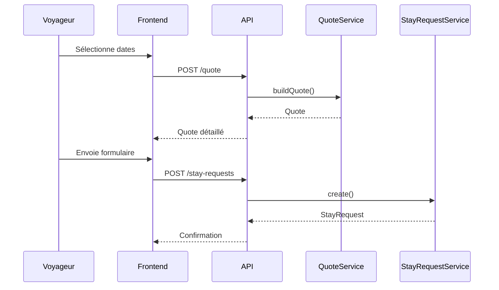

# 06 - API

## Objectif

Décrire les endpoints REST nécessaires à la V1.

Les noms sont indicatifs, mais doivent rester orientés métier.

---

## Public API

### GET /api/public/property

Retourne les informations publiques de la maison.

Query :
- `locale=fr|en|es`

### GET /api/public/availability

Retourne les disponibilités sur une période.

Query :
- `from`
- `to`

### POST /api/public/quote

Calcule un devis.

Body :

```json
{
  "arrivalDate": "2025-07-09",
  "departureDate": "2025-07-17",
  "adults": 4,
  "children": 2
}
```

Response :

```json
{
  "nights": 8,
  "nightlyPrices": [
    { "date": "2025-07-09", "priceCents": 45000 },
    { "date": "2025-07-10", "priceCents": 45000 }
  ],
  "subtotalCents": 390000,
  "fees": [
    { "label": "Ménage", "priceCents": 40000 }
  ],
  "totalCents": 430000
}
```

### POST /api/public/stay-requests

Crée une demande de séjour.

Body :
- dates ;
- coordonnées ;
- nombre de voyageurs optionnel ;
- message ;
- quote snapshot.

---

## Admin API

### POST /api/admin/login

Connexion propriétaire.

### GET /api/admin/calendar

Retourne les réservations, demandes et blocages.

### GET /api/admin/stay-requests

Liste les demandes.

### GET /api/admin/stay-requests/{id}

Détail d'une demande.

### POST /api/admin/stay-requests/{id}/approve

Accepte une demande et crée une réservation.

### POST /api/admin/stay-requests/{id}/reject

Refuse une demande.

### GET /api/admin/reservations

Liste les réservations.

### POST /api/admin/calendar-blocks

Bloque une période.

### DELETE /api/admin/calendar-blocks/{id}

Supprime un blocage.

### GET /api/admin/pricing-periods

Liste les périodes tarifaires.

### POST /api/admin/pricing-periods

Crée une période.

### PATCH /api/admin/pricing-periods/{id}

Modifie une période.

### DELETE /api/admin/pricing-periods/{id}

Supprime une période.

### GET /api/admin/content

Récupère les contenus éditoriaux.

### PATCH /api/admin/content

Met à jour les contenus éditoriaux.

### POST /api/admin/photos

Upload une photo.

### PATCH /api/admin/photos/{id}

Modifie alt/order/main.

### DELETE /api/admin/photos/{id}

Supprime une photo.

---

## Séquence : création d'une demande



---

## TODO

- [ ] Valider les noms d'endpoint.
- [ ] Définir les codes d'erreur.
- [ ] Ajouter l'auth admin.
- [ ] Ajouter rate limiting sur les endpoints publics.
