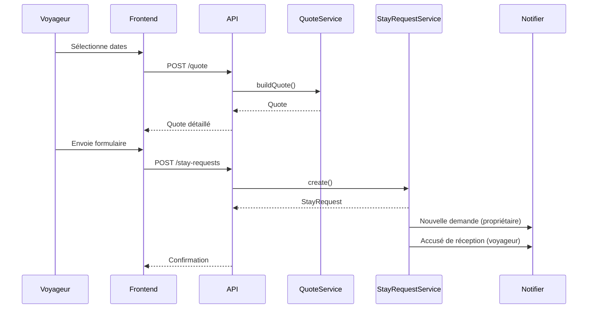

# 06 - API

## Objectif

Décrire les endpoints REST nécessaires à la V1.

Les noms sont indicatifs, mais doivent rester orientés métier.

---

## Public API

### GET /api/public/property

Retourne les informations publiques de la maison enrichies et localisées.

Query :
- `locale=fr|en` (défaut : `fr`, fallback sur `fr` si locale non disponible)

Response `200` :

```json
{
  "slug": "le-115",
  "maxGuests": 12,
  "maxAdults": 10,
  "currency": "EUR",
  "baseNightlyPriceCents": 45000,
  "title": "La Provençale",
  "subtitle": "Maison d'exception",
  "description": "Au cœur de la Provence...",
  "location": "Luberon",
  "reviewsUrl": "https://g.page/le-115",
  "publicAddress": "Cour de la République, 84210 Pernes-les-Fontaines",
  "facebookUrl": "https://www.facebook.com/le115",
  "instagramUrl": "https://www.instagram.com/le115",
  "highlights": [
    { "icon": "garden", "label": "Cour intérieure" }
  ],
  "amenities": [
    { "code": "wifi", "icon": "wifi", "label": "Wifi haute vitesse" }
  ],
  "faq": [
    { "question": "Puis-je amener mon chien ?", "answer": "Oui, chiens bienvenus." }
  ],
  "photos": [
    {
      "id": "...",
      "category": "exterieur",
      "alt": "Vue de la façade principale",
      "isMain": true,
      "sortOrder": 1,
      "variants": [
        { "width": 400, "url": "/api/public/media/...?w=400" },
        { "width": 800, "url": "/api/public/media/...?w=800" },
        { "width": 1600, "url": "/api/public/media/...?w=1600" }
      ],
      "originalUrl": "/api/public/media/...?w=original"
    }
  ]
}
```

> **Corrigé le 2026-08-15, vérifié en conditions réelles contre l’API.** Les URL de
> variantes s’écrivent `/api/public/media/{id}?w=400`, jamais `/api/public/media/{id}/400`
> — la largeur est un **paramètre de requête**, cohérent avec `GET /api/public/media/{id}`
> décrit juste en dessous. Trois autres écarts relevés à la même occasion : `amenities[]`
> et `faq[]` ne portent **pas** d’`id`, `photos[]` porte un `sortOrder`, et
> `originalWidth` / `originalHeight` **n’existent pas** dans la réponse.
> Le site public (`../le115-frontend`, `src/lib/api/types.ts`) est typé sur l’API réelle.

**Rupture de compatibilité** : l’endpoint ne retourne plus `name` ni `baseline` (remplacés par `title` et `subtitle` localisés).

**`publicAddress`, `facebookUrl`, `instagramUrl`** (DEC-035) sont des chaînes, **vides** quand
elles ne sont pas renseignées, jamais `null`. `publicAddress` est l'**adresse affichée** : la
rue, jamais le numéro (DEC-022 amendée). L’adresse exacte (`address`) n’est **jamais** exposée
par l’API publique, et rien ici n’en est déduit.

**`maxAdults`** (DEC-037) est un entier, ou `null` quand aucune limite d'adultes n'est
posée. **`highlights`** est le bandeau d'atouts de l'accueil : six au plus, **dans l'ordre de
la propriétaire**, `label` localisé (anglais vide : repli sur le français). C'est toujours un
tableau, vide quand la propriétaire a vidé la liste — le site n'affiche alors aucun bandeau.
Ni `id` ni `sortOrder` : comme `amenities[]`, la liste n'en porte pas.

### GET /api/public/audience-pages

Retourne **toutes** les pages d'audience publiées dans une langue, **contenu compris**
(DEC-032) — un seul point d'entrée sert à la fois la rangée d'onglets, présente sur
toutes les pages du site, et le contenu de la page demandée.

Query :
- `locale` : `fr` ou `en` ; toute autre valeur (ou son absence) retombe sur `fr`.

Response `200` :

```json
[
  {
    "slug": "cyclistes",
    "icon": "bike",
    "navLabel": "Cyclistes",
    "title": "La maison à vélo",
    "intro": "Le Vaucluse se traverse à vélo.",
    "sections": [{ "heading": "Au départ", "body": "Un garage **fermé**." }],
    "alternates": { "fr": "cyclistes", "en": "cyclists" }
  }
]
```

Le `body` de chaque section est du **Markdown restreint** (DEC-036) : gras, italique, liens,
listes sur un niveau ; `heading`, `title` et `intro` restent du texte simple.

**Aucun repli de langue** : une page publiée en français seulement est absente du
tableau reçu pour `en` — le site rend alors un 404 sur son adresse, jamais le texte
français.

**`alternates`** donne le slug de la page dans chaque langue **publiée**, la langue
demandée comprise (DEC-033) — c'est ce qui permet au site d'écrire ses `hreflang` et
son sélecteur de langue sans aller interroger l'autre langue, et de ne jamais annoncer
une adresse qui rendrait un 404. Toujours un objet, jamais `null` : une page publiée en
français seulement y rend `{ "fr": "cyclistes" }`.

### GET /api/public/legal-pages

Retourne les pages légales **publiées** dans une langue, **contenu compris** (DEC-035) — un
seul point d’entrée sert à la fois le pied de page, présent sur toutes les pages du site, et
le contenu de chaque page légale.

Query :
- `locale` : `fr` ou `en` ; toute autre valeur (ou son absence) retombe sur `fr`.

Response `200`, dans l’ordre fixe `legal-notice`, `privacy`, `rental-terms` :

```json
[
  {
    "kind": "legal-notice",
    "title": "Mentions légales",
    "updatedAt": "2026-10-08T09:30:00Z",
    "sections": [{ "heading": "Éditeur du site", "body": "Première ligne.\nSeconde ligne.\n\nUn autre paragraphe." }]
  }
]
```

**Aucun repli de langue** : une page publiée en français seulement est absente du tableau reçu
pour `en` — le site rend alors un 404 sur son adresse, jamais le texte français. Au premier
déploiement rien n’est publié : la réponse est `[]`, ce n’est pas une erreur. Les tableaux
sont toujours des tableaux, jamais `null`.

`updatedAt` (RFC 3339, UTC) est la date de la dernière écriture du **texte** ; publier ne la
change pas. Dans un `body`, une ligne vide sépare deux paragraphes ; un saut de ligne simple
est un retour à la ligne. Contrairement aux pages d’audience, il n’y a pas d'`alternates` : le
site interroge l’autre langue pour savoir si la page y est publiée. Les adresses publiques des
trois pages sont fixes et vivent côté site (DEC-033).

Le `body` de chaque section est du **Markdown restreint** (DEC-036) : gras, italique, liens,
listes sur un niveau ; `title` et `heading` restent du texte simple.

### POST /api/public/contact-messages

Envoie un message du formulaire « Nous écrire » à la propriétaire (DEC-035). **Rien n’est
stocké** : ni table, ni journal d’activité, ni contenu dans les logs. L’email part à la
propriétaire avec un `Reply-To` sur le visiteur ; le HTML saisi y est échappé. Il n’y a pas
d’accusé de réception au visiteur.

Body :
- `name` : obligatoire, rogné, **120 caractères au plus**, sans caractère de contrôle (saut de
  ligne, tabulation…) ;
- `email` : obligatoire, adresse **nue** valide (« Nom <a@b.fr> » est refusé), 254 caractères
  au plus ;
- `phone` : facultatif, rogné, **40 caractères au plus**, sans caractère de contrôle ;
- `message` : obligatoire, rogné, **5 000 caractères au plus** (sauts de ligne permis) ;
- `consent` : doit valoir `true` ;
- `locale` : `fr` ou `en` ;
- `website` : le **champ piège**, que le formulaire laisse vide ;
- `renderedAt` : l’instant du rendu du formulaire, en millisecondes depuis l’époque Unix,
  fourni par le serveur du site.

Les longueurs sont comptées en **caractères** (runes), pas en octets, après rognage.

**Garde anti-robot, sans tiers** (DEC-021). Un envoi dont `website` n’est pas vide, ou dont
`renderedAt` est absent, illisible, nul ou négatif, situé dans le futur, ou antérieur de moins
de **3 secondes** à l’arrivée, est pris pour un robot. Il reçoit **`204` comme un succès, sans
que rien ne parte** : lui dire ce qui l’a trahi l’aiderait. Un `renderedAt` du mauvais type
n’est pas une erreur `400`, c’est le même cas. La garde est une barrière contre les robots
naïfs : `renderedAt` vient du client et se falsifie.

Réponses :
- `204` : message envoyé — **ou** robot écarté ;
- `422 VALIDATION` : `details: { "fields": ["name", "email", …] }`, **tous** les champs
  fautifs à la fois, sous leur nom JSON et dans l’ordre du formulaire (`name`, `email`,
  `phone`, `message`, `consent`, `locale`) ;
- `429` : plus de 10 envois dans l’heure pour cette IP (voir « Rate limiting ») ;
- `503 CONTACT_UNAVAILABLE` : l’envoi a échoué. L’envoi est **synchrone** et **borné à
  15 secondes**, détaché de l’annulation de la requête — un visiteur qui ferme l’onglet
  n’annule pas un message accepté. Un doublon est possible si le visiteur renvoie, ce qui est
  préféré à un message perdu. Le message d’erreur renvoie vers un contact direct ;
- `400 INVALID_REQUEST` : corps illisible ou trop gros (64 KiB).

### GET /api/public/media/{id}

Sert le binaire d'une photo ou sa variante responsive.

Query :
- `w` : largeur souhaitée (`400`, `800`, `1600`, ou `original` ; défaut : `original`)

Response `200` : binaire JPEG ou PNG (Content-Type: `image/jpeg` ou `image/png`).

Notes :
- Pas d'upscale : si `w` dépasse la largeur native, retourne l'original.
- Cache immuable (`Cache-Control: public, max-age=31536000, immutable`).
- Rate-limité par un plafond qui lui est propre, pas celui des lectures JSON publiques — voir
  « Rate limiting » plus bas.
- `ETag` posé et `304 Not Modified` rendu **avant** tout accès base/disque sur une requête
  conditionnelle (`If-None-Match`).

Erreurs : `404` si la photo n'existe pas, si `w` n'est pas reconnu (les variantes < source width
seulement), **ou** si `{id}` n'est pas un identifiant valide — le visiteur ne doit pas pouvoir
distinguer « identifiant malformé » d'« identifiant inexistant ».

### GET /api/public/availability

Retourne les disponibilités sur une période.

Query :
- `from`
- `to`

### POST /api/public/quote

Calcule un devis. Le devis est **toujours recalculé côté serveur** (aucun montant client n'est accepté).

Body :

```json
{
  "arrival": "2026-07-04",
  "departure": "2026-07-11",
  "adults": 4,
  "children": 2,
  "locale": "fr"
}
```

Response `200` :

```json
{
  "nights": 7,
  "breakdown": [
    { "date": "2026-07-04", "priceCents": 30000 }
  ],
  "subtotalCents": 210000,
  "fees": [
    { "code": "cleaning", "amountCents": 12000, "label": "Ménage" }
  ],
  "adjustments": [],
  "totalCents": 222000,
  "appliedRule": "Haute saison",
  "submittable": true,
  "errors": []
}
```

- `locale` : optionnel (défaut `fr`), détermine la langue des libellés des frais (fallback `fr` si locale non disponible).
- `fees[].label` : libellé du frais résolu dans la locale demandée, à titre informatif (le calcul du montant est inchangé).

- `submittable` : `false` si le devis viole une règle (durée min, jour d'arrivée/départ, dates dans le passé, voyageurs > max, adultes > adultes au plus). Le devis reste **affichable** mais non soumissible ; `errors[]` porte alors les codes concernés (voir *Erreurs*).
- `POST /quote` ne vérifie **pas** la disponibilité (prix pur) ; celle-ci est contrôlée à la soumission.
- Champs de date au format ISO `AAAA-MM-JJ`. « Aujourd'hui » est évalué en Europe/Paris.

### POST /api/public/stay-requests

Crée une demande de séjour. Le serveur **re-vérifie les règles et la disponibilité** et **recalcule le devis** avant de persister ; le devis est **figé** (`quote_snapshot`) sur la demande.

Body :
- `arrival`, `departure` (ISO) ;
- `firstName`, `lastName`, `email` (**requis, adresse valide**), `phone` ;
- `adults`, `children` (optionnels) ;
- `message` ;
- `locale` : optionnel (défaut `fr`, comme `/quote`), détermine la langue de la note de
  dérogation renvoyée dans `details[]` si la demande est refusée pour violation d'une règle
  de séjour (fallback `fr` si locale non disponible).

**Bornes de longueur** sur les champs libres, comptées en **runes** (pas en octets, pour
qu’une saisie française accentuée ne soit pas pénalisée) : `firstName` et `lastName` ≤ 100,
`email` ≤ 254, `phone` ≤ 40, `message` ≤ 2000. Un dépassement renvoie `400 INVALID_REQUEST`
avec `details.field` nommant le premier champ fautif (un seul à la fois).

Response `201` : `{ "id": "...", "quote": { ... } }` (le devis figé).

**Deux emails partent à la création** (depuis le 2026-08-18), tous deux en best-effort — un
échec SMTP est journalisé, il ne fait jamais échouer la demande :

| Destinataire | Contenu | Langue |
|---|---|---|
| La propriétaire | Nouvelle demande : dates, voyageurs, coordonnées, total du devis figé. `Reply-To` = le voyageur | Français |
| **Le demandeur** | **Accusé de réception** : dates, montant du devis figé, référence de la demande. Il dit explicitement qu’il **n’est pas** une confirmation de séjour, pour ne pas se confondre avec l’email d’acceptation | La `locale` mémorisée sur la demande (fr/en) |

Le second est le pendant naturel des emails d’acceptation et de refus, qui existaient déjà :
le voyageur savait qu’on lui répondait, il ne savait pas qu’on l’avait reçu.

Erreurs possibles : `422 VALIDATION` (devis non soumissible, `details` = codes, avec la note
de dérogation localisée le cas échéant), `409 DATES_UNAVAILABLE` (dates indisponibles),
`409 DUPLICATE_REQUEST` (même email et mêmes dates envoyés dans les 24 heures précédentes, **ou**
plus de trois demandes de la même adresse sur 24 heures, dates confondues — DEC-030),
`400 INVALID_REQUEST` (email manquant/invalide, dates invalides, corps invalide, ou un champ
au-delà de sa borne de longueur — `details.field` nomme alors le champ).

> **Plusieurs causes de `400` partagent encore un seul code, et c’est une ambiguïté à lever.**
> Un appelant qui reçoit `INVALID_REQUEST` ne peut pas distinguer une **adresse email
> refusée** — la seule cause, avec un champ trop long, que le visiteur puisse corriger — d’un
> corps mal formé ou trop gros. Le champ trop long fait désormais exception : il porte
> `details.field` (cf. bornes de longueur ci-dessus), ajouté après ce constat. L’email refusé,
> lui, ne porte toujours aucun détail. Le site public doit donc parier sur les causes qui n’en
> portent pas, et son pari est parfois faux : il conseille de vérifier l’email à quelqu’un dont
> l’adresse n’a rien d’anormal — **et il ne lit d’ailleurs pas `details.field` non plus**,
> traitant toute `400` comme un problème d’email (`le115-frontend/src/app/[locale]/demande/actions.ts`).
> **Décision de contrat à prendre** : donner au refus d’email son propre code stable
> (`INVALID_EMAIL`) côté Go, et faire lire `details.field` au site. Consignée dans
> `../le115-backend/docs/DEBTS.md`.

---

## Admin API

Toutes les routes admin (hors `login`) exigent une **session authentifiée**. L'authentification se fait par **cookie de session opaque HttpOnly** (compte propriétaire unique, seedé — pas d'inscription). Sans session valide → `401 UNAUTHORIZED`. Sur toute route portant un paramètre `{id}`, un identifiant qui n'est pas un UUID valide renvoie `400 INVALID_REQUEST` (et non une erreur de base de données).

**CSRF** : chaque session porte un jeton CSRF, livré dans le **corps** de `POST /login` et de
`GET /me` (jamais par un cookie, pour rester lisible par un front hébergé sur une autre
origine). Toute écriture admin (méthode autre que `GET`/`HEAD`/`OPTIONS`) doit porter l'en-tête
`X-CSRF-Token` avec la valeur exacte du jeton de la session courante, sous peine de
`403 CSRF_INVALID`. `POST /login` (pas encore de session) et `POST /logout` (doit fonctionner
même sur une session déjà invalide) sont exemptés.

### POST /api/admin/login

Connexion propriétaire. Body `{ "email", "password" }`. Succès → `200` + `{ "csrfToken" }` +
cookie de session (`HttpOnly`, `SameSite=Lax`, `Secure` en production). Identifiants invalides →
`401 UNAUTHORIZED` (message générique, sans distinguer email inconnu et mot de passe faux).
Endpoint **rate-limité**.

### POST /api/admin/logout

Déconnexion : invalide la session et efface le cookie. → `204`.

### GET /api/admin/me

Retourne le propriétaire de la session courante et son jeton CSRF (`{ "email", "csrfToken" }`).
Protégé.

### GET /api/admin/calendar

Calendrier agrégé sur une fenêtre. Paramètres **obligatoires** `from` et `to`
(dates ISO `YYYY-MM-DD`, `to` ≥ `from`) ; absents ou mal formés → `400 INVALID_REQUEST`.

Renvoie, triées par date de début, les occupations qui chevauchent la fenêtre :
chaque élément porte `type`, `id`, `from`, `to` (plage demi-ouverte `[from, to)`),
`label` et `status`.

| `type` | Source | `label` | `status` |
|---|---|---|---|
| `reservation` | réservation **confirmée** | nom du voyageur | `confirmed` |
| `block` | blocage manuel | motif | `""` |
| `external` | événement d'une source externe **activée** | résumé de l'événement | `""` |

Les demandes en attente n'y figurent pas : elles ne bloquent pas la disponibilité
(cf. `04-Dashboard.md`, « États du calendrier »).

### POST /api/admin/blocks

Bloque une période. Body `{ "from", "to", "reason" }` (dates ISO, plage demi-ouverte
`[from, to)` — c'est le dashboard qui convertit sa saisie inclusive « du / au »).
Succès → `201` + `{ "id" }`. Dates mal formées ou plage vide → `400 INVALID_REQUEST`.
L'action est journalisée.

### DELETE /api/admin/blocks/{id}

Supprime un blocage. Succès → `204`. `{id}` inexistant → `404 NOT_FOUND` (aucune entrée n'est
journalisée pour un blocage qui n'a jamais existé). `{id}` n'est pas un identifiant valide →
`400 INVALID_REQUEST`, comme tout paramètre de route admin nommé `id`.

### GET /api/admin/activity-log

Journal d'activité, le plus récent d'abord. Paramètre optionnel `limit` : 100 par
défaut, plafonné à 500 (une valeur absente, nulle, négative ou au-delà de 500 vaut
100). Chaque entrée porte `type` (ex. `block_created`, `reservation_cancelled`),
`message` (phrase lisible, en français) et `createdAt`.

### GET /api/admin/stay-requests

Liste les demandes, les plus récentes d'abord. Paramètre optionnel `status`
(`pending` | `approved` | `rejected`) ; absent, toutes les demandes sont
renvoyées.

Chaque élément porte `id`, `status`, `firstName`, `lastName`, `email`, `phone`,
`arrival`, `departure`, `adults`, `children`, `totalCents`, `createdAt`.

`totalCents` est lu dans le devis figé de la demande. Un instantané dépourvu
de total vaut `0` — jamais une erreur, pour qu'une ligne héritée ne prive pas
le propriétaire de toute sa liste.

### GET /api/admin/stay-requests/{id}

Détail d'une demande : les champs de la ligne de liste, plus `message` (laissé par
le voyageur), `internalNote` et `quoteSnapshot` (devis figé). `{id}` inconnu →
`404 NOT_FOUND`.

### POST /api/admin/stay-requests/{id}/approve

Accepte une demande et crée la réservation correspondante, dans une seule transaction.

1. **Synchronisation d'abord** (DEC-013) : les sources externes activées sont
   synchronisées ; si l'une échoue → `409 SYNC_REQUIRED`, rien n'est créé.
2. La disponibilité est revérifiée ; dates prises entre-temps → `409 DATES_UNAVAILABLE`.
3. La demande passe à `approved`, la réservation est créée `confirmed`, l'action est
   journalisée, et le voyageur reçoit l'email d'approbation, qui porte l'**adresse
   exacte** du bien (DEC-022).

Succès → `200` + `{ "reservationId", "conflictingPendingRequestIds" }` : la seconde
clé liste les **autres demandes en attente** qui chevauchent les dates désormais
réservées (tableau vide s'il n'y en a pas) — elles ne sont pas refusées
automatiquement, c'est au propriétaire de les traiter.

Demande qui n'est plus en attente → `409 CONFLICT`. `{id}` inconnu → `404 NOT_FOUND`.

### POST /api/admin/stay-requests/{id}/reject

Refuse une demande : elle passe à `rejected`, le voyageur reçoit l'email de refus.
Succès → `204`. Demande qui n'est plus en attente → `409 CONFLICT`.

### PATCH /api/admin/stay-requests/{id}/note

Remplace la note interne de la demande (jamais montrée au voyageur). Body
`{ "note" }` — une chaîne vide efface la note. Succès → `204`.

### GET /api/admin/reservations

Liste les réservations. Chaque élément porte `id`, `status` (`confirmed` |
`cancelled`), `guestName`, `email`, `source`, `arrival`, `departure`, `totalCents`,
`createdAt`.

### GET /api/admin/reservations/{id}

Détail d'une réservation (mêmes champs que la ligne de liste + `internalNote`
et `quoteSnapshot` figé). `{id}` inconnu → `404 NOT_FOUND`.

### POST /api/admin/reservations/{id}/cancel

Annule une réservation confirmée : elle passe à `cancelled` et **libère ses dates**.
L'action est journalisée ; **aucun email n'est envoyé au voyageur** en V1 (cf.
`04-Dashboard.md`). Succès → `204`. Réservation déjà annulée → `409 CONFLICT`.

### POST /api/admin/reservations/{id}/adjust-price

Ajoute une ligne d'ajustement au devis figé d'une réservation confirmée (DEC-012).
Body `{ "label", "amountCents" }` : montant **signé**, négatif pour une remise.

- `label` vide ou `amountCents` nul → `422 VALIDATION` ;
- remise qui ferait passer le total sous zéro → `422 DISCOUNT_EXCEEDS_TOTAL`, avec
  `details.maxDiscountCents` (cf. `03-Business-Rules.md`, « Ajustements ») ;
- réservation non confirmée → `409 CONFLICT`.

Succès → `200` + `{ "reservationId", "totalCents" }` (nouveau total). Le devis figé est
régénéré, son détail d'origine conservé, et l'action journalisée.

### PATCH /api/admin/reservations/{id}/note

Remplace la note interne de la réservation. Body `{ "note" }`. Succès → `204`.

### GET /api/admin/sync-sources

Liste les sources de synchronisation externes configurées (ex. Abritel via URL iCal).
Chaque source porte `id`, `provider`, `name`, `enabled`, et l'état de son **dernier
import** : `lastSyncAt` (ISO 8601 UTC), `lastSyncStatus`, `lastError` — tous trois
`null` pour une source jamais synchronisée. L'URL iCal n'est jamais renvoyée.

Il n'existe pas d'historique des imports : seul le dernier est exposé.

### POST /api/admin/sync-sources

Ajoute une source de synchronisation externe. Body `{ "provider", "name", "icalUrl" }`.
Succès → `201` + `{ "id" }`. Une seule source par fournisseur et par bien.

En pratique, les sources sont **provisionnées au démarrage** depuis la configuration
du serveur, et l'écran Synchronisations n'en crée pas (cf. `04-Dashboard.md`) :
modifier, désactiver ou supprimer une source n'a pas de route en V1.

### POST /api/admin/sync-sources/{id}/run

Déclenche manuellement une synchronisation. Succès → `200` + `{ "status",
"eventsImported" }`. Échec de l'import → `503 SYNC_FAILED`, l'erreur étant consignée
sur la source (`lastError`).

Toutes les routes de synchronisation renvoient `503 SYNC_DISABLED` si la
synchronisation est désactivée sur le serveur.

Aucun import n'est planifié en V1 : une source ne se synchronise qu'à la main, ou
au moment d'une approbation.

### GET /api/admin/pricing-periods

Liste les périodes tarifaires.

### POST /api/admin/pricing-periods

Crée une période.

### PATCH /api/admin/pricing-periods/{id}

Modifie une période.

### DELETE /api/admin/pricing-periods/{id}

Supprime une période.

### GET /api/admin/fees

Liste les frais additionnels.

### POST /api/admin/fees

Crée un frais additionnel avec libellé bilingue.

Body :
- `code` : identifiant unique du frais ;
- `amountCents` : montant en centimes ;
- `label` : `{ "fr": "...", "en": "..." }`.

Erreur : `409 CONFLICT` si le code existe déjà.

### PATCH /api/admin/fees/{id}

Modifie un frais (partiel : seuls les champs présents sont mis à jour).

Body (tous optionnels) :
- `label` : `{ "fr": "...", "en": "..." }` ;
- `amountCents`.

Response `200`.

### DELETE /api/admin/fees/{id}

Supprime un frais.

Response `204`.

### GET /api/admin/stay-rules

Liste les règles de séjour.

Response `200` :

```json
[
  {
    "id": "...",
    "name": "Haute saison",
    "from": "2026-06-14",
    "to": "2026-08-28",
    "minNights": 7,
    "allowedCheckinDows": [6],
    "allowedCheckoutDows": [6],
    "derogationNote": { "fr": "Hors samedi : nous contacter.", "en": "Outside Saturdays: please contact us." },
    "priority": 10,
    "isDefault": false
  }
]
```

- `from`/`to` à `null` ⇒ règle par défaut (`isDefault: true`).
- `allowedCheckinDows`/`allowedCheckoutDows` : entiers `0`–`6`, dimanche = `0`.

### POST /api/admin/stay-rules

Crée une règle de séjour. Body : mêmes champs que la réponse (hors `id`/`isDefault` :
`from`/`to` absents ou `null` ⇒ règle par défaut).

Response `201` : `{ "id": "..." }`.

Erreurs :
- `422 VALIDATION` : nom vide, `minNights` hors `1`–`365`, un seul de `from`/`to` fourni,
  `to < from`, jour hors `0`–`6`.
- `409 CONFLICT` : chevauchement avec une règle saisonnière existante de **même priorité**
  (la superposition est autorisée entre règles de priorités différentes) ; ou tentative de
  créer une **seconde règle par défaut** (une seule autorisée par bien).

### PATCH /api/admin/stay-rules/{id}

Modifie une règle de séjour (partiel : seuls les champs présents sont mis à jour).

Body (tous optionnels) : `name`, `from`, `to`, `minNights`, `allowedCheckinDows`,
`allowedCheckoutDows`, `derogationNote`, `priority`.

Response `204`.

Erreurs :
- `422 VALIDATION` : mêmes règles qu'à la création, plus le refus d'un changement de
  **nature** de la règle (convertir une règle saisonnière en règle par défaut, ou l'inverse).
- `409 CONFLICT` : chevauchement à priorité identique avec une autre règle.
- `404 NOT_FOUND` : identifiant inconnu.

### DELETE /api/admin/stay-rules/{id}

Supprime une règle de séjour.

Response `204`.

Erreurs :
- `409 CONFLICT` : la règle visée est **la règle par défaut** — elle ne peut pas être
  supprimée (elle est obligatoire ; sans elle, tout séjour hors saison serait soumissible
  sans aucune contrainte).
- `404 NOT_FOUND` : identifiant inconnu.

### GET /api/admin/property

Retourne la fiche du bien : `slug`, `name`, `baseline`, `address`, `maxGuests`, `baseNightlyPriceCents`, `currency`, `reviewsUrl`, `publicAddress`, `facebookUrl`, `instagramUrl` (DEC-035), `maxAdults` (DEC-037 : entier, ou `null` sans limite).

### PATCH /api/admin/property

Met à jour tout ou partie de `name`, `baseline`, `address`, `maxGuests`, `baseNightlyPriceCents`, `reviewsUrl`, `publicAddress`, `facebookUrl`, `instagramUrl`, `maxAdults` — les dix colonnes non traduites éditables de `property`. `slug` et `currency` sont en **lecture seule** : ils ne figurent pas dans le contrat de la requête, et les transmettre est refusé.

**Partiel** : seuls les champs présents dans le corps de la requête sont mis à jour ; les champs omis restent inchangés.

Body (tous optionnels) :
- `name` : chaîne, rognée puis exigée non vide ;
- `baseline`, `address` : chaînes, rognées ; une valeur vide transmise est bel et bien enregistrée vide, ce n’est pas une absence ;
- `maxGuests` : entier ≥ 1 ;
- `maxAdults` (DEC-037) : **adultes au plus**, entier compris entre 1 et `maxGuests`, ou `null` pour effacer la limite. Trois états : clé absente, inchangé ; `null`, effacée ; entier, posée. La borne haute se juge **après patch** : abaisser `maxGuests` sous un `maxAdults` existant est refusé, sans rien écrire. Un `maxAdults` qui n'est pas un entier est refusé en `400 INVALID_REQUEST` ;
- `baseNightlyPriceCents` : entier > 0 ;
- `reviewsUrl` : adresse de la fiche **Google Business** du bien, rognée. Vide ou URL **absolue en `https`** — `http` est refusé (l'adresse est affichée dans une page servie en HTTPS sous CSP stricte). Aucune restriction de domaine : Google sert ces fiches sous plusieurs hôtes, et la liste bouge. La **chaîne vide est une valeur**, pas une absence : c’est ainsi qu’on efface une fiche saisie par erreur.
- `publicAddress` (DEC-035) : l'**adresse affichée** sur le site, texte libre rogné, **200 caractères au plus** (en caractères, pas en octets), **sans numéro de rue** — c’est à la propriétaire d’y veiller : le serveur ne déduit jamais cette adresse de `address`. Vide, le site affiche le secteur ;
- `facebookUrl`, `instagramUrl` (DEC-035) : rognées ; vides, ou URL absolue en `https` **sur le domaine du réseau** — `facebook.com`, `instagram.com`, sous-domaines compris (`www.`) —, sans identifiants ni port. Contrairement à `reviewsUrl`, le domaine est contrôlé : une faute de frappe ne doit envoyer le visiteur nulle part ailleurs. La chaîne vide efface.

Erreurs :
- `422 VALIDATION` : nom (rogné) vide, `maxGuests` < 1, `maxAdults` < 1 ou supérieur à `maxGuests` après patch (`details: { "field": "maxAdults" }`), `baseNightlyPriceCents` ≤ 0, `reviewsUrl` non vide qui n’est pas une URL absolue en `https`, `publicAddress` de plus de 200 caractères, ou `facebookUrl` / `instagramUrl` non vide hors de `https` sur le bon domaine. Le refus d’un de ces **trois** champs porte `details: { "field": "publicAddress" | "facebookUrl" | "instagramUrl" }`, pour que le dashboard place le message sous le bon champ ; ceux des champs existants restent sans `details`.
- `400 INVALID_REQUEST` : corps portant une clé hors contrat, notamment `slug` ou `currency` ; `maxAdults` non entier.
- `404 NOT_FOUND` : bien introuvable.

Response `200` :

```json
{
  "property": {
    "slug": "le-115",
    "name": "Le 115, Maison de Provence",
    "baseline": "Maison premium en Provence",
    "address": "…",
    "maxGuests": 8,
    "maxAdults": null,
    "baseNightlyPriceCents": 15000,
    "currency": "EUR",
    "reviewsUrl": "https://g.page/le-115",
    "publicAddress": "Cour de la République, 84210 Pernes-les-Fontaines",
    "facebookUrl": "https://www.facebook.com/le115",
    "instagramUrl": ""
  },
  "warnings": []
}
```

`warnings` est **toujours un tableau**, jamais `null`. Baisser `maxGuests` sous l’effectif d’une réservation déjà confirmée et non terminée est **accepté, jamais refusé** — `max_guests` gouverne les demandes à venir, une réservation confirmée est un engagement pris (DEC-028). La réponse signale alors le nombre de séjours concernés sans bloquer l’enregistrement :

```json
{ "code": "GUESTS_BELOW_EXISTING_RESERVATIONS", "count": 2 }
```

Ce signalement est **aveugle aux réservations saisies à la main** : sans demande d’origine (`stay_request_id` nul), elles n’ont pas d’effectif connu et ne sont jamais comptées.

Il en va de même de `maxAdults` (DEC-037) : le poser, ou l'abaisser, sous le nombre d'adultes de la demande d'origine d'une réservation confirmée et non terminée est **accepté**, avec l'avertissement

```json
{ "code": "ADULTS_BELOW_EXISTING_RESERVATIONS", "count": 1 }
```

`warnings` peut porter les deux avertissements à la fois.

### GET /api/admin/content

Retourne le contenu éditorial bilingue : `title/subtitle/description/location` en `{fr,en}`, `amenities[]` (`id`, `code`, `icon`, `label{fr,en}`), `faq[]` (`id`, `question{fr,en}`, `answer{fr,en}`).

### PATCH /api/admin/content

Met à jour les champs éditoriaux property (`title/subtitle/description/location` en `{fr,en}`).

**Partiel** : seuls les champs présents dans le corps de la requête sont mis à jour ; les champs omis restent inchangés. Chaque champ localisé, quand il est fourni, doit porter les deux locales `{fr,en}`.

**Effacement** : l'absence d'une clé signifie « inchangé ». Un champ localisé
transmis avec des chaînes vides, en revanche, est bel et bien enregistré vide ;
c'est le dashboard qui exige un français non vide sur les quatre textes
éditoriaux.

**`rating` et `reviewCount` ont quitté ce contrat** (2026-08-26) : les avis font
foi sur une fiche Google Business, dont l'adresse s'édite via
`PATCH /api/admin/property` (`reviewsUrl`). Les deux clés sont désormais **hors
contrat** — les transmettre rend `400 INVALID_REQUEST`, comme toute clé inconnue.
Les colonnes `rating` et `review_count` ont été **supprimées de la base** le
2026-08-26 : le produit ne tient plus aucune copie des avis.

### GET /api/admin/highlights

Retourne le **bandeau d'atouts** de l'accueil (DEC-037), dans l'ordre de la propriétaire :

```json
[
  { "id": "…", "icon": "garden", "label": { "fr": "Cour intérieure", "en": "Inner courtyard" } }
]
```

Toujours un tableau, jamais `null` ; vide si la propriétaire a vidé la liste.

### PUT /api/admin/highlights

Remplace le bandeau, **en entier** : la liste reçue devient la liste en base, dans l'ordre reçu.

Body : `{ "highlights": [ { "id"?, "icon", "label": { "fr", "en" } } ] }`. `id` est facultatif : absent ou vide, l'atout est créé ; présent, il désigne un atout existant du bien. Un atout absent du corps est supprimé, libellés compris. Six atouts au plus. `icon` est un code du catalogue des atouts (celui des équipements, plus `guests`), jamais vide. `label.fr` est requis (rogné, non vide) ; `label.en` est facultatif, et vide, le public retombe sur le français.

Response `204`, sans corps.

Erreurs :
- `400 INVALID_REQUEST` : clé `highlights` **absente ou `null`** — l'écriture étant entière, un corps sans la liste effacerait tout par mégarde ; une liste vide explicite (`[]`) est, elle, permise ; ou `id` qui n'est pas un UUID (`details: { "index" }`) ;
- `422 HIGHLIGHTS_TOO_MANY` : plus de six atouts ;
- `400 ICON_INVALID` : icône hors catalogue, ou vide (`details: { "index" }`) ;
- `422 VALIDATION` : libellé français vide (`details: { "field": "label", "index" }`) ;
- `422 HIGHLIGHT_ETRANGER` : un `id` du corps n'existe pas, ou appartient à un autre bien (`details: { "index" }`) ;
- `422 HIGHLIGHT_DUPLIQUE` : le même `id` apparaît deux fois (`details: { "index" }`).

`index` compte à partir de 0, dans le corps reçu.

### POST /api/admin/amenities

Crée un équipement (libellé bilingue).

Le `code` est unique par bien : un doublon renvoie **409 CONFLICT**. Il est
enregistré débarrassé de ses espaces de bord.

L'`icon` doit appartenir au **catalogue fermé** (cf. `04-Dashboard.md`, qui compte depuis B2b `shop`, `no-smoking`, `no-pets` et `no-party` ; `guests` n'en fait pas partie, il est réservé aux atouts) : toute
autre valeur renvoie **422 VALIDATION**. La chaîne vide (« aucune ») est
acceptée.

### PATCH /api/admin/amenities/{id}

Modifie un équipement.

Le `code` est unique par bien : un doublon renvoie **409 CONFLICT**. Il est
enregistré débarrassé de ses espaces de bord.

L'`icon` doit appartenir au **catalogue fermé** : toute autre valeur renvoie
**422 VALIDATION**.

### DELETE /api/admin/amenities/{id}

Supprime un équipement.

### POST /api/admin/amenities/reorder

Réordonne les équipements.

### POST /api/admin/faq

Crée une question FAQ (question/réponse bilingues).

### PATCH /api/admin/faq/{id}

Modifie une question FAQ.

### DELETE /api/admin/faq/{id}

Supprime une question FAQ.

### POST /api/admin/faq/reorder

Réordonne les questions FAQ.

### GET /api/admin/audience-pages

Liste les pages d'audience du bien, bilingues, avec leur état de publication
par langue (`publishedFr`, `publishedEn`). `slug` y est un objet bilingue
`{ "fr": "…", "en": "…" }` (DEC-033) — une langue sans identité y a une chaîne
vide.

### POST /api/admin/audience-pages

Crée une page d'audience (`slug`, `icon`). Ici, et seulement ici, `slug` est
une **chaîne** : une page se crée en français, et l'anglais s'écrit ensuite
dans l'éditeur, quand la version anglaise s'écrit. Le texte s'écrit ensuite
via `PUT /api/admin/audience-pages/{id}`.

Le `slug` doit être au format minuscules/chiffres/tirets (`400 SLUG_INVALID`
sinon) et ne pas appartenir à la liste des routes fixes du site public —
`contact`, `informations-pratiques`, `demande`, `practical-information`,
`request` (`409 SLUG_RESERVED` sinon, sans quoi la page ne serait jamais
atteinte : Next résout les segments fixes avant les dynamiques). La liste
réunit les routes fixes des **deux** langues (DEC-033) : un slug français ne
peut pas non plus porter l'un des trois mots anglais. Un doublon de slug dans
la même langue renvoie `409 SLUG_TAKEN`.

L'`icon` doit appartenir au catalogue **propre aux pages d'audience** (dix-sept
codes, `guests` compris — distinct du catalogue des équipements) : toute autre
valeur renvoie `400 ICON_INVALID`. La chaîne vide (« aucune ») est acceptée.

### GET /api/admin/audience-pages/{id}

Lit une page, bilingue, sections comprises. `slug` y est un objet bilingue,
comme dans la liste.

### PUT /api/admin/audience-pages/{id}

Écrit la page **entière**, atomiquement — identité, textes des deux langues,
et sections dans l'ordre reçu. `slug` est ici un objet bilingue
`{ "fr": "…", "en": "…" }` : effacer le slug d'une langue (chaîne vide) efface
son identité dans cette langue — refusé (`409 SLUG_REQUIRED_WHILE_PUBLISHED`,
`details.locale`) si cette langue est encore publiée, il faut la dépublier
d'abord. Chaque section porte un `id` facultatif : le serveur met à jour
celles qui en ont un, crée celles qui n'en ont pas, et **supprime celles qui
ne sont plus dans le corps reçu**.

**Chaque `body` de section est validé** (DEC-036), français puis anglais, dans l'ordre des
sections : un corps hors du format rend `422 RICH_TEXT_INVALID` avec
`details: { "locale": "fr" | "en", "section": <rang à partir de 0>, "reason": "…" }`, et
**rien n'est écrit**. La complétude d'une langue se juge sur le texte extrait, jamais sur le
Markdown brut.

Mêmes validations que la création pour le format et la réserve du `slug`, et
pour `icon`. Un doublon de slug dans une langue renvoie `409 SLUG_TAKEN`
(`details.locale` vaut `fr` ou `en` selon la langue fautive). Un `id` de
section appartenant à une autre page, ou répété deux fois dans le corps,
renvoie `422` (`SECTION_ETRANGERE` / `SECTION_DUPLIQUEE`).

**Une langue déjà publiée qui devient incomplète par cette écriture est
dépubliée automatiquement**, et l'événement journalisé
(`audience_page_unpublished`) : l'écriture réussit toujours (`204`), le
contrat n'est pas renégocié — un refus enfermerait le propriétaire dehors, il
ne pourrait plus jamais commencer la refonte d'une page en ligne.

### DELETE /api/admin/audience-pages/{id}

Supprime la page, ses sections, ses lignes de publication et son texte
(`localized_content`, polymorphe et sans cascade).

### PUT /api/admin/audience-pages/{id}/publication/{locale}

Publie la page dans une langue (`fr` ou `en`).

Refuse **`409 PAGE_INCOMPLETE`** si le slug (DEC-033), le libellé d'onglet, le
titre, le chapeau, ou l'intitulé/le corps d'une section est vide dans cette
langue, ou si la page n'a aucune section — mieux vaut le silence que le
remplissage à moitié (D5). Un corps est « vide » selon son **texte extrait**, jamais selon
le Markdown brut (DEC-036) : un lien sans texte ou des puces vides ne remplissent pas une
section.

### DELETE /api/admin/audience-pages/{id}/publication/{locale}

Dépublie la page dans une langue. Ne vérifie **aucune** complétude : c'est le
geste qui répare une page publiée par erreur.

### GET /api/admin/legal-pages

Liste les trois pages légales du bien (DEC-035), dans l’ordre fixe `legal-notice`, `privacy`,
`rental-terms` — toujours trois, une page légale ne se crée ni ne se supprime. Une page se
désigne par son **`kind`**, non par un `id` ; un `kind` inconnu rend `404 NOT_FOUND`.

```json
[
  {
    "kind": "legal-notice",
    "title": { "fr": "Mentions légales", "en": "Legal notice" },
    "sections": [
      { "id": "…", "heading": { "fr": "Éditeur du site", "en": "Publisher" }, "body": { "fr": "…", "en": "…" } }
    ],
    "publishedFr": false,
    "publishedEn": false,
    "updatedAt": "2026-10-08T09:30:00Z"
  }
]
```

### GET /api/admin/legal-pages/{kind}

Lit une page, bilingue, sections comprises ; même forme qu’un élément de la liste.

### PUT /api/admin/legal-pages/{kind}

Écrit la page **entière**, atomiquement : `{ "title": {fr,en}, "sections": [{ "id"?, "heading": {fr,en}, "body": {fr,en} }] }`.
Chaque section porte un `id` facultatif : le serveur met à jour celles qui en ont un, crée
celles qui n’en ont pas, et **supprime celles qui ne sont plus dans le corps reçu**. Un `id`
mal formé rend `400 INVALID_REQUEST` ; un `id` appartenant à une autre page, ou répété, rend
`422` (`SECTION_ETRANGERE` / `SECTION_DUPLIQUEE`). Réponse `204`.

**Chaque `body` de section est validé** (DEC-036), comme pour les pages d'audience : un corps
hors du format rend `422 RICH_TEXT_INVALID` avec
`details: { "locale": "fr" | "en", "section": <rang à partir de 0>, "reason": "…" }`, et
**rien n'est écrit**. La complétude et le marqueur « À COMPLÉTER » se jugent sur le texte
extrait, jamais sur le Markdown brut.

**`sections` est obligatoire** : un corps sans ce champ, ou avec `null`, rend
`400 INVALID_REQUEST` et n’écrit rien — il effacerait sinon toutes les sections. Un tableau
vide explicite (`[]`) reste permis.

**Le corps peut aller jusqu’à 256 KiB** (les autres routes admin hors upload : 16 KiB) : trois
textes juridiques bilingues dépassent aisément 16 KiB.

**Une écriture qui abîmerait une langue publiée est refusée, jamais appliquée** (DEC-035). Si
une langue encore publiée devenait incomplète, ou contiendrait « À COMPLÉTER », la réponse est
`409 PAGE_INCOMPLETE` ou `409 PLACEHOLDER_REMAINING` avec `details: { "locale": "fr" | "en" }`,
et **rien n’est écrit** : ni texte, ni `updatedAt`. Là où une page d’audience se dépublie
d’elle-même, une page légale ne se retire jamais du site sur une fausse manœuvre ; pour la
retravailler, on dépublie d’abord la langue (`DELETE …/publication/{locale}`). Une langue
non publiée s’enregistre dans n’importe quel état.

### PUT /api/admin/legal-pages/{kind}/publication/{locale}

Publie la page dans une langue (`fr` ou `en` ; autre valeur : `400 INVALID_REQUEST`). Réponse
`204`. Refuse :
- **`409 PAGE_INCOMPLETE`** si la langue n’a pas tout son texte — un titre, au moins une
  section, l’intitulé et le corps de chaque section — un corps « vide » se juge sur son
  **texte extrait**, jamais sur le Markdown brut (DEC-036) ;
- **`409 PLACEHOLDER_REMAINING`** si un texte de cette langue contient encore le marqueur des
  brouillons « À COMPLÉTER ». Le marqueur est reconnu sans égard à la casse ni aux accents,
  avec des frontières de mot : un texte légitime qui contiendrait « à compléter » bloque donc
  aussi la publication.

Les deux refus portent `details: { "locale": "fr" | "en" }`. Les pages sont livrées en
brouillons, **aucune n’est publiée**.

### DELETE /api/admin/legal-pages/{kind}/publication/{locale}

Dépublie la page dans une langue. Ne vérifie **aucune** complétude : c’est le geste qui
répare, et qui permet de retravailler une page en ligne.

### GET /api/admin/photos

Liste toutes les photos du bien.

Response `200` :

```json
[
  {
    "id": "...",
    "category": "exterieur",
    "contentType": "image/jpeg",
    "width": 2400,
    "height": 1800,
    "byteSize": 524288,
    "sortOrder": 1,
    "isMain": true,
    "alt": {
      "fr": "Vue de la façade",
      "en": "Facade view"
    }
  }
]
```

### POST /api/admin/photos

Upload une photo (multipart, max 20 MiB).

Body :
- `file` : binaire du fichier (JPEG ou PNG) ;
- `category` : enum (`exterieur`, `interieur`, `chambres`, `salles-de-bain`, `autre`) ;
- `altFr` : texte alternatif français ;
- `altEn` : texte alternatif anglais ;
- `isMain` (optional, défaut `false`) : définir comme photo principale.

Response `201` : `{ "id": "..." }` — l’identifiant seul (vérifié contre l’API le
2026-08-15 : il n’y a **pas** de champ `url`). Les URL de service se construisent
depuis cet identifiant : `/api/public/media/{id}?w=400|800|1600|original`.

Génère automatiquement les variantes responsive (400/800/1600).

### PATCH /api/admin/photos/{id}

Modifie une photo (partiel : seuls les champs présents sont mis à jour).

Body (tous optionnels) :
- `sortOrder` : réordonner ;
- `isMain` : définir/annuler comme photo principale ;
- `altFr`, `altEn` : mettre à jour les textes alternatifs localisés.

Response `200`.

### POST /api/admin/photos/{id}/set-main

Définit la photo comme principale (l'ancienne principale est annulée).

Response `204`.

### DELETE /api/admin/photos/{id}

Supprime une photo (y compris ses fichiers et variantes).

Response `204`.

### POST /api/admin/photos/reorder

Réordonne les photos.

Body : `[{ "id": "...", "sortOrder": 1 }, …]`

Response `204`.

---

## Séquence : création d'une demande


```mermaid
sequenceDiagram
    participant U as Voyageur
    participant F as Frontend
    participant A as API
    participant Q as QuoteService
    participant S as StayRequestService
    participant N as Notifier

    U->>F: Sélectionne dates
    F->>A: POST /quote
    A->>Q: buildQuote()
    Q-->>A: Quote
    A-->>F: Quote détaillé
    U->>F: Envoie formulaire
    F->>A: POST /stay-requests
    A->>S: create()
    S-->>A: StayRequest
    S->>N: Nouvelle demande (propriétaire)
    S->>N: Accusé de réception (voyageur)
    A-->>F: Confirmation
```

Les deux envois sont **synchrones et best-effort** : ils se font après l’écriture en base,
dans la requête HTTP appelante, plafonnés à 5 s chacun. Un relais SMTP lent retarde donc la
confirmation rendue au visiteur, sans jamais faire échouer la demande déjà enregistrée.

---

## Erreurs

Toutes les erreurs suivent une enveloppe JSON stable :

```json
{ "error": { "code": "VALIDATION", "message": "…", "details": [ ] } }
```

Codes métier stables :

| Code | HTTP | Sens |
|---|---:|---|
| `INVALID_REQUEST` | 400 | Corps/paramètres invalides (dates mal formées, email manquant/invalide…). **Trop large sur `POST /stay-requests`** : il ne distingue pas un email refusé d’un corps invalide ou trop gros — cf. la note sous cet endpoint |
| `UNAUTHORIZED` | 401 | Authentification requise ou identifiants/session invalides |
| `CSRF_INVALID` | 403 | En-tête `X-CSRF-Token` absent ou ne correspondant pas au jeton de la session courante, sur une écriture admin |
| `PROPERTY_NOT_FOUND` | 404 | Bien introuvable |
| `NOT_FOUND` | 404 | Ressource admin introuvable (blocage, photo, tarif, règle de séjour…), y compris un paramètre de route `{id}` syntaxiquement valide mais ne correspondant à rien |
| `VALIDATION` | 422 | Demande non soumissible ; `details` liste les codes de règle enfreints. Côté admin : ajustement de prix sans libellé ou de montant nul ; `PATCH /property` refusant `publicAddress`, `facebookUrl` ou `instagramUrl` (`details.field` nomme le champ). `POST /contact-messages` : `details.fields` liste les champs fautifs (DEC-035) |
| `DISCOUNT_EXCEEDS_TOTAL` | 422 | `POST /reservations/{id}/adjust-price` : la remise ferait passer le total sous zéro ; `details.maxDiscountCents` donne la remise maximale applicable |
| `CONFLICT` | 409 | Conflit d'intégrité : chevauchement de périodes tarifaires (même priorité), code de frais dupliqué, code d'équipement dupliqué, etc. Aussi : approuver ou refuser une demande qui n'est plus en attente, annuler ou ajuster une réservation qui n'est plus confirmée |
| `DATES_UNAVAILABLE` | 409 | Dates demandées indisponibles |
| `SYNC_REQUIRED` | 409 | `POST /stay-requests/{id}/approve` : la synchronisation préalable d'une source externe a échoué, l'approbation est bloquée (DEC-013) |
| `SYNC_FAILED` | 503 | `POST /sync-sources/{id}/run` : l'import a échoué ; l'erreur est consignée sur la source |
| `SYNC_DISABLED` | 503 | Routes `/sync-sources` : la synchronisation est désactivée sur le serveur |
| `DUPLICATE_REQUEST` | 409 | `POST /stay-requests`, **deux garde-fous sous un seul code** : une demande identique (même email, mêmes dates) déjà envoyée dans les 24 heures précédentes, **ou** une quatrième demande de la même adresse sur 24 heures, dates confondues (DEC-030). Les distinguer apprendrait à qui sonde l’API lequel des deux l’arrête. Le message renvoyé invite à contacter directement la propriétaire pour corriger une demande déjà partie — il n’existe aujourd’hui aucun autre moyen |
| `SLUG_INVALID` | 400 | `POST`/`PUT /audience-pages` : le slug n'est pas minuscules/chiffres/tirets |
| `SLUG_RESERVED` | 409 | `POST`/`PUT /audience-pages` : le slug appartient à une route fixe du site public, dans l'une ou l'autre langue (`contact`, `informations-pratiques`, `demande`, `practical-information`, `request`, ainsi que, depuis DEC-035, les six adresses des pages légales : `mentions-legales`, `legal-notice`, `confidentialite`, `privacy`, `conditions-de-location`, `rental-terms`) |
| `SLUG_TAKEN` | 409 | `POST`/`PUT /audience-pages` : une autre page du bien porte déjà ce slug dans la même langue ; `details.locale` vaut `fr` ou `en` |
| `SLUG_REQUIRED_WHILE_PUBLISHED` | 409 | `PUT /audience-pages/{id}` : le corps efface le slug d'une langue encore publiée ; `details.locale` vaut `fr` ou `en` — il faut dépublier d'abord |
| `ICON_INVALID` | 400 | `POST`/`PUT /audience-pages` : l'icône n'appartient pas au catalogue des pages d'audience |
| `SECTION_ETRANGERE` | 422 | `PUT /audience-pages/{id}` : un `id` de section du corps appartient à une autre page, ou n'existe pas |
| `SECTION_DUPLIQUEE` | 422 | `PUT /audience-pages/{id}` : le même `id` de section apparaît deux fois dans le corps |
| `RICH_TEXT_INVALID` | 422 | `PUT /audience-pages/{id}` et `PUT /legal-pages/{kind}` (DEC-036) : le `body` d'une section sort du Markdown restreint ; `details` porte `locale` (`fr` ou `en`), `section` (rang à partir de 0) et `reason`, l'une des neuf raisons : `titre non autorisé`, `image non autorisée`, `HTML non autorisé`, `code non autorisé`, `citation non autorisée`, `tableau non autorisé`, `liste imbriquée non autorisée`, `règle horizontale non autorisée`, `lien non autorisé : seules les adresses https, internes ou mailto sont acceptées`. Rien n'est écrit |
| `PAGE_INCOMPLETE` | 409 | `PUT /audience-pages/{id}/publication/{locale}` : la langue visée n’a pas tout son texte (D5). Aussi sur les routes `legal-pages` (DEC-035) : `PUT …/publication/{locale}`, et `PUT /legal-pages/{kind}` qui rendrait incomplète une langue publiée — l’écriture est alors refusée ; `details.locale` vaut `fr` ou `en` |
| `PLACEHOLDER_REMAINING` | 409 | Routes `legal-pages` (DEC-035) : `PUT …/publication/{locale}`, ou `PUT /legal-pages/{kind}` sur une langue publiée, alors qu’un texte de la langue contient encore « À COMPLÉTER » ; `details.locale` vaut `fr` ou `en` |
| `HIGHLIGHTS_TOO_MANY` | 422 | `PUT /api/admin/highlights` : plus de six atouts (DEC-037) |
| `ICON_INVALID` | 400 | `PUT /api/admin/highlights` : icône hors catalogue ou vide ; `details.index` désigne l'atout (DEC-037) |
| `HIGHLIGHT_ETRANGER` | 422 | `PUT /api/admin/highlights` : un `id` du corps n'existe pas ou appartient à un autre bien ; `details.index` (DEC-037) |
| `HIGHLIGHT_DUPLIQUE` | 422 | `PUT /api/admin/highlights` : le même `id` deux fois dans le corps ; `details.index` (DEC-037) |
| `CONTACT_UNAVAILABLE` | 503 | `POST /contact-messages` : l’envoi de l’email a échoué ou dépassé 15 secondes (DEC-035) ; le message n’est stocké nulle part |
| `INTERNAL` | 500 | Erreur interne |

Codes de règle (portés par `errors[]` d'un devis et par `details` d'un `VALIDATION`) :

| Code | Sens |
|---|---|
| `MIN_NIGHTS` | Durée inférieure au minimum de la règle applicable |
| `CHECKIN_DAY` | Jour d'arrivée non autorisé (ex. haute saison hors samedi) |
| `CHECKOUT_DAY` | Jour de départ non autorisé |
| `INVALID_DATES` | Arrivée ≥ départ |
| `DATES_IN_PAST` | Arrivée dans le passé (« aujourd'hui » Europe/Paris) |
| `GUESTS_EXCEED_MAX` | Nombre de voyageurs supérieur à la capacité réelle du bien |
| `ADULTS_EXCEED_MAX` | Nombre d'adultes supérieur à `maxAdults` (DEC-037). Évalué **après** `GUESTS_EXCEED_MAX` : un groupe de 14 adultes pour 12 places porte les deux, dans cet ordre. Sans objet quand `maxAdults` est `null`. Porté par `errors[]` du devis (`submittable: false`) et par les `details` du `422 VALIDATION` de `POST /stay-requests` ; aucun âge n'est précisé |
| `STAY_TOO_LONG` | Durée du séjour supérieure à la borne technique de 365 nuits — au-delà, le calcul énumérerait une date par nuit ; sans lien avec les durées commerciales des règles de séjour |
| `GUESTS_INVALID` | Nombre de voyageurs négatif ou hors bornes techniques (garde anti-débordement de l’addition adultes + enfants) — distinct de `GUESTS_EXCEED_MAX`, qui refuse un effectif réel supérieur à la capacité du bien |

## Rate limiting

Les endpoints publics et la connexion admin sont soumis à un rate limiting, par IP cliente,
en fenêtre fixe. Un dépassement renvoie `429`. Les plafonds diffèrent volontairement d’une
route à l’autre :

| Portée | Limite | Pourquoi |
|---|---|---|
| Lectures JSON publiques — `GET /property`, `GET /availability`, `GET /audience-pages`, `GET /legal-pages`, `POST /quote` | 60 / minute | plafond général de l’API publique |
| `POST /stay-requests` | 10 / heure | bien plus strict que les lectures ci-dessus : chaque appel déclenche **deux** envois SMTP, dont un vers une adresse **fournie par l’appelant**. Le domaine expéditeur porte un DMARC en rejet strict — un abus ne ferait donc pas que du bruit, il ferait mettre le domaine expéditeur en liste noire, après quoi le site cesse de notifier quoi que ce soit, silencieusement. Dix plutôt que cinq laisse de la place à un foyer, un bureau, ou un NAT d’opérateur mobile partageant une IP entre de nombreux abonnés, sans changer la donne côté abus |
| `POST /contact-messages` | 10 / heure | même raison que les demandes de séjour : chaque appel déclenche un envoi SMTP, et un abus ferait mettre le domaine expéditeur en liste noire. Un limiteur **à part**, donc un **compteur propre** : dix demandes de séjour n’épuisent pas le formulaire de contact, ni l’inverse (DEC-035) |
| `GET /media/{id}` | 600 / minute **et** 20 / seconde — les deux fenêtres se cumulent | la fenêtre minute borne le débit soutenu ; la fenêtre seconde borne la rafale que la minute seule laisse passer à son ouverture (un audit de sécurité avait mesuré 75 requêtes rapides sans un seul refus) |
| `POST /api/admin/login` | 10 / minute | anti-force-brute sur l’unique compte propriétaire |

Le corps des requêtes est par ailleurs borné : 64 KiB sur l’API publique, 16 KiB sur les
routes admin hors upload, **256 KiB sur `PUT /api/admin/legal-pages/{kind}`** (DEC-035), 20 MiB
sur l’upload de photo.

## TODO

- [x] Valider les noms d'endpoint (surface publique + auth admin figées).
- [x] Définir les codes d'erreur (enveloppe + catalogue ci-dessus).
- [x] Ajouter l'auth admin (session cookie HttpOnly, login/logout/me).
- [x] Ajouter rate limiting sur les endpoints publics (+ login admin).
- [x] Endpoints admin de cycle de vie : approuver, refuser, annuler, ajuster le prix,
      notes internes, calendrier agrégé, journal d'activité.
- [x] CRUD admin des contenus, photos, tarifs, règles de séjour et pages d'audience ;
      import iCal déclenché à la main ou à l'approbation.
- [ ] Exposer publiquement les règles de séjour (cf. `08-Roadmap.md`).
- [ ] Synchronisation planifiée, et gestion des sources (modifier, désactiver,
      supprimer).
