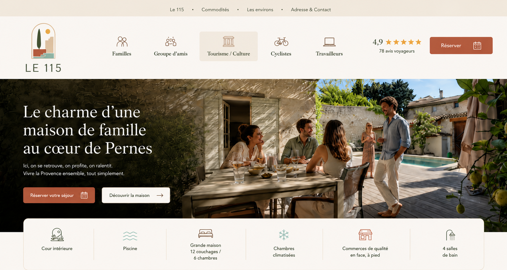
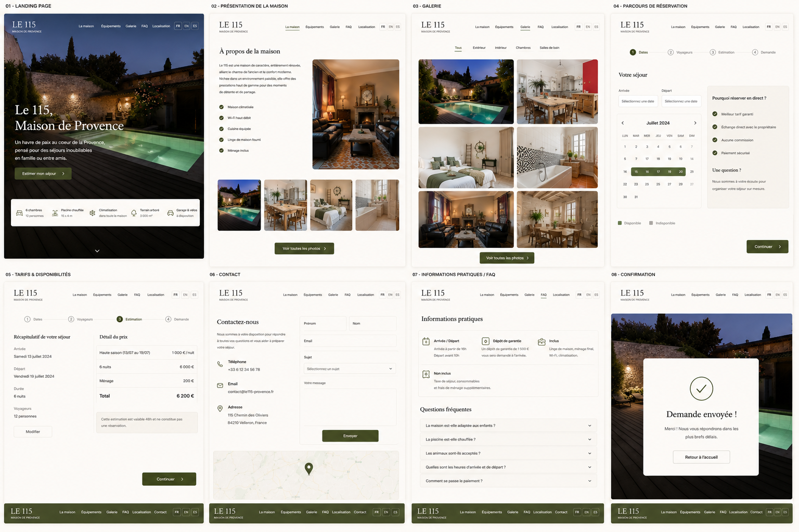
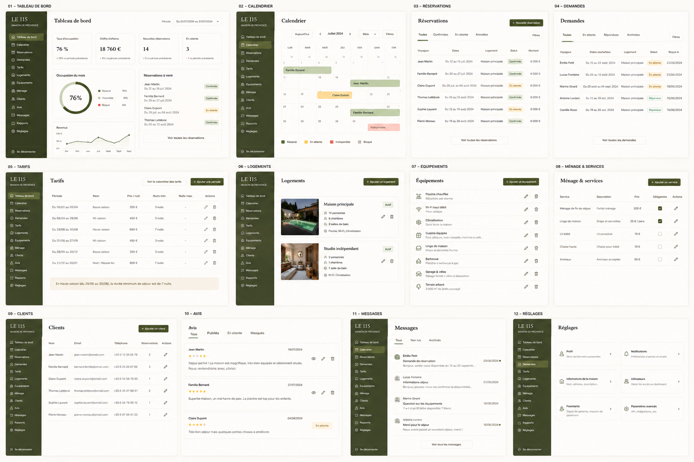
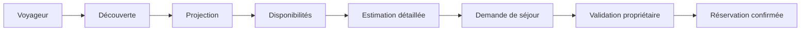

# Le 115, Maison de Provence

> Documentation produit, fonctionnel et technique — V1



> Suggestion front v1 



> Suggestion dashboard v1



## Vision

**Le 115, Maison de Provence** est une landing page premium dédiée à la location saisonnière d'une maison en Provence.

Le site doit permettre à un voyageur de :
- découvrir la maison ;
- se projeter dans son séjour ;
- consulter les disponibilités ;
- estimer le prix ;
- envoyer une demande de séjour.

La réservation n'est pas instantanée : chaque demande est validée manuellement par le propriétaire.

---

## Parcours principal



---

## Dossiers

```text
le115-docs/
├── docs/       Documentation produit et technique
├── specs/      Spécifications détaillées pour développement / IA
├── prompts/    Prompts prêts pour Claude Code
└── tasks/      Plan de développement par tâches
```

---

## Documentation

| Document | Rôle |
|---|---|
| [00-Glossary.md](00-Glossary.md) | Vocabulaire métier |
| [00-Product-Decisions.md](00-Product-Decisions.md) | Décisions validées |
| [01-Product.md](01-Product.md) | Vision et périmètre V1 |
| [02-UX.md](02-UX.md) | UX, sections, wireframes |
| [03-Business-Rules.md](03-Business-Rules.md) | Règles métier |
| [04-Dashboard.md](04-Dashboard.md) | Back-office |
| [05-Data-Model.md](05-Data-Model.md) | Modèle de données |
| [06-API.md](06-API.md) | API REST |
| [07-Architecture.md](07-Architecture.md) | Architecture applicative |
| [08-Roadmap.md](08-Roadmap.md) | Roadmap produit |

---

## Principes

- Rester fidèle à la direction artistique fournie.
- Utiliser le CTA principal **“Estimer mon séjour”**.
- Afficher un devis détaillé, jamais uniquement un total.
- Ne pas bloquer les dates pour une simple demande.
- Ouvrir le dashboard sur le calendrier.
- Rendre les prix, contenus et photos administrables.
- Garder une documentation exploitable par un humain et par une IA de développement.
