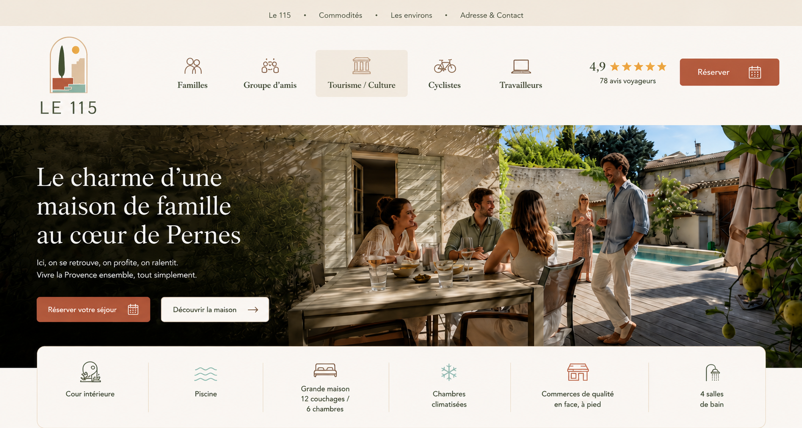
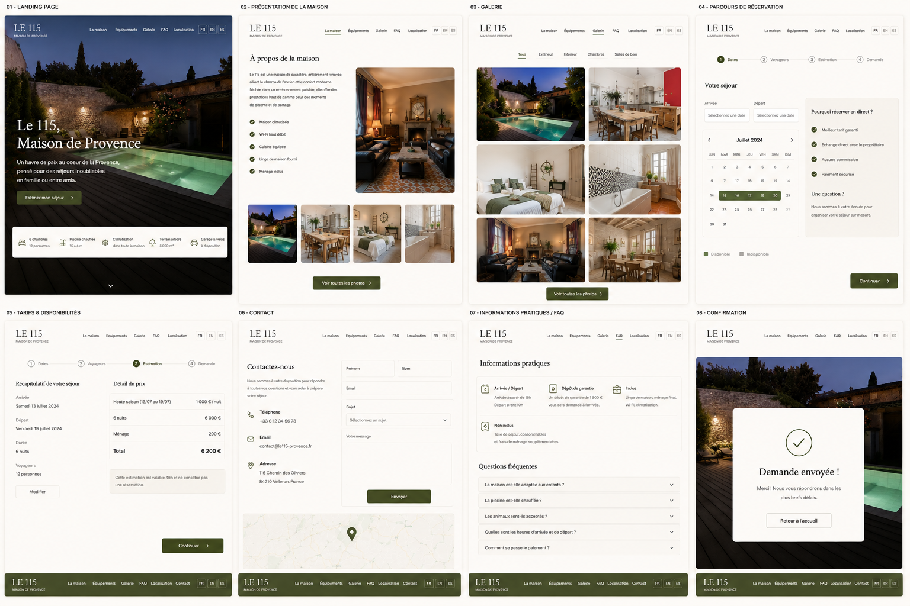
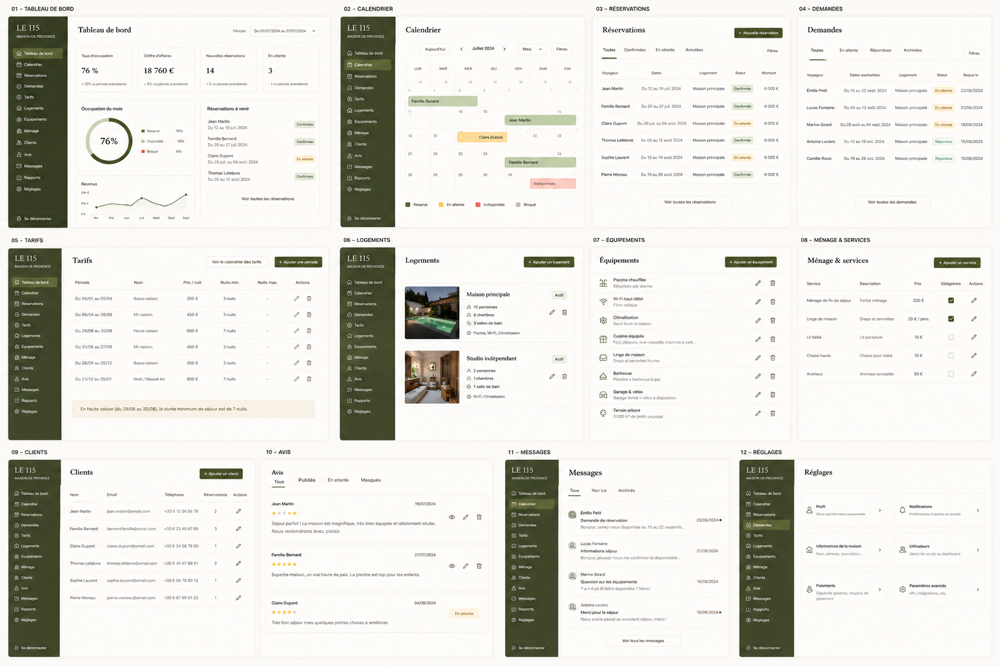
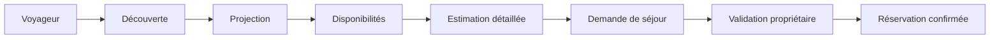

# Le 115, Maison de Provence

> Documentation produit, fonctionnel et technique — V1



> Direction retenue — [assets/landing-hybride.html](assets/landing-hybride.html) *(à ouvrir dans un navigateur)*

C’est la **direction validée** pour le site public visiteur (cf. DEC-020). Elle
reprend la mise en page de `landing-reference.png` — deux niveaux d’en-tête, logo
en arche, accent terracotta, dégradé latéral, note et avis en en-tête, bandeau
d’atouts chevauchant le visuel — et en corrige trois points :

- le bouton principal dit **« Réserver »** (DEC-026, qui a renversé DEC-003), et la
  page qu’il ouvre détrompe aussitôt : rien ne se réserve en ligne (DEC-004) ;
- la navigation porte les **ancres réelles** du produit, pas des libellés qui
  mènent à des contenus inexistants ;
- les **onglets d’audience mènent à des pages** de contenu, pas à un filtre de la
  galerie.

Le rendu utilise la photo réelle de la maison (`assets/photo-cour.jpg`) et
s’ouvre sans backend.

> Suggestion front v1 



> Suggestion dashboard v1



## Vision

**Le 115, Maison de Provence** est une landing page premium dédiée à la location saisonnière d'une maison en Provence.

Le site doit permettre à un voyageur de :
- découvrir la maison ;
- se projeter dans son séjour ;
- consulter les disponibilités ;
- estimer le prix ;
- envoyer une demande de séjour.

La réservation n'est pas instantanée : chaque demande est validée manuellement par le propriétaire.

---

## Parcours principal


```mermaid
flowchart LR
    Traveler[Voyageur] --> Discover[Découverte]
    Discover --> Projection[Projection]
    Projection --> Availability[Disponibilités]
    Availability --> Quote[Estimation détaillée]
    Quote --> Request[Demande de séjour]
    Request --> Owner[Validation propriétaire]
    Owner --> Reservation[Réservation confirmée]
```

---

## Dossiers

```text
le115-docs/
├── docs/       Documentation produit et technique
├── specs/      Spécifications détaillées pour développement / IA
├── prompts/    Prompts prêts pour Claude Code
└── tasks/      Plan de développement par tâches
```

---

## Les quatre dépôts

Le produit vit dans quatre dépôts frères. Celui-ci ne porte aucun code : il fait
foi sur le **produit et les règles métier**, jamais sur les choix techniques, qui
restent dans le dépôt concerné.

| Dépôt | Rôle |
|---|---|
| `le115-docs` *(ici)* | **Source de vérité produit** : glossaire, décisions, règles métier, UX, modèle de données, roadmap |
| `le115-backend` | API Go + PostgreSQL : disponibilités, tarifs, règles de séjour, devis, demandes, contenus FR/EN, photos, iCal. Porte aussi `docs/DEBTS.md`, **registre unique des dettes du projet** |
| `le115-dashboard` | Back-office React (Vite), douze modules — le propriétaire y **saisit** les contenus que le site public affiche |
| `le115-frontend` | **Site public visiteur** (Next.js), rendu au serveur, FR/EN — cf. DEC-020 à DEC-022 |

---

## Documentation

| Document | Rôle |
|---|---|
| [00-Glossary.md](00-Glossary.md) | Vocabulaire métier |
| [00-Product-Decisions.md](00-Product-Decisions.md) | Décisions validées |
| [01-Product.md](01-Product.md) | Vision et périmètre V1 |
| [02-UX.md](02-UX.md) | UX, sections, wireframes |
| [03-Business-Rules.md](03-Business-Rules.md) | Règles métier |
| [04-Dashboard.md](04-Dashboard.md) | Back-office |
| [05-Data-Model.md](05-Data-Model.md) | Modèle de données |
| [06-API.md](06-API.md) | API REST |
| [07-Architecture.md](07-Architecture.md) | Architecture applicative |
| [08-Roadmap.md](08-Roadmap.md) | Roadmap produit |

---

## Principes

- Rester fidèle à la direction artistique fournie.
- Utiliser le CTA principal **« Réserver »** (DEC-026), et détromper sur la page
  qu’il ouvre, pas dans le bouton.
- Afficher un devis détaillé, jamais uniquement un total.
- Ne pas bloquer les dates pour une simple demande.
- Ouvrir le dashboard sur le calendrier.
- Rendre les prix, contenus et photos administrables.
- Garder une documentation exploitable par un humain et par une IA de développement.
